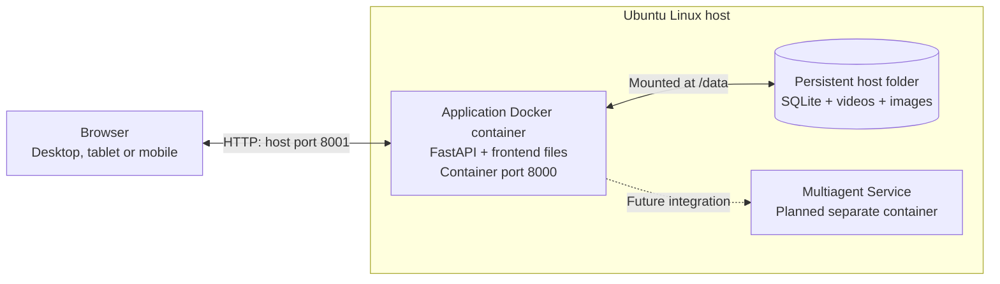

# Video Analyzer Agent

A web application for uploading large videos and keeping each video's questions, image attachments, and conversation history together. Each conversation has one video; uploads in different conversations can run in parallel.

**Current scope:** user accounts, video uploads, image attachments, saved conversations, and backend metadata preparation are implemented. Chat currently answers basic metadata questions. Video and image understanding will be provided by a separate **Multiagent Service**, which is not connected yet.

## High-level architecture



The frontend runs in the browser and calls FastAPI. The backend handles authentication, file storage, session mapping, metadata preparation, and chat history. Video chunks go to the backend; video processing stays on the server.

SQLite runs within the backend process. Its database file and the media files live on the host. The current deployment uses Docker Compose with one application container and one Uvicorn worker.

## Project layout

| Location | Purpose |
| --- | --- |
| [frontend/](frontend/) | HTML, CSS, JavaScript, and browser assets |
| [backend/](backend/) | Authentication, uploads, conversations, images, and storage |
| [main.py](main.py) | FastAPI entry point; serves the frontend and API |
| [manage_users.py](manage_users.py) | Account administration |
| [tests/](tests/) | Backend, frontend, and deployment checks |
| [docs/](docs/) | Detailed architecture, design, and deployment guides |

## Build and package

Run these steps on a **build machine**, such as Ubuntu or WSL Ubuntu. It needs Git and a working Docker Engine with Buildx and Compose. If Docker is missing, follow the [Docker Ubuntu installation guide](https://docs.docker.com/engine/install/ubuntu/).

```bash
git clone https://github.com/krishnakv24/Video-Analyzer-Agent.git
cd Video-Analyzer-Agent
docker info
docker buildx version
docker compose version
```

If you already have the checkout, start from its directory. The example versions below are `1.0.0` for the base and `0.1.2` for the application.

### 1. Create the reusable dependency base

```bash
bash build_base.sh 1.0.0
```

[Dockerfile.base](Dockerfile.base) installs Ubuntu, Python, FFmpeg, and the libraries in `requirements.txt`. This step needs internet access and produces:

```text
dist/videolens-base-1.0.0.tar
```

Reuse this archive for code updates. If `requirements.txt` or `Dockerfile.base` changes, build a new base version.

### 2. Package the current application

```bash
bash package.sh 0.1.2 dist/videolens-base-1.0.0.tar
```

The script loads the saved base, checks its dependency definitions, and uses [Dockerfile](Dockerfile) to copy the latest application code and set the startup command. Packaging does not install libraries. It produces:

```text
dist/videolens-0.1.2.tar.gz
```

The release contains the final `image.tar`, `compose.yaml`, `.env.example`, `install.sh`, and installation instructions. The final image includes the base layers. User data and credentials are excluded.

Both build scripts refuse to overwrite existing archives. Reuse an existing base archive and choose a new application version for each release.

## Deploy on Ubuntu Linux

Copy **`dist/videolens-0.1.2.tar.gz`** to the Ubuntu server using SCP, a file transfer tool, or removable storage. The server only needs the final release archive. Its CPU architecture must match the image platform printed during packaging.

On the server, from the directory containing that archive:

```bash
tar -xzf videolens-0.1.2.tar.gz
cd videolens-0.1.2
sudo bash install.sh
```

**Run the installer from the extracted release directory.** It prepares Docker Engine and Compose when absent, creates the configuration and host data folder, loads the image, and starts the service. A fresh Docker installation requires Ubuntu with systemd, sudo access, and internet access. Working Docker installations are reused; incomplete installations may require repair.

The image starts FastAPI automatically when its container starts. Python, SQLite support, and application libraries are already inside the image. `setup.sh` and the project's `.venv` are only for local development and are not needed for Docker deployment.

### Create an account and open the UI

From the extracted release directory:

```bash
sudo docker compose exec app python manage_users.py create admin --admin
```

Enter a password when prompted. There is no default login.

- **On the Ubuntu host:** open [http://localhost:8001](http://localhost:8001).
- **On Windows when running in WSL:** use the same URL in the Windows browser.
- **From another computer or phone:** on native Ubuntu, set `BIND_ADDRESS=0.0.0.0` in the release's `.env`, rerun `sudo bash install.sh`, and open `http://<server-IP>:8001`. The network must allow access to port 8001. WSL access from other devices needs additional networking configuration; see the [deployment guide](docs/deployment/docker.md#run-directly-from-source-in-wsl).

The default host port is **8001**, mapped to port **8000** inside Docker. `HTTP_PORT` in the release's `.env` controls the host port.

## Where the data lives

The installer uses this host directory by default:

```text
/srv/videolens/data/
    frame.sqlite3    # Accounts, sessions, uploads, and messages
    videos/          # Partial and completed video uploads
    images/          # Images attached to conversations
```

Compose mounts the whole directory at `/data` inside the container. Replacing the container preserves these host files. Keep enough disk space for large uploads and backups, and run only one backend instance against this directory.

For a different storage location on the **first installation**, run `sudo bash install.sh /absolute/path/to/data`. Later runs reuse the saved `.env` configuration. Follow the [backup and migration guide](docs/deployment/docker.md#move-existing-data-or-back-it-up) before moving existing data.

## Check and update the service

From the installed release directory, check the container and API:

```bash
sudo docker compose ps
curl --fail http://127.0.0.1:8001/api/health
sudo docker compose logs --tail=50 app
```

For an application update:

1. Package the updated code with a new application version, reusing the base unless dependencies changed.
2. Transfer and extract the new release into a separate directory on the server.
3. Back up the entire data directory with the service stopped, following the guide above.
4. Copy the previous release's `.env` into the new release directory.
5. Run `sudo bash install.sh` from the new directory.

Keep the same Compose project name (`videolens`) and `HOST_DATA_DIR` to update the existing service and retain its accounts and conversations. Updates briefly interrupt the service.

## Detailed documentation

- [Architecture and responsibilities](docs/architecture.md)
- [Frontend design and screenshots](docs/design/frontend-design.md)
- [Backend design and API flows](docs/design/backend-design.md)
- [Docker deployment, networking, backups, and tests](docs/deployment/docker.md)
- [Local development setup](frontend/README.md)
