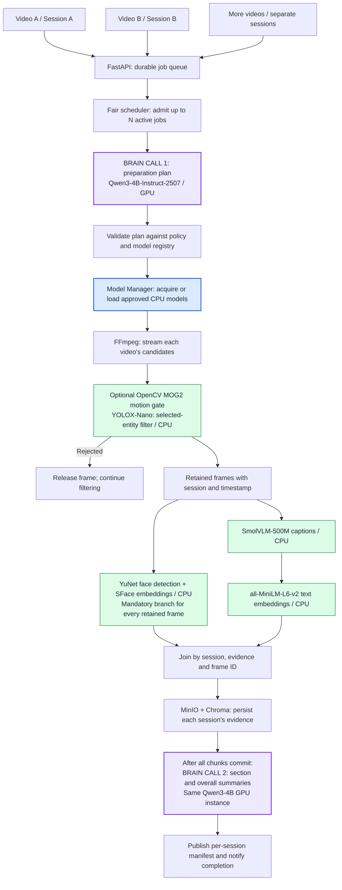
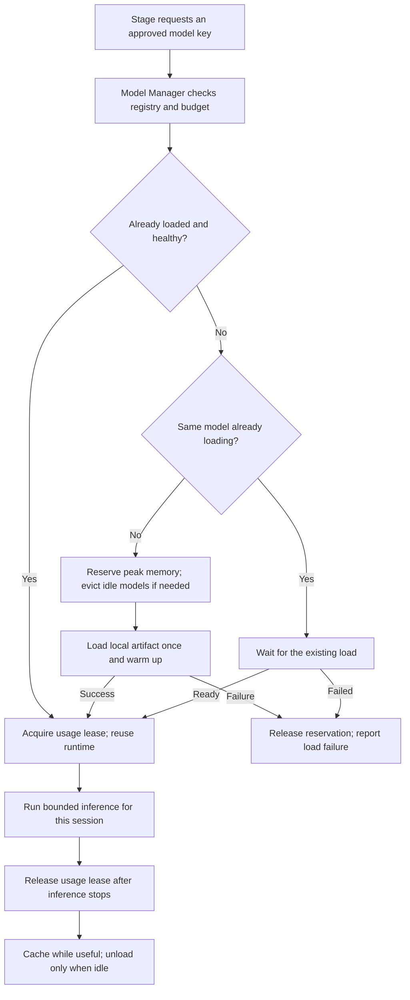

# Agent 1: preparation, shared Brain, and model workers

**Status: design only; not implemented.** Multiple video sessions can progress concurrently through one agent service. Agent 1 calls the GPU Brain for preparation planning and summaries. Chat and Agent 2 remain deferred.

**Filter first:** face processing, captioning, indexing, and visual summaries use only retained frames. Faces are mandatory on every retained frame. The initial Brain planning call receives metadata and user selections, not video frames.

## 1. Complete flow with model names

The named models are the proposed evaluation baseline. Runtime compatibility, accuracy, memory, and throughput must pass validation before a release.



The middle pipeline streams bounded chunks independently for each session; it does not load entire videos into RAM. Each accepted frame reaches both branches. Rejected frames end only their own processing. Empty chunks still checkpoint; a video with no retained frames skips summary inference and publishes an explicit empty result.

Purple boxes are Brain calls, blue is model loading/reuse, and green is CPU inference. Both Brain boxes refer to **one resident model**, shared through a fair inference queue. Neither the model nor its conversation state is copied for every uploaded video. Model Manager acquisition also runs at each stage when a model lease is needed; the diagram shows its first use.

## 2. Proposed models and runtimes

| Step | Baseline model or tool | Runtime / device | Role |
| --- | --- | --- | --- |
| Planning and summaries | **Qwen/Qwen3-4B-Instruct-2507**, validated GGUF `Q4_K_M` export | llama.cpp with CUDA / GPU | Propose an approved preparation plan; summarize retained evidence. One shared Brain. |
| Decode and timestamps | **FFmpeg / libavcodec** | Native C/C++ / CPU | Decode candidates incrementally; preserve source timestamps. No AI model. |
| Optional motion gate | **OpenCV MOG2** | OpenCV C++ / CPU | Motion/change filtering for configured footage profiles; separate background state per video. |
| Entity filter | **YOLOX-Nano**, `yolox_nano.onnx` | ONNX Runtime C++ / CPU | People, cars and other supported selected classes. |
| Face detection | **YuNet**, `face_detection_yunet_2023mar.onnx` | Pinned compatible OpenCV 4.x DNN / CPU | Detect faces/landmarks on every retained frame. |
| Face features | **SFace**, `face_recognition_sface_2021dec.onnx` | OpenCV DNN / CPU | Align usable face crops and generate face embeddings. |
| Frame captions | **HuggingFaceTB/SmolVLM-500M-Instruct**, compatible GGUF plus projector | llama.cpp multimodal / CPU | Caption each retained frame; use a pinned model/projector pair. |
| Caption vectors | **sentence-transformers/all-MiniLM-L6-v2**, validated ONNX export | ONNX Runtime C++ / CPU | Embed captions into a separate text collection. |
| Storage and orchestration | **MinIO, Chroma, SQLite, FastAPI, LangGraph** | Host/container services | Storage, jobs, workflow and APIs; these are not AI models. |

The Brain is a text instruction model, not the visual captioner. Its official card lists local llama.cpp support. The proposed GPU profile starts evaluation with one generation slot and a bounded 4,096-token context, including output allowance. This is a target for the previously reported 6 GB GPU, **not a verified fit or latency claim**. Model quantization, KV cache, runtime buffers and available VRAM must be measured. [Qwen model card](https://huggingface.co/Qwen/Qwen3-4B-Instruct-2507)

YOLOX provides a Nano ONNX artifact; YuNet and SFace have native examples. Validate detector recall on the actual CCTV footage, since frames missed here are unavailable to later stages. [YOLOX ONNX](https://github.com/Megvii-BaseDetection/YOLOX/blob/main/demo/ONNXRuntime/README.md), [YuNet](https://github.com/opencv/opencv_zoo/tree/main/models/face_detection_yunet), [SFace](https://github.com/opencv/opencv_zoo/tree/main/models/face_recognition_sface)

SmolVLM supports image descriptions and is listed by llama.cpp. Its CPU runtime must disable both language-layer and multimodal-projector GPU offload; use a CPU-only worker build with explicit `-ngl 0 --no-mmproj-offload`. Keep its input-image and output-token budgets bounded. Its captions are candidates for evaluation, not guaranteed observations. [SmolVLM model card](https://huggingface.co/HuggingFaceTB/SmolVLM-500M-Instruct), [official GGUF artifacts](https://huggingface.co/ggml-org/SmolVLM-500M-Instruct-GGUF), [multimodal runtime](https://github.com/ggml-org/llama.cpp/blob/master/docs/multimodal.md)

MiniLM generates 384-dimensional text vectors. Preserve its tokenizer, attention-mask-aware mean pooling, and normalization in the native adapter. Keep captions within its 256-wordpiece limit or split with frame-linked references instead of silently truncating. This baseline uses English captions. [MiniLM model card](https://huggingface.co/sentence-transformers/all-MiniLM-L6-v2)

These choices replace the earlier unspecified model roles. Pin artifact hashes, export/quantization settings, runtime revisions, preprocessing, licenses, and quality thresholds in the registry. Model weights are packaged or provisioned before service use; the application does not download arbitrary models during a request.

## 3. Exactly where the Brain is called

| Call | Caller and input | Result and enforcement |
| --- | --- | --- |
| **1. Preparation planning** | LangGraph `plan_preparation` node calls `BrainClient.plan()` after durable job acceptance and source validation. Input: metadata, `entities`, `instructions`, profile limits, approved capability/model IDs. | Structured proposal containing approved model aliases and caption/summary instructions. `PlanValidator` enforces selections, mandatory face/caption/text stages, device limits and supported capabilities. Persist the resolved plan and hash before processing. |
| **2. Section summaries** | `summarize_sections` calls `BrainClient.summarize()` on bounded chronological groups of retained captions, detector metadata, timestamps and evidence IDs after their writes commit. | Evidence-linked section summaries. Validate returned references and output schema; preserve source records. |
| **3. Overall summary** | `summarize_video` calls the **same Brain** on section summaries and their evidence references. Use intermediate levels if the input exceeds the context budget. | Overall summary linked to the sections and retained evidence; save before publication. |

The flow diagram groups calls 2 and 3 as the summary phase. They can require many bounded inference requests for a 24-hour video. Never send the full video, discarded frames, raw embeddings, or all captions in one unbounded prompt.

The orchestrator calls the private Brain runtime through `BrainClient`; the browser and existing backend call only the agent FastAPI. Plan and summary requests have their own scoped inputs. Reusing weights does not mean sharing prompts, KV-cache conversations, or results between users.

The graph has fixed stage boundaries. The Brain can propose choices from the configured catalog; it cannot create tools, install models, execute commands, drop mandatory stages, change ownership, or bypass the filter. Invalid proposals receive a bounded repair attempt and then a visible failure. A committed plan is reused on retry rather than asking the Brain to choose a different pipeline mid-job.

For People and Cars, the current catalog resolves to the **same YOLOX model** with an OR class mask, plus YuNet/SFace, SmolVLM and MiniLM. There is no separate person-model and car-model copy. New specialized capabilities require an approved registry entry and adapter before a Brain proposal can use them.

## 4. Multiple videos at the same time

| Shared resource | Per-session state |
| --- | --- |
| One agent FastAPI and durable scheduler | One finalized video, preparation job, entity selection and immutable plan |
| One loaded runtime per approved model/revision/device configuration | Separate decoder cursor, MOG2 background state, graph checkpoint and worker lease |
| Fair CPU-model queues and one GPU Brain generation slot initially | Bounded frame queues, branch outcomes, progress, cancellation and errors |
| One batched storage writer initially | Separate object keys, index metadata, summaries and completion events |

Proposed `MAX_ACTIVE_PREPARATIONS=2` is an initial test setting, configurable for the host. Admission also checks measured RAM, decoder buffers, model workspaces and queue budgets. Additional jobs remain `queued`; running jobs can wait for a shared model without losing progress. On a smaller host, reduce admission to one. Reducing active videos does not remove the resident models' fixed memory costs.

Each admitted video has one decoder owner, so frames remain ordered within that video. Model workers take small bounded requests from sessions in round-robin order. A 24-hour video cannot monopolize the caption queue by submitting its entire frame list first. Queues have per-session and global byte/item limits, with backpressure to the relevant decoder.

Start with one worker per CPU model key and one Brain generation slot. Face and caption work may overlap; shared model calls from A and B can be interleaved. Batch only when the pinned runtime supports it, keeping item identity explicit. Concurrent sessions do not imply unlimited parallel inference or unchanged per-video latency.

Do not instantiate models inside each LangGraph graph or FastAPI request. A shared broker owns runtime processes/instances and CPU permits. Bound native decoder/OpenCV/ONNX/llama.cpp threads under the container's CPU allocation and retain capacity for uploads, polling, cancellation and storage. [ONNX Runtime thread management](https://onnxruntime.ai/docs/performance/tune-performance/threading.html)

Every task/result carries `owner_id`, `session_id`, `job_id`, `evidence_id`, `frame_id` when applicable, pinned model identity, and the current attempt token. Join by these identifiers, never by arrival order. Session A finishing or cancelling must not unload a model still being used by B.

## 5. Dynamic model loading



- **Registry:** maps a logical model ID to an approved local artifact hash/revision, runtime, precision, device, compatible preprocessing/projector, capabilities, and memory/workspace budget. The validated plan resolves aliases once and persists exact identities.
- **Load once:** key instances by the complete runtime configuration. An atomic per-key lock shares one load future across simultaneous requests from A and B. Readiness follows hash/compatibility checks and warm-up, not merely opening a file.
- **Reserve before loading:** account for resident models, peak load memory, active requests, decoder/queue buffers and service headroom. If no safe capacity exists, wait within a bound or return a resource error. Never start an unbounded number of loads.
- **Reuse safely:** an inference lease/refcount prevents unloading while a call is queued for that instance or executing. Release model leases and CPU execution permits after each bounded native call, before waiting on storage or another model. Completion and lease-release handling must remain runnable even when input queues are full.
- **Unload only idle models:** after no active leases, apply an idle timeout or least-recently-used eviction when memory is needed. Keep common CPU models warm when possible. Under pressure, pause decoders and drain work before evicting; do not reload all models for each frame.
- **Brain residency:** load and warm the selected GPU Brain at service startup and pin it. CPU-model eviction cannot take its reserved GPU memory. All active videos reuse its bounded inference queue.
- **Failure/restart:** persist desired model identities and job state, not process pointers. Recover loads on demand, replay idempotent stage tasks, and reject stale results. A failed load affects requesting work and is visible; no silent model substitution.
- **Version changes:** new jobs may use a new approved profile. In-flight jobs retain their exact versions; if old and new runtimes cannot coexist in memory, schedule them separately instead of silently replacing one.

For this baseline, dynamic loading primarily saves idle resources and shares models across sessions. It does not require choosing a new model for every frame. GPU fallback to a cloud provider is not silently activated; a later explicit provider configuration can implement that boundary.

## 6. Filtering and retained evidence

The existing UI sends `entities` and `instructions` after upload. Supported options are `People`, `Cars`, `Motorcycles`, `Bicycles`, and `Animals`; the list is nonempty. Brain planning preserves this selection.

The proposed source profile uses 900-second checkpoint chunks and up to 6 candidate frames per second, subject to evaluation. Optional motion gating belongs to the fixed profile; the Brain cannot weaken filtering to meet a speed target. Every retained frame must match at least one selected supported class. Periodic candidates still pass the same gate.

`Animals` maps to the detector's explicit supported list: bird, cat, dog, horse, sheep, cow, elephant, bear, zebra and giraffe. It does not cover arbitrary animal species. [YOLOX class list](https://github.com/Megvii-BaseDetection/YOLOX/blob/main/yolox/data/datasets/coco_classes.py)

With Cars-only selection, every retained car frame goes to YuNet and SFace as applicable. A face-only frame rejected by the filter remains excluded. `no_faces` is a valid completed frame outcome; unusable faces have quality reasons and no fabricated embeddings.

Only source validation, decoding and filtering receive the video path. Downstream workers accept registered `RetainedFrameRef` records; the Brain receives metadata or retained-derived text. Source hashes are verified/computed by streaming. Preserve original timestamps and frame ordinals, including variable-rate footage.

## 7. Storage, completion and recovery

```text
User -> session_id -> one finalized source video
  -> agent job_id + immutable validated plan
      -> evidence_id
          -> frame_id + timestamp
              -> retained image + entity detections
              -> caption + text vector
              -> face outcomes + usable face crops/vectors
          -> section summaries + overall summary + manifest
```

| Persistent location | Contents |
| --- | --- |
| Backend host data directory | Existing account/session database, original videos and user image uploads |
| Agent read-only `/media/videos` | Source video mount; backend database is not shared |
| Agent persistent `/state` | Jobs, plans, leases, checkpoints, accepted frame IDs, pending writes and registry publication |
| Agent read-only `/models` | Provisioned model artifacts, projector files and versioned manifests |
| MinIO host-backed storage | Retained images/crops and summaries under `video-chatbot/<session_id>/<evidence_id>/...` |
| Chroma host-backed storage | Separate caption-text and face-vector collections, scoped by owner/session/evidence and embedding version |

The single-host Docker target is the existing web container plus the agent container and private MinIO/Chroma services. The agent container supervises the API, scheduler/model workers and resident Brain runtime. Only the Brain process uses CUDA; CPU workers explicitly disable GPU offload. Model processes are managed centrally, not per session.

A session becomes ready only after all chunks commit, `captioned_frames == face_processed_frames == retained_frames`, required object/vector writes succeed, summaries pass validation, and the immutable manifest is published. No retained frames produces `summary_key: null` and `no_retained_frames`; it is not proof of absence in the original video.

Use durable jobs, request idempotency, leases/fencing, chunk checkpoints and pending-write reconciliation. MinIO, Chroma and SQLite do not share a transaction. Publish the authoritative evidence registry last; consumers cannot expose unfinished versions as complete. Source/model/plan changes cannot silently rewrite published evidence.

Cancellation targets one job, stops its outstanding work, and releases its leases only after calls stop. It leaves shared models and other jobs running. Deletion tombstones the session, quiesces its work and removes its scoped outputs; backend source deletion waits for agent cleanup acknowledgement. Completion notifications are deduplicated by session/evidence.

Host mounts survive container replacement; consistent backups are still required for host disk loss. The current backend performs metadata preparation only. [Backend jobs](../../backend/jobs.py) and [conversation deletion](../../backend/conversation_deletion.py) require integration, and packaging does not yet deploy this design.

## 8. Acceptance before implementation is called complete

Verify two videos make independent progress with shared model instances; concurrent requests load each model once; model waits respect queue/memory limits; cancelling A does not interrupt B; rejected frames never reach downstream stages; faces remain mandatory; invalid Brain plans fail safely; restart preserves pinned plans and frame IDs; and required-stage/model/storage failures cannot publish readiness.

Evaluate entity recall, face quality, caption/summary grounding, queue fairness, load/eviction behavior, RAM/VRAM peaks and processing time on representative long videos. There is no measured 24-hour-video throughput claim yet.

See the [detailed workflow and class diagram](workflows.md). All named classes and model configurations in these documents are proposed; no agent inference is implemented yet. Detailed API contracts are deferred.
