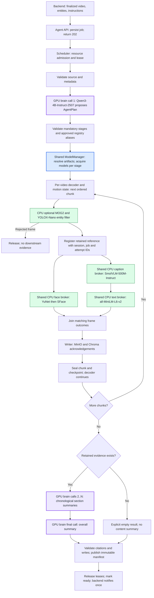
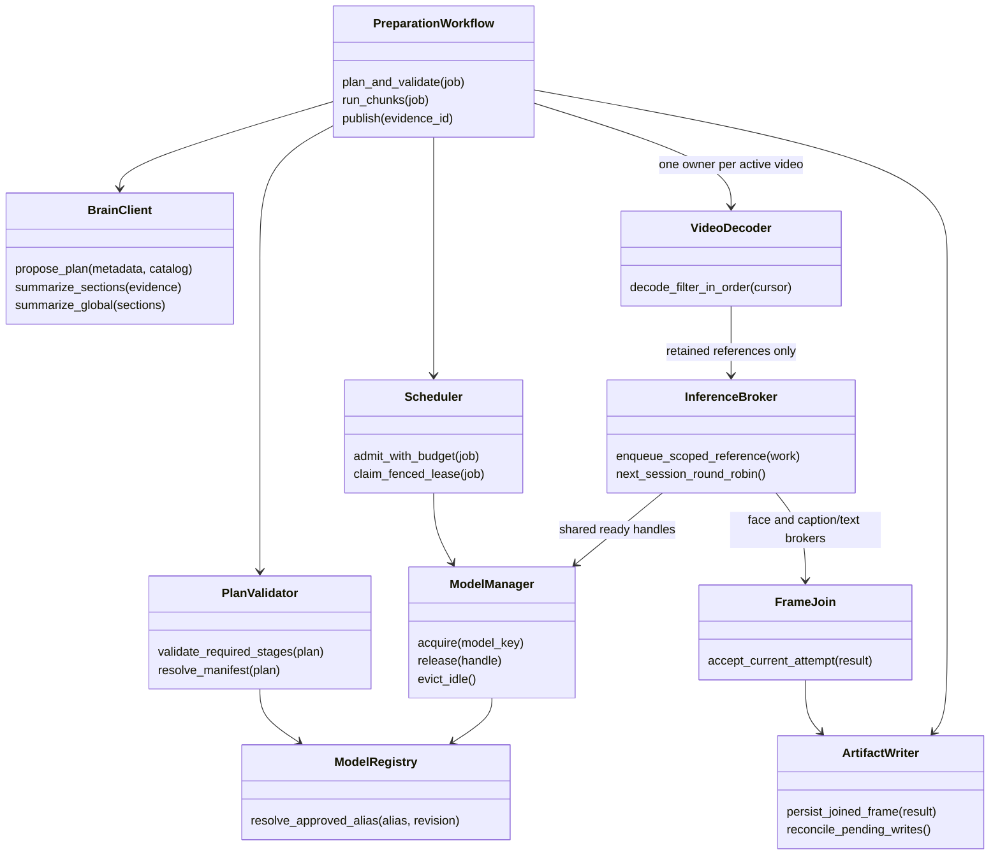

# Agent 1 preparation workflow

**Status: proposed design only; no agent models or workflow are implemented or deployed.** Agent 1 uses a GPU brain to plan preparation and summarize retained evidence, with CPU models for frame processing. Agent 2 and chat are deferred. See the [architecture](architecture.md).

**Filtering comes first for visual processing. Every downstream visual operation receives only retained frames.** Planning receives validated metadata, selections, instructions, and an approved model catalog; it cannot inspect video frames or bypass the filter.

## 1. Identifiers and states

| Identifier | Meaning |
| --- | --- |
| `session_id` | Existing backend `jobs.id`; one conversation and one source video. |
| `job_id`, `request_id` | Agent execution and backend logical request; retries preserve the logical request. |
| `attempt_id`, fencing token | Current execution attempt and lease generation; stale attempts cannot commit. |
| `evidence_id`, `frame_id`, `face_id` | Immutable preparation version and its typed frame/face records. |
| `plan_id`, registry revision | Validated plan and the immutable catalog used to resolve its model aliases. |

Job states are `queued`, `running`, `cancel_requested`, `succeeded`, `failed`, and `cancelled`. Session states are `unprepared`, `preparing`, `ready`, `failed`, `deleting`, and `deleted`. A job is accepted only after durable persistence. Required planning, model, inference, storage, index, or summary failures prevent readiness; an explicitly empty retained set is valid after successful filtering.

## 2. Complete workflow and brain calls

Purple boxes show calls to the same Qwen Brain; blue shows model acquisition and green shows CPU inference. The Brain stays loaded in its separate GPU runtime. Planning and summaries share a serialized, fair request broker across jobs. No preparation completion automatically invokes Agent 2 or chat.

### Planning and validation

- The brain receives authorized metadata, selected entities, upload instructions, resource limits, and approved model capabilities. It proposes an `AgentPlan` using registry aliases and caption/summary instructions. The validator fixes chunk/sampling/inference parameters from the selected server profile; the Brain cannot weaken filtering to meet a speed target.
- `PlanValidator` resolves aliases against a pinned registry revision. The validated manifest fixes exact model revisions, artifact hashes, preprocessing, runtime settings, thresholds, required outputs, and resource reservations before decoding starts.
- The plan must retain the selected-entity gate and mandatory face, caption, text-index, storage, and summary stages. Instructions cannot remove stages, inject executable code, select arbitrary model URLs, or grant source access to downstream tools.
- Invalid plans receive bounded repair attempts through the brain. Exhausted repair or brain failure produces an explicit planning failure; there is no silent fixed-plan fallback.
- Save the accepted plan durably and reuse it after restart. A new model choice requires a new validated execution/evidence version; it cannot silently change halfway through a video.

### Filtering contract

- The selected entity list is nonempty and supported. Registry class mappings implement **OR**: a candidate matching any selected category is eligible. `Animals` means the explicitly supported detector classes, not every species.
- An optional motion gate must also pass when enabled. Candidate sampling is upstream of the same gate: **no periodic or context frame bypasses the selected filter**.
- Proposed starting limits are 900-second chunks and up to 6 candidate frames per second, subject to validation and benchmark. A chunk is a checkpoint boundary, not an in-memory video batch.
- Preserve original presentation timestamps and a frame ordinal for variable frame rates and repeated timestamps. Retained references include detections and selection reasons; rejected bytes/detections remain transient, apart from aggregate counters.
- Only source validation, decoding, and filtering receive source access. Faces, captions, embeddings, and summaries cannot open the original video, rejected frames, or audio. **There are no later original-video rescans.**
- Verify or stream-compute a source fingerprint. Recovery may decode/filter again only to resume unfinished preparation or reconstruct the same accepted IDs. Persist the plan and decoder/filter recovery policy; inconsistent source, state, or reconstruction fails explicitly.

## 3. Shared models and dynamic loading

These are **preliminary baseline models pending target-machine benchmarks**, not a claim of measured fit, speed, or recall.

| Role | Baseline / runtime | Loading policy |
| --- | --- | --- |
| Brain: planning and section/global summaries | Qwen3-4B-Instruct-2507, GGUF Q4_K_M, GPU llama.cpp | One resident instance at startup; validate readiness before admitting jobs. |
| Selected-entity detector | YOLOX-Nano ONNX, CPU ONNX Runtime | One shared instance per resolved model key. |
| Optional motion gate | OpenCV MOG2 on CPU | Separate mutable state for each video decoder owner. |
| Face detector and embedding | YuNet and SFace, CPU OpenCV DNN | Shared immutable model handles; serialized broker calls unless runtime safety is validated. |
| Caption every retained frame | SmolVLM-500M-Instruct GGUF, CPU llama.cpp | One shared caption runtime; both vision encoder and decoder stay on CPU. |
| Caption text embedding | all-MiniLM-L6-v2 ONNX, CPU ONNX Runtime | One shared instance with pinned tokenizer, pooling, and normalization. |

`ModelRegistry` is server-managed: each alias identifies an approved capability, license metadata, local artifacts, hashes, runtime/backend, preprocessing, limits, and estimated memory. Models are provisioned separately under read-only `/models`; a brain response cannot download files or install code.

`ModelManager.acquire()` uses a key covering model revision, artifact hashes, device, precision, runtime, and preprocessing. It reserves memory before loading, shares one in-progress load among concurrent callers, verifies files, warms the runtime, and returns a handle only after readiness succeeds. A failed load releases its reservation and fails dependent stages with a reason.

CPU models load lazily when an admitted plan first needs them, then remain reusable across sessions. Reference counts and in-flight request counts protect active handles. Only idle CPU models may be evicted under a bounded cache policy; do not unload after each frame or chunk. The resident GPU brain is excluded from routine CPU-cache eviction. A restart reconstructs handles from pinned manifests rather than serialized pointers.

Release each model lease and CPU permit after its bounded inference call, before waiting on another model or storage. Completion/lease-release handlers retain execution capacity when input queues are full. Reusing weights never reuses another session's prompt or KV-cache conversation. See the [model loading flow](architecture.md#5-dynamic-model-loading) for cache hits, shared loading, memory waits and failure paths.

Official starting references: [YOLOX ONNX](https://github.com/Megvii-BaseDetection/YOLOX/blob/main/demo/ONNXRuntime/README.md), [YuNet](https://github.com/opencv/opencv_zoo/tree/main/models/face_detection_yunet), [SFace](https://github.com/opencv/opencv_zoo/tree/main/models/face_recognition_sface), and [llama.cpp multimodal support](https://github.com/ggml-org/llama.cpp/blob/master/docs/multimodal.md). The caption runtime must disable language-layer GPU offload and projector offload; a CPU-only build/container provides the deployment boundary. Pin compatible runtime and model versions.

## 4. Multiple videos and retained-frame processing

The scheduler target is **two active videos**, configurable and subject to admission checks for model/runtime memory, decoder buffers, queue budgets, and available storage. Fall back to one active job when the two-job budget is unavailable; keep further jobs durably queued. If even one cannot fit, report a resource wait/failure instead of repeatedly loading until out of memory.

Each active video owns one ordered decoder and its motion/filter state: at most two such owners initially. Chunks of the same video do not run simultaneously. CPU model brokers are shared across videos, so two jobs do not mean two caption models or two face-model sets. Start with one in-flight request per model and bounded native thread pools. Face and caption brokers may operate concurrently within the shared memory/CPU budget.

Each broker holds bounded per-session queues and selects ready work round-robin; a long video cannot occupy every queue slot. Bound queues by bytes and items, and backpressure the responsible decoder when a branch or writer falls behind. Queued messages carry references, not unbounded decoded arrays. Joined-frame staging also has a byte budget and expiry/cleanup policy.

For every retained frame:

1. Register the stable accepted ID and selection metadata before fan-out. Include `session_id`, `job_id`, `attempt_id`, fencing token, `evidence_id`, `frame_id`, timestamp, ordinal, and resolved model keys in each work/result envelope.
2. Deliver the reference to **both** face and caption branches; competing consumers must not split a frame between branches. An empty chunk has zero branch outputs and still checkpoints its filtering progress.
3. YuNet detects faces on the retained image at the configured resolution; align usable crops and generate SFace embeddings. This runs for Cars-only selection too. A frame with no faces completes as `no_faces`; rejected-quality faces record reasons without fabricated embeddings.
4. SmolVLM captions that same retained frame. MiniLM embeds the completed caption for its mandatory text index. Caption and embedding revisions are separate fields. Every retained frame requires a caption; overload cannot silently discard a task.
5. Join only matching session/job/evidence/frame records from the current fenced attempt. Preserve independent completion/failure states and usable face counts. Late results from revoked attempts are discarded.
6. The writer persists retained images, usable face crops/vectors, captions/text vectors, and metadata. A frame is complete only after both branch outcomes and all required sink writes are acknowledged.
7. After all chunks commit, the brain summarizes bounded chronological sections of **retained captions and retained detector metadata only**. It then summarizes those sections, preserving contributing frame IDs/timestamps and coverage limits. It does not inspect raw video or infer observations in discarded gaps.

The summary validator rejects unknown evidence IDs, out-of-scope references, and unsupported coverage claims. Bounded retries apply; persistent errors fail preparation. No retained frames means zero records, `summary_key: null`, and `no_retained_frames`, without a fabricated summary or a claim that selected entities never appeared.

## 5. Storage, checkpoints, and publication

| Location / record | Contract |
| --- | --- |
| `/media/videos` | Read-only host source; access limited to validation and the decoder/filter interfaces. |
| `/models` | Approved, versioned, read-only model files; runtime handles are process-local. |
| `/state` | Durable jobs, accepted plans, registry fingerprints, leases, manifests, graph/chunk checkpoints, and pending writes. |
| MinIO | Scoped retained images, usable face crops, summary artifacts, and immutable manifests. |
| Chroma | Separate versioned caption-text and face-vector collections, with owner/session/evidence metadata. |
| Face / caption outcome | Original frame reference, status, model/preprocessing revisions, result references, and structured errors. |
| Published manifest | Source/plan/model fingerprints, ordered frame records, summaries and evidence references, counts, coverage limits, acknowledged writes. |

LangGraph executes the validated plan through required stage interfaces; it is not a substitute for job dispatch, leases, or mid-chunk recovery. The backend account/conversation database remains private. MinIO, Chroma, and job/checkpoint storage do not share a transaction.

- Scope checkpoint threads to `prep:<session_id>:<job_id>`. Store IDs, accepted plan, committed chunk cursor, accepted manifests, completed branches, limits, and errors; never decoded images, full videos, model objects, or large embedding arrays.
- Claim renewable leases with increasing fencing tokens. Only the current attempt commits progress or publishes; retries use stable logical stage/frame keys and attempt-specific staging.
- Persist pending sink operations before delivery. Retry ambiguous MinIO/Chroma failures with stable keys and reconcile acknowledgements from a durable outbox.
- Seal a chunk only after its iterator and every required frame write complete. A graph-node checkpoint alone cannot certify an unfinished chunk.
- Require unique-frame counts `captioned_frames == face_processed_frames == retained_frames`. Face-processed counts frame outcomes, not individual faces; `no_faces` requires no crop/vector write.
- Save and acknowledge required section/global summaries. Publish the immutable manifest and authoritative registry entry last, then mark `ready`/`succeeded`. Consumers must reject unpublished or cross-session evidence.
- Backend polling imports one completion per stable request/evidence pair; retries and refreshes do not generate repeated notifications.
- Cancellation blocks new fan-out and publication, quiesces current work, releases model references, and records `cancelled`. Deletion first tombstones/quiesces the session, then removes scoped data; the backend deletes its source only after agent acknowledgement. Repeated cleanup is idempotent.

## 6. Planned class interfaces

## 7. Acceptance cases

| Case | Required result |
| --- | --- |
| Concurrent jobs request the same model | One load/instance per key, one memory reservation, separate scoped results. |
| Second active video exceeds budget | It remains queued; the first proceeds with bounded resources. |
| Invalid plan or arbitrary artifact URL | Bounded repair, then failure; no download or filter bypass. |
| Filter rejects a frame | No face, caption, vector, summary, or later rescan uses that frame. |
| Cars-only / no faces / multiple faces | Both required branches run; explicit `no_faces` or individual face outcomes. |
| Branch, model load, summary, or sink fails | Bounded retry; no partial readiness and no fabricated result. |
| Restart or stale attempt finishes | Pinned plan and accepted IDs resume; stale writes/publication are fenced out. |
| Empty retained set | Explicit empty manifest and filter limitations; no whole-video absence claim. |
| Session deletion with shared models | Scoped work quiesces; shared handles remain available to other active sessions. |

Benchmark retained-frame recall, caption/face quality, peak RAM/VRAM, CPU contention, queue fairness, storage growth, and long-video completion time before setting production limits. None of these capabilities or performance results is claimed as implemented here.
