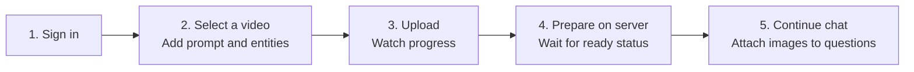
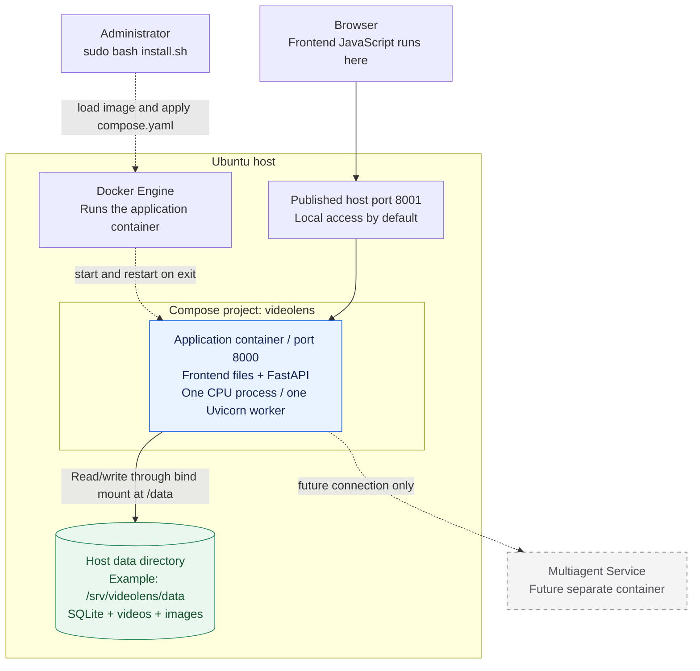

# Frame — frontend and backend architecture

> **High-level design (HLD)** - Deployment decision: Docker Compose on one Ubuntu host, with persistent host storage.
> The Docker image packages the current frontend and FastAPI backend. SQLite, videos, and images stay in a host directory mounted into the container. See the [Docker deployment guide](deployment/docker.md) for setup and operation. The Multiagent Service is a future separate container; its implementation is outside this design.

Frame has two responsibilities: let a user upload a video and continue its conversation, and keep that user's files and messages connected to the right session. This document explains those responsibilities and where they run.

| Start here | What you will find |
| --- | --- |
| **This HLD** | System view, responsibilities, deployment, and storage ownership |
| [Frontend LLD](design/frontend-design.md) | Screenshots, user interactions, browser states, and UI call chains |
| [Backend LLD](design/backend-design.md) | API contracts, processing sequences, data mapping, and class diagrams |

**On this page:** [User journey](#1-the-user-journey) · [Architecture](#2-the-architecture) · [Responsibilities](#3-who-does-what) · [Host storage](#4-where-the-data-lives) · [Docker Compose](#5-docker-compose-deployment) · [Recovery](#6-restarts-and-recovery) · [Decisions](#7-design-decisions-and-verification)

## 1. The user journey



- **One conversation = one video.** Follow-up questions and images stay with that conversation.
- **More than one upload can run.** Each upload started from New conversation has an independent draft and server upload ID, even when filenames, sizes, and modification times match. Earlier transfers continue.
- **Saved work survives refresh and login.** The backend keeps completed sessions and their messages. Browser storage restores interrupted drafts as Resume upload rows; select the intended draft and reselect its original video to continue.
- **An upload failure has a clear recovery path.** After transfer recovery fails, a popup explains the reason, clears that draft, and offers Choose video again with its prompt and filters restored. Cleanup targets only uploads that have no saved conversation.
- **Current preparation is metadata only.** It computes a checksum and optional video duration. Current chat answers metadata questions; recognition is not connected.

## 2. The architecture

The supplied Compose configuration runs one application container. Solid arrows show requests or storage access; dotted arrows show management or a future integration.



The frontend and backend remain separate source folders. The application image packages both because [main.py](../main.py) serves the frontend and `/api` from one FastAPI app. SQLite runs inside the backend process. Its database file and the media files live outside the container, in the mounted host directory.

### How the application starts

1. **Prepare the dependency base and package the application.** Build the reusable dependency image with `build_base.sh`. For each release, `package.sh` loads that saved base, copies the current application code into a derived image, and exports the final image with its Compose configuration and installer. Copy the release archive to Ubuntu.
2. **Install the release.** Extract it and run `sudo bash install.sh`. The installer prepares Docker when needed, creates the data directory and initial `.env`, loads the image, and starts Compose. Reruns preserve existing configuration and data.
3. **Docker starts FastAPI.** Compose mounts the host directory at `/data`, sets `FRAME_DATA_DIR=/data`, and publishes host port 8001 to container port 8000. The image's default command starts Uvicorn. The backend creates its database and media subdirectories as needed.
4. **Create an account and open the UI.** Run `docker compose exec app python manage_users.py create admin --admin`, then open `http://localhost:8001/` on the host. Direct LAN access requires an appropriate bind address and host networking configuration; WSL has additional networking requirements.

The [Docker deployment guide](deployment/docker.md) includes the exact commands for WSL and native Ubuntu, image transfer, accounts, and storage. The installer returns after the application passes its health check; Docker keeps running the container after the terminal closes.

### How a video and its conversation are handled

The browser sends video chunks to FastAPI. The backend saves them under `/data/videos` and records upload progress in SQLite. Upload completion finalizes the video; creating a conversation links that upload to a unique session. Backend metadata preparation runs in the same application process, and the browser polls for its status. Follow-up messages and image records are associated with the session, with image bytes stored under `/data/images`. Docker runs the application; FastAPI implements this user workflow.

### What happens during recovery

Compose configures `restart: unless-stopped` so Docker can restart the container after its process exits, unless it was deliberately stopped. A rebuilt or recreated container uses the same configured host directory. Startup restarts queued or unfinished metadata preparation from the beginning. In-flight requests may need retrying; upload finalization still has a crash window between renaming the video and committing its database status. Persistent files alone do not guarantee automatic recovery of every operation.

Application updates replace the single app container and cause a short outage. A host outage requires restoring that host or recovering onto another machine from backup. Automated off-host backups and power-loss recovery checks remain outstanding; see [restarts and recovery](#6-restarts-and-recovery).

Multiagent design and development will have their own folder later. This document reserves its separate-service box only. GPU execution or external API selection belongs to that future service.

## 3. Who does what

| Responsibility | Frontend | Backend |
| --- | --- | --- |
| Sign in | Collect credentials, restore the workspace | Check credentials, issue session cookie, enforce ownership |
| Video transfer | Slice the file into 8 MiB requests; show each draft's progress | Check offsets and limits; stream bytes to host storage |
| Conversation | Select the visible session; keep background drafts running | Create a unique session linked to one completed upload |
| Preparation | Poll preparing sessions, including background conversations; notify on observed completion | Compute SHA-256 and optional duration; persist ready/failed |
| Failed upload | Show the reason, reset its selection, and retry queued cleanup | Discard an owner-checked upload only when no conversation references it |
| Follow-up images | Preview images beside the question; send on Submit | Validate image bytes; attach image records to that message |
| Conversation history | Render text and protected image URLs | Persist and return only the signed-in user's session data |
| Delete a conversation | Open its options menu, confirm deletion, update the selected view | Check ownership and preparation state; remove that conversation's rows and referenced media |
| Maintenance | No maintenance UI | Administrator uses account and cleanup scripts |

The browser handles presentation and transfer. File validation, storage, metadata preparation, and access checks belong to the backend.

## 4. Where the data lives

The database is currently **SQLite**, so “database on the host” means its database file stays on the host disk. There is no separate database server in this design. Mount the entire data directory into the application container; SQLite must also be able to write its journal files there.

| Data | Example path on the Docker host | Path used by FastAPI |
| --- | --- | --- |
| Database and journals | `/srv/videolens/data/frame.sqlite3` and related files | `/data/frame.sqlite3` |
| Video being uploaded | `/srv/videolens/data/videos/{upload_id}.part` | `/data/videos/{upload_id}.part` |
| Completed video | `/srv/videolens/data/videos/{upload_id}.video` | `/data/videos/{upload_id}.video` |
| Chat image | `/srv/videolens/data/images/{session_id}/{stored_name}` | `/data/images/{session_id}/{stored_name}` |

Set **`FRAME_DATA_DIR=/data`** in the application container. The host path above is a deployment example; the existing local default is the repository's `data/` directory. Preserve the current directory contents when moving to the mounted path. Do not bake user data into the Docker image or use the container's writable layer for it.

The mapping is:

```text
User
 └─ Upload record ──────────────── Video file
     └─ Conversation (job ID = session ID)
         ├─ Messages
         └─ Image records ──────── Image files
              └─ message ID identifies the attached question
```

IDs and metadata live in SQLite; the video and image bytes live in files. See the [data model and class diagram](design/backend-design.md#6-data-model-and-class-diagrams) for exact relationships.

A user can delete one saved conversation from its sidebar menu. This removes its video, all registered images (including images uploaded but not attached to a message), messages, and upload/session records. Accounts, login sessions, and other conversations remain. Preparation must finish before deletion is allowed. The backend stages media before committing the database deletion, then removes the staged files; [deletion recovery details](design/backend-design.md#delete-one-conversation) cover rollback and incomplete file cleanup.

## 5. Docker Compose deployment

Use the [Docker deployment guide](deployment/docker.md) for the current deployment. [Dockerfile.base](../Dockerfile.base) defines the reusable Ubuntu/Python/library image. [Dockerfile](../Dockerfile) adds current application files and the startup command to that base. The repository also supplies [compose.yaml](../compose.yaml), [.dockerignore](../.dockerignore), and [.env.example](../.env.example). The same final image runs in WSL Ubuntu for testing and on a native Ubuntu server.

The host needs **Docker Engine, the Compose plugin, and a writable data directory**. Python, FastAPI dependencies, SQLite support, and FFmpeg are packaged in the image. The backend creates the SQLite file and the `videos/` and `images/` directories under `/data`. [setup.sh](../setup.sh) remains a local Python development setup script.

[build_base.sh](../build_base.sh) exports the dependency base separately. [package.sh](../package.sh) loads that archive and adds current code without installing libraries. A changed dependency list or base Dockerfile requires a new base build. The final archive includes the base layers, so the server only needs that final release. Run its included [install.sh](../install.sh) to prepare Docker and host storage, create the initial configuration, load the image, and start the application. Existing configuration and host data are preserved on reruns. See the [package workflow](deployment/docker.md#package-in-wsl-and-install-on-ubuntu).

| Resource | Current configuration | Reason |
| --- | --- | --- |
| Application image | Ubuntu 24.04, Python 3.12, requirements, frontend/backend code, maintenance scripts, and FFmpeg/`ffprobe` | Package the application and runtime tools together |
| Application process | Uvicorn on port 8000 with one worker and no `--reload` | Upload locks and preparation ownership belong to one process |
| Compose project | `videolens`, with one service named `app` | Start, stop, inspect, and update the application using Compose |
| Network entry | Host `127.0.0.1:8001` maps to container port 8000 by default | Serve the UI and `/api` on one origin; make LAN access an explicit configuration |
| Data storage | Pre-existing `HOST_DATA_DIR` bind-mounted read/write at `/data` | Keep SQLite, journals, videos, and images on the host across container replacement |
| File permissions | Non-root `APP_UID:APP_GID`, matching the host data owner | Allow writes to application data without running the app as root |
| Runtime restrictions | Read-only container root filesystem, writable `/tmp`, dropped capabilities | Keep runtime writes in the configured data and temporary locations |
| Process recovery | `restart: unless-stopped`, with a two-minute shutdown grace period | Restart an exited container while allowing deliberate stops |
| Health check | `/api/health` queried by Docker | Show process responsiveness; this does not test storage or restart a merely unhealthy process |
| Logs | Docker JSON logs with rotation | Inspect app output using `docker compose logs` and limit log growth |

A bind mount connects the host directory directly to the application. Container removal preserves that directory, but application file deletions still affect the host files. Keep one backend instance using it; neither Docker nor the mount enforces an application lock. [Docker bind mounts](https://docs.docker.com/engine/storage/bind-mounts/).

Docker must be running for the restart policy to work. Enable its service at boot on the Ubuntu server; shutting down WSL stops the test environment. A stopped or removed container needs an explicit start or Compose up operation as appropriate. [Docker restart policies](https://docs.docker.com/engine/containers/start-containers-automatically/).

For HTTPS deployment, configure a reverse proxy with the same hostname for `/` and `/api`, restrict access to the app port, and accept **at least 20 MiB image bodies** and 8 MiB video chunks. Configure timeouts for each request and appropriate request buffering. A 24-hour video uses many requests. Trust forwarded HTTPS headers only from the proxy so FastAPI can set secure cookies correctly. Keep media routes behind FastAPI's ownership checks. Proxy and TLS configuration remain deployment work.

**Host means the Ubuntu Docker host filesystem.** `/srv/videolens/data` is an example server path; the existing repository `data/` directory is the local development default. Verify disk capacity and permissions before migration. The current frontend/backend use CPU and require no GPU runtime or external model credentials.

## 6. Restarts and recovery

| Event | What survives | What the user or operator does |
| --- | --- | --- |
| Browser refresh | Saved database records, received video bytes, and locally saved draft details | Reopen a session, or select its Resume upload draft and reselect the original video |
| Application container restart | Data on the mounted host directory | Chunk recovery needs a successful status query. An interrupted-page draft can resume; a reported upload failure instead offers a fresh upload and queues cleanup. Startup reschedules unfinished metadata preparation |
| Container recreation or image update | Same host files when `HOST_DATA_DIR` is preserved | Reuse that directory and keep one backend instance writing to it |
| Storage host unavailable | Files remain tied to that host | Restore the host or recover from backup; automatic failover to another host is not provided |
| Manual cleanup | Accounts stay unless explicitly included | Stop the application, preview cleanup, then execute only the intended reset |
| Delete one conversation | Accounts and other conversations remain | Confirm in the sidebar menu; a file-cleanup warning requires administrator attention |
| Failed-upload cleanup cannot reach the server | Its known upload ID remains queued in browser storage when available | Retry on network recovery and every 15 seconds while signed in with the page open; reload/sign-in restores the cleanup queue |

The file system and SQLite are separate persistence operations. Recovery works for saved upload offsets, but the code does not provide an atomic transaction covering both files and database rows. Specific failure cases are recorded in the [backend recovery notes](design/backend-design.md#7-failure-handling-and-operational-limits).

Upload-saved and preparing-to-ready alerts are separate events. The frontend suppresses repeats using per-user/job/event browser records and Web Locks where available; opening or reloading an already-ready conversation stays quiet. Notifications depend on an open page and are not server push. Optional browser-alert errors do not invalidate saved uploads.

## 7. Design decisions and verification

| Decision | Outcome |
| --- | --- |
| D1 — Frontend and backend own this design | Three focused documents: HLD, frontend LLD, backend LLD |
| D2 — Deploy with Docker Compose | One application container serves the existing frontend and backend |
| D3 — Database and media stay on the host | SQLite and files persist through a host directory mounted at `/data` |
| D4 — Keep one backend writer | One app container, one Uvicorn worker, controlled replacement |
| D5 — Keep future scope small | One Multiagent Service box; its implementation and design are deferred |

Before deploying, verify: the same user can reopen sessions after container recreation; two uploads can advance independently; the chosen reverse proxy accepts the configured chunk/image sizes; cross-user media is denied; interrupted uploads resume; and a backed-up database plus media directory can be restored together. Current tests cover small concurrent transfers, ownership, chat/image mapping, cleanup, and Docker container recreation. Real 24-hour-file performance, native-server networking, and power-loss recovery still require deployment-specific validation.

For implementation details, continue with the [frontend LLD](design/frontend-design.md) or [backend LLD](design/backend-design.md).
