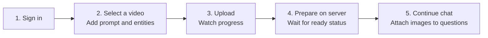
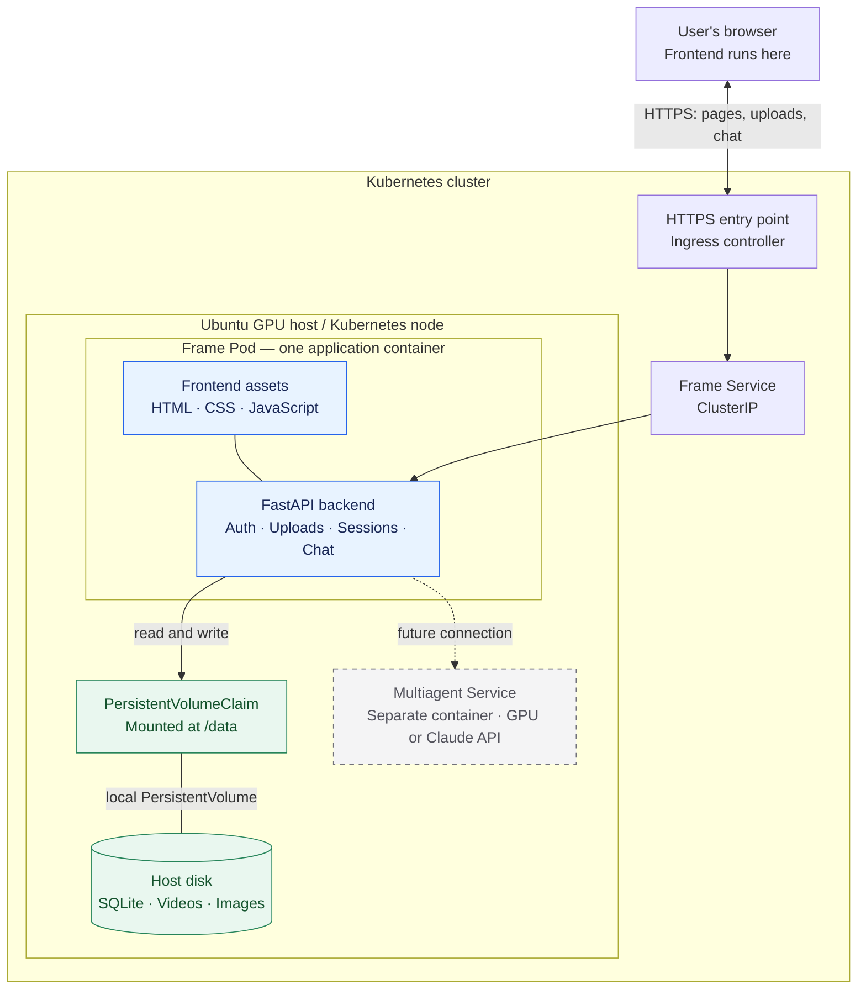

# Frame — frontend and backend architecture

> **High-level design (HLD)** · Deployment decision: Docker + Kubernetes on an Ubuntu GPU host, with host storage.
> The application behavior below exists today. Container packaging and Kubernetes resources described here are the agreed deployment design; they have not yet been added to this repository.

Frame has two responsibilities: let a user upload a video and continue its conversation, and keep that user's files and messages connected to the right session. This document explains those responsibilities and where they run.

| Start here | What you will find |
| --- | --- |
| **This HLD** | System view, responsibilities, deployment, and storage ownership |
| [Frontend LLD](design/frontend-design.md) | Screenshots, user interactions, browser states, and UI call chains |
| [Backend LLD](design/backend-design.md) | API contracts, processing sequences, data mapping, and class diagrams |

**On this page:** [User journey](#1-the-user-journey) · [Architecture](#2-the-architecture) · [Responsibilities](#3-who-does-what) · [Host storage](#4-where-the-data-lives) · [Kubernetes](#5-docker-and-kubernetes-deployment) · [Recovery](#6-restarts-and-recovery) · [Decisions](#7-design-decisions-and-verification)

## 1. The user journey



- **One conversation = one video.** Follow-up questions and images stay with that conversation.
- **More than one upload can run.** Each upload started from New conversation has an independent draft and server upload ID, even when filenames, sizes, and modification times match. Earlier transfers continue.
- **Saved work survives refresh and login.** The backend keeps completed sessions and their messages. Browser storage restores interrupted drafts as Resume upload rows; select the intended draft and reselect its original video to continue.
- **Current preparation is metadata only.** It computes a checksum and optional video duration. Current chat answers metadata questions; recognition is not connected.

## 2. The architecture

Solid arrows show the frontend/backend data path. The dotted arrow reserves a future connection only.



The frontend and backend remain separate source folders. The application image packages both because [main.py](../main.py) already serves the frontend and `/api` from one FastAPI app. The browser uses one origin for cookies, API requests, and images. The deployment runs on an Ubuntu machine with a GPU. Multiagent design and development will have their own folder later; this document reserves only its separate-container box, with the requested GPU execution or Claude API fallback.

## 3. Who does what

| Responsibility | Frontend | Backend |
| --- | --- | --- |
| Sign in | Collect credentials, restore the workspace | Check credentials, issue session cookie, enforce ownership |
| Video transfer | Slice the file into 8 MiB requests; show each draft's progress | Check offsets and limits; stream bytes to host storage |
| Conversation | Select the visible session; keep background drafts running | Create a unique session linked to one completed upload |
| Preparation | Poll the selected session; show its status | Compute SHA-256 and optional duration; persist ready/failed |
| Follow-up images | Preview images beside the question; send on Submit | Validate image bytes; attach image records to that message |
| Conversation history | Render text and protected image URLs | Persist and return only the signed-in user's session data |
| Delete a conversation | Open its options menu, confirm deletion, update the selected view | Check ownership and preparation state; remove that conversation's rows and referenced media |
| Maintenance | No maintenance UI | Administrator uses account and cleanup scripts |

The browser handles presentation and transfer. File validation, storage, metadata preparation, and access checks belong to the backend.

## 4. Where the data lives

The database is currently **SQLite**, so “database on the host” means its database file stays on the host disk. There is no separate database server in this design. Mount the entire data directory into the application container; SQLite must also be able to write its journal files there.

| Data | Example path on the Kubernetes host | Path used by FastAPI |
| --- | --- | --- |
| Database and journals | `/srv/frame/data/frame.sqlite3` and related files | `/data/frame.sqlite3` |
| Video being uploaded | `/srv/frame/data/videos/{upload_id}.part` | `/data/videos/{upload_id}.part` |
| Completed video | `/srv/frame/data/videos/{upload_id}.video` | `/data/videos/{upload_id}.video` |
| Chat image | `/srv/frame/data/images/{session_id}/{stored_name}` | `/data/images/{session_id}/{stored_name}` |

Set **`FRAME_DATA_DIR=/data`** in the application container. The host path above is a deployment example; the existing local default is the repository's `data/` directory. Preserve the current directory contents when moving to the mounted path. Do not bake user data into the Docker image or use the container's writable layer for it.

The mapping is:

```text
User
 └─ Upload record ──────────────── Video file
     └─ Conversation (job ID = session ID)
         ├─ Messages
         └─ Image records ──────── Image files
              └─ message ID identifies the attached question
```

IDs and metadata live in SQLite; the video and image bytes live in files. See the [data model and class diagram](design/backend-design.md#6-data-model-and-class-diagrams) for exact relationships.

A user can delete one saved conversation from its sidebar menu. This removes its video, all registered images (including images uploaded but not attached to a message), messages, and upload/session records. Accounts, login sessions, and other conversations remain. Preparation must finish before deletion is allowed. The backend stages media before committing the database deletion, then removes the staged files; [deletion recovery details](design/backend-design.md#delete-one-conversation) cover rollback and incomplete file cleanup.

## 5. Docker and Kubernetes deployment

These are deployment settings to implement, not a report of resources currently running.

| Resource | Selected design | Reason |
| --- | --- | --- |
| Application image | Python runtime, requirements, `main.py`, `backend/`, `frontend/`, `manage_users.py`, `cleanup_data.py`; include `ffprobe` for duration | Package the application, maintenance commands, and runtime tools |
| Application process | `uvicorn main:app --host 0.0.0.0 --port 8000 --workers 1`; no `--reload` | Upload locks and preparation ownership currently belong to one process |
| Compute host | Ubuntu Kubernetes node with persistent host disk and GPU hardware | Frontend/backend run on CPU; they do not reserve GPU devices or need CUDA for current behavior |
| Deployment | One replica; `Recreate` update strategy | Avoid old/new application pods overlapping during normal upgrades; upgrades cause a brief outage |
| Service | ClusterIP targeting port 8000 | Stable route to the application pod |
| HTTPS entry | Ingress and an installed controller; same hostname for `/` and `/api` | Serve the UI, cookies, and API through one origin |
| Data volume | Static **local PersistentVolume**, matching PVC, mounted at `/data` | Keep the database, videos, and images on the selected host |
| Volume placement | PV `nodeAffinity`; StorageClass `kubernetes.io/no-provisioner` with `WaitForFirstConsumer` | Schedule the pod where its host data exists |
| Data lifecycle | PV reclaim policy `Retain`; host-directory permissions for the application user | Separate application replacement from data removal |
| Availability checks | Use `/api/health` for basic process checks; add storage-aware readiness before release | Current health response does not test database or disk access |

Local PVs require node affinity, and delayed binding allows Kubernetes to consider the pod's placement. A local volume remains tied to its node; Kubernetes does not copy it to another host. [Kubernetes local volumes](https://kubernetes.io/docs/concepts/storage/volumes/#local), [volume binding](https://kubernetes.io/docs/concepts/storage/storage-classes/#volume-binding-mode).

`Recreate` stops old pods before replacements during a deployment update. It is not a distributed lock: do not manually run another backend or force-delete a pod whose process may still be writing. ReadWriteOnce also does not mean “one application writer.” [Kubernetes deployment strategy](https://kubernetes.io/docs/concepts/workloads/controllers/deployment/#recreate-deployment), [volume access modes](https://kubernetes.io/docs/concepts/storage/persistent-volumes/#access-modes).

Configure the chosen ingress to accept **at least 20 MiB image bodies** and 8 MiB video chunks, with timeouts for each request and appropriate request buffering. A 24-hour video is many requests, not one day-long request. Trust forwarded HTTPS headers only from the ingress so FastAPI can set secure cookies correctly. Keep media routes behind FastAPI's ownership checks.

**Host means the Ubuntu Kubernetes node filesystem.** `/srv/frame/data` is a Linux deployment path; the current Windows project directory is the development workspace. Exact Ubuntu version, node name, host directory, ingress implementation, disk capacity, and resource requests remain environment configuration. GPU allocation and Claude credentials belong to the deferred service configuration; they are not required to run the current frontend/backend.

## 6. Restarts and recovery

| Event | What survives | What the user or operator does |
| --- | --- | --- |
| Browser refresh | Saved database records, received video bytes, and locally saved draft details | Reopen a session, or select its Resume upload draft and reselect the original video |
| Application container restart | Data on the mounted host directory | Retry a failed draft; automatic chunk recovery needs a successful status query. Startup reschedules unfinished metadata preparation |
| Container image / pod replacement | Same host data if the PVC is retained | Reattach the existing claim and keep the single-writer rule |
| Storage host unavailable | Files remain tied to that host | Restore the host or recover from backup; automatic cross-node failover is not provided |
| Manual cleanup | Accounts stay unless explicitly included | Stop the application, preview cleanup, then execute only the intended reset |
| Delete one conversation | Accounts and other conversations remain | Confirm in the sidebar menu; a file-cleanup warning requires administrator attention |

The file system and SQLite are separate persistence operations. Recovery works for saved upload offsets, but the code does not provide an atomic transaction covering both files and database rows. Specific failure cases are recorded in the [backend recovery notes](design/backend-design.md#7-failure-handling-and-operational-limits).

## 7. Design decisions and verification

| Decision | Outcome |
| --- | --- |
| D1 — Frontend and backend own this design | Three focused documents: HLD, frontend LLD, backend LLD |
| D2 — Docker images run on Kubernetes | Single application pod serves the existing frontend and backend |
| D3 — Database and media stay on the host | SQLite and files persist through a local PV/PVC mount |
| D4 — Keep one backend writer | One replica, one Uvicorn worker, controlled replacement |
| D5 — Keep future scope small | One Multiagent Service box; its implementation and design are deferred |

Before deploying, verify: the same user can reopen sessions after a pod replacement; two uploads can advance independently; ingress accepts the configured chunk/image sizes; cross-user media is denied; interrupted uploads resume; and a backed-up database plus media directory can be restored together. Current tests cover small concurrent transfers, ownership, chat/image mapping, and cleanup, not Kubernetes or 24-hour-file performance.

For implementation details, continue with the [frontend LLD](design/frontend-design.md) or [backend LLD](design/backend-design.md).
