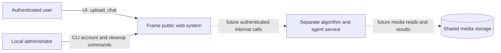
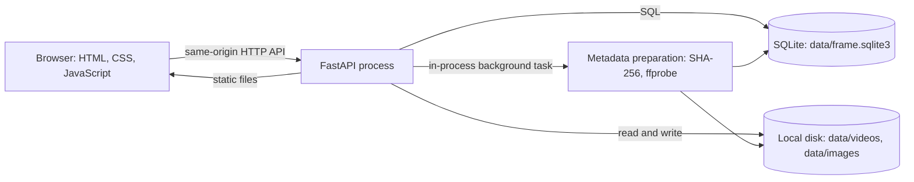
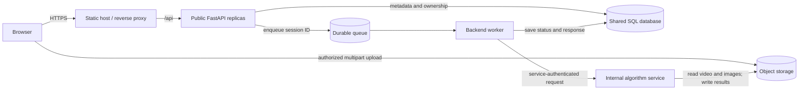
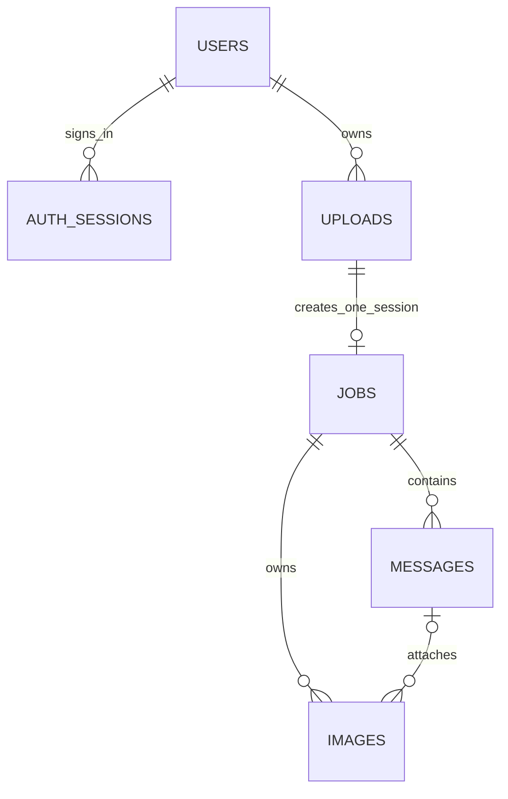

# Frame video analyzer — high-level design (HLD)

**Status:** implemented local system plus clearly marked target architecture

**Scope:** browser UI, public FastAPI service, persisted media and metadata, and the planned boundary to a separate internal algorithm service

**Detailed design:** [frontend and API LLD](design/frontend-design.md)

## 1. Purpose and boundaries

Frame lets an authenticated user create conversations, upload one video per conversation, add reference images to follow-up questions, and see a response. A session is identified by `jobs.id`; each session references exactly one `uploads.id`. Multiple sessions and uploads may belong to the same user. The current response engine answers only stored metadata questions. Video detection, image understanding, and the agent are **not implemented in this repository**.

The public backend owns identity, authorization, upload coordination, sessions, chat history, and browser-visible media URLs. A future algorithm service will own media analysis and agent execution in a separate project. The browser must never call that internal service directly.

## 2. Quality goals and constraints

| Concern | Current design | Target for multi-instance production |
| --- | --- | --- |
| Large media | Browser sends 8 MiB chunks; server streams each request to local disk; configured video limit is 250 GiB | Resumable multipart upload to shared object storage; capacity, retention, and quotas defined operationally |
| Concurrent sessions | Distinct upload IDs have separate in-process locks; one video receives ordered chunks | Coordination must survive multiple API processes and hosts |
| Durability | SQLite holds records; `data/` holds media; no automated backup or retention policy | Shared relational database, durable media storage, backups, lifecycle policy |
| Processing | FastAPI background task computes SHA-256 and optional `ffprobe` duration | Durable queue and independent workers; internal algorithm service consumes storage keys |
| Identity | HttpOnly session cookie, CSRF token, per-user ownership checks | HTTPS termination, secrets management, rate limiting, audit and monitoring |
| Recovery | Saved upload offset supports retry; pending preprocessing is resumed on process startup | Idempotent work, retries, dead-letter handling, explicit job state transitions |

These are design goals, not claims that the target features already exist. No throughput or availability SLA has been measured.

## 3. System context



The algorithm service is a separate trust boundary. It must use service authentication and private connectivity; a browser session cookie is not an internal-service credential.

## 4. Container view

### 4.1 Implemented local deployment



`main.py` mounts the frontend and API in one process. SQLite and media files are local to that host. This deployment should run as a **single API process** unless storage and upload coordination are redesigned. A per-upload Python lock does not coordinate separate workers or machines. Synchronous file writes and `fsync` can briefly block the event loop. Local preprocessing uses an API background task, so it is not a durable distributed job queue.

### 4.2 Target deployment — planned, not implemented



The public API authorizes uploads and issues limited storage access. The browser transfers video bytes to storage. The worker passes references, not the full video body, to the algorithm service. The public API remains the only source of browser-visible session status and owner-checked result URLs. Exact storage, queue, database provider, and internal endpoints remain design decisions.

## 5. Data ownership and mapping



| Record | Primary key | Link and responsibility |
| --- | --- | --- |
| `users` | `id` | Account and password hash |
| `auth_sessions` | `token_hash` | `user_id`; expiring login and CSRF state |
| `uploads` | `id` | `user_id`; filename, byte count, committed offset, transfer status |
| `jobs` | `id` = `session_id` | `upload_id` is unique; entities, instructions, preparation status and metadata |
| `messages` | integer `id` | `job_id`; ordered user and assistant text |
| `images` | `id` | `session_id`; stored filename and optional `message_id` |

Video bytes live at `data/videos/{upload_id}.part` during transfer and `data/videos/{upload_id}.video` after completion. Image bytes live at `data/images/{session_id}/{stored_name}`. Paths are server-side implementation details; clients receive API IDs and authorized image URLs. SQLite contains references and metadata, not the media bodies. The backend derives a future algorithm request by joining `jobs` to `uploads` and selecting images for the same session/message.

## 6. Critical journeys

| Journey | Current behavior | Detailed flow |
| --- | --- | --- |
| Sign in and restore | Cookie authenticates; backend lists only owned jobs | [LLD: identity](design/frontend-design.md#4-identity-and-authorization) |
| Upload and create session | Resume by committed offset; complete file; create one job per upload | [LLD: video transfer](design/frontend-design.md#5-video-transfer-and-session-creation) |
| Prepare and notify | Hash and optional duration; poll status until ready/failed | [LLD: preparation](design/frontend-design.md#6-preparation-and-status) |
| Follow-up question with images | Validate and store images, attach to a message, return metadata-based answer | [LLD: chat](design/frontend-design.md#7-chat-and-image-flow) |

**State meaning:** `ready` currently means metadata preparation finished. It does not imply video detection or image matching. The browser's completion notification is a toast and, if permission was granted and the page is open, a browser notification; there is no server push or offline push service.

## 7. External and internal interfaces

The implemented same-origin `/api` surface is documented in the [LLD endpoint matrix](design/frontend-design.md#3-interface-contracts). All protected calls require a valid session cookie; modifying calls also require `X-CSRF-Token`. Ownership is checked before returning an upload, job, message, or image. The static frontend is served at `/`.

The following is a **proposed integration contract**, not a current endpoint:

```json
{
  "session_id": "<job UUID>",
  "video_key": "videos/<upload UUID>.video",
  "image_keys": ["images/<session UUID>/<stored name>"],
  "question": "Is this person in the video?"
}
```

The public backend must derive these keys from owner-checked database records; the browser must not supply arbitrary storage paths. The algorithm service should return structured answer, timestamps, result-image keys, and task status. The public backend will persist those as session messages and serve result images through authorized URLs. Service credential, request schema, idempotency key, callback/polling choice, and retry policy are still open design items.

## 8. Deployment, operations, and risks

For the current local deployment, persist and back up the whole `data/` directory, run a single API process, and terminate HTTPS at a reverse proxy for remote access. Monitor disk free space and failed jobs; a 24-hour upload can consume substantial disk and I/O. `cleanup_data.py` previews or resets database-linked media and session records, but it is a manual maintenance command and not a retention scheduler. Stop the API before running it.

Before scaling to multiple API instances, replace local media storage and in-process upload locks, move metadata to a shared server database, and move processing to durable workers. Add operational tests for interrupted uploads, restart recovery, concurrent writers, capacity exhaustion, backup restoration, and authorization across sessions. The current automated tests cover authentication, session ownership, concurrent uploads, and cleanup behavior; they do not establish production capacity.

## 9. Source of truth

| Area | Implementation |
| --- | --- |
| App assembly and static mount | `main.py` |
| Auth and ownership middleware | `backend/auth.py` |
| SQLite schema and connection | `backend/db.py` |
| Upload protocol and storage | `backend/uploads.py`, `backend/config.py` |
| Session creation and metadata | `backend/jobs.py`, `backend/video_metadata.py` |
| Image and chat endpoints | `backend/images.py`, `backend/chat.py` |
| Browser behavior | `frontend/script.js` |

Diagram levels follow the [C4 model](https://c4model.com/diagrams); Mermaid provides the notation. Source code remains authoritative if a document becomes stale.
