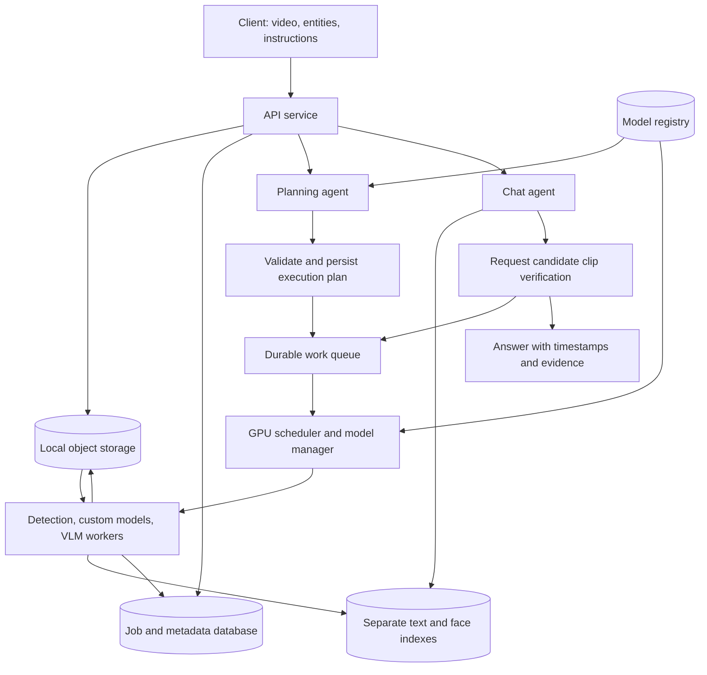
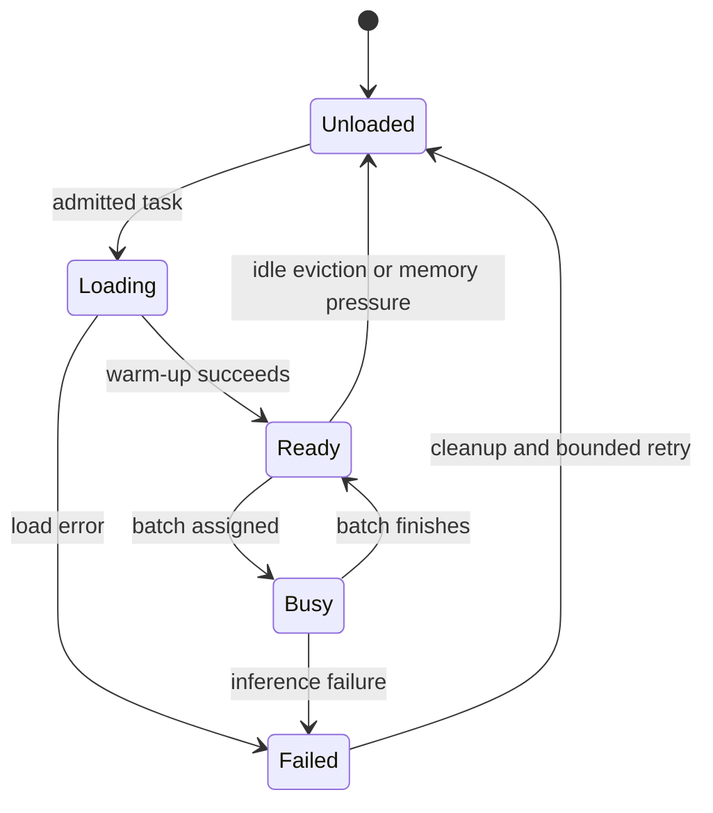

# Offline video analysis: dynamic model architecture

Status: proposed design, updated from the initial HTML and project discussion.

## Purpose and scope

Analyze prerecorded videos using a request-specific pipeline. Users select entities or describe their analysis needs. An agent selects suitable registered models, and a GPU scheduler loads them when needed and executes the plan efficiently.

The service is API-first. A future client can provide entity selection controls and a free-text instruction field. Analysis covers the whole frame; there is no region selection.

Deployment assumption: inference, storage, and orchestration run locally without internet access. Required model weights and dependencies must be provisioned before use. Supported requests are bounded by installed model capabilities and available hardware.

## Architecture



## Responsibilities

| Component | Responsibility |
|---|---|
| API service | Accept uploads and instructions; expose job status, chat, and evidence endpoints. |
| Planning agent | Map the user's request to capabilities, choose registered models and stages, and explain unsupported requests. |
| Model registry | Describe installed models, capabilities, versions, local artifacts, resource profiles, and input/output contracts. |
| Plan validator | Check compatibility, resource feasibility, and supported entities before execution. |
| Durable queue and job store | Track pending work, leases, retries, progress, cancellation, and recovery. |
| GPU scheduler | Assign work to GPUs, control concurrency, batch compatible tasks, and prioritize interactive work. |
| Model manager | Load, warm, reuse, and safely unload models under scheduler control. |
| Processing workers | Decode video and execute detection, custom inference, captioning, embedding, and verification stages. |
| Chat agent | Retrieve candidate moments, request additional evidence analysis, and produce grounded answers. |

The agent chooses the analysis steps. Resource allocation remains under deterministic scheduler control. Simple entity selections can map directly to a validated plan without an agent call.

## Upload and planning flow

1. Store the uploaded video and create independent `video_id` and `job_id` values.
2. Return an accepted response with the job identifier once upload persistence succeeds.
3. Probe duration, frame rate, dimensions, and codec.
4. Resolve the selected entities and free-text instructions against the model registry.
5. Build and validate a versioned execution plan, including sampling policy, models, thresholds, and outputs.
6. Persist the plan and enqueue chunk tasks.
7. Publish progress and mark the analysis ready only after required outputs are durable.

Entity detection and behavior analysis are distinct capabilities. A selection such as “cars” can use a detector; “damaged cars” may require a detector followed by a custom damage model. Unsupported capabilities must be reported rather than silently replaced.

Example plan, using illustrative model identifiers:

```json
{
  "video_id": "vid_001",
  "analysis_id": "analysis_001",
  "request": "Find damaged vehicles",
  "entities": ["car", "truck"],
  "scope": "full_frame",
  "stages": [
    {"task": "detect", "model_id": "vehicle_detector_v1"},
    {"task": "classify_crops", "model_id": "vehicle_damage_v1"},
    {"task": "verify_candidates", "model_id": "local_vlm_v1"},
    {"task": "embed_descriptions", "model_id": "text_embedder_v1"}
  ],
  "sampling": {"baseline_enabled": true, "motion_priority": true},
  "retain_original": true
}
```

Sampling rates, batch sizes, and chunk lengths are configurable and must be measured on the target hardware. The initial HTML's 6 FPS, 15-minute chunks, and 5% retention are not fixed requirements.

## Filtering and evidence processing

Use fast detectors, including YOLO-compatible or custom models, for supported entity filtering. A VLM is reserved for interpretation or verification when required by the plan. A request needing a capability unavailable in fast detectors can use another registered model if its resource profile is feasible.

Maintain periodic baseline samples across the full video. Motion can increase processing priority but must not be the only gate before detection, since stationary subjects can matter. Preserve candidate timestamps and surrounding clip intervals, not only isolated screenshots.

Pipeline stages:

1. Decode bounded chunks while preserving original presentation timestamps.
2. Apply baseline sampling and optional motion prioritization.
3. Detect selected entities and retain candidate observations.
4. Run any requested custom models on frames, crops, or clips matching their input contracts.
5. Use temporal analysis or VLM clip verification for behavior requests.
6. Store observations, evidence, and searchable descriptions with model and plan provenance.

Filtering reduces search coverage. Store that scope with each analysis and surface it in answers. Expanded requests can create a new analysis over the retained original video.

## Model registry

Each registered version records:

- Stable model ID, artifact version or checksum, local weight path, and runtime adapter.
- Supported tasks and entity vocabulary.
- Expected input type, preprocessing, output schema, and embedding space where applicable.
- Supported device and precision settings.
- Measured resident memory and peak inference memory for supported batch/input profiles.
- Compatible downstream stages, health status, and load/warm-up measurements.

Custom models implement a common adapter contract: `load`, `warmup`, `infer`, `health`, and `unload`. Registry validation checks that local artifacts exist and that outputs match the declared schema. An agent cannot invent model IDs or load arbitrary user-supplied executable paths.

## Runtime loading and GPU scheduling

The objective is high useful throughput while preserving memory headroom and acceptable chat latency. GPU memory occupancy alone is not the optimization target.

Model lifecycle:



- Admit work using resident model memory plus estimated peak inference memory and a configured safety margin.
- Reuse warm models and batch compatible tasks from queued chunks instead of swapping on every frame.
- Bound CPU decode and staging queues so preprocessing cannot exhaust host memory.
- Allow concurrent models only when profiling demonstrates safe memory use and useful throughput.
- Evict idle models first; never unload a model with active inference references.
- Prioritize interactive verification at batch boundaries, with fairness to prevent ingestion starvation.
- On out-of-memory errors, release failed allocations and retry with a smaller supported batch/profile. Fail clearly after bounded retries.
- Include planning and chat LLMs in the same resource accounting if they use the GPU.

Start with one scheduler controlling each GPU. Multiple API or worker processes must not independently load models without coordinated reservations. Multi-GPU routing can later use device capability and model affinity.

## Storage and identity

| Record or store | Contents |
|---|---|
| Video | Original asset, duration, codec, checksum, and storage key. |
| Analysis | Video reference, user scope, plan version, selected models, and completion state. |
| Job/chunk | Stage, attempts, progress, lease, checkpoint, and failure details. |
| Frame | Unique frame ID, video reference, original timestamp, and optional image key. |
| Detection | Frame/clip reference, entity class, bounding box, confidence, and model version. |
| Event | Start/end timestamps, supporting observations, and verification status. |
| Chat session | Independent conversation identity and referenced analyses. |
| Text index | Description embeddings and references to evidence records. |
| Face index, when requested | Face embeddings, detection references, model version, and embedding space. |

Use separate indexes for incompatible embedding spaces. Support multiple detections per frame. Do not use integer seconds as unique frame IDs. Store integer timestamp units such as milliseconds with a documented time base.

Object storage holds originals, evidence images, and optional derived clips. A relational database is the source of truth for jobs and relationships; the vector index supports retrieval. Persist stable object keys and expose evidence through an API-accessible URL instead of returning only an `s3://` path.

## Chat and verification

1. Resolve the requested video/analysis and conversation context.
2. Check whether the question falls within the indexed analysis scope.
3. Search the appropriate index with explicit video/analysis filters.
4. Retrieve candidate evidence and surrounding clips.
5. Schedule verification when needed to support the requested claim.
6. Return an answer, timestamps, evidence links, and any coverage limitations.

A nearest-neighbor match is a candidate, not proof. Return “insufficient evidence” when verification does not support a conclusion. Face matching, when enabled, uses the same embedding model for indexing and queries and calibrated thresholds; it is not described as exact matching.

## API and job lifecycle

Proposed endpoints:

| Endpoint | Purpose |
|---|---|
| `GET /capabilities` | List currently supported entities and analysis tasks for UI controls. |
| `POST /videos` | Upload video with analysis configuration; return video and job IDs. |
| `GET /jobs/{job_id}` | Return lifecycle state, stage progress, and errors. |
| `POST /jobs/{job_id}/cancel` | Request cancellation at a safe execution boundary. |
| `POST /videos/{video_id}/analyses` | Create an analysis with new scope or models. |
| `POST /chat` | Submit a question and explicit video/analysis references. |
| `GET /evidence/{evidence_id}` | Access an evidence image or clip. |

Job states: `queued`, `planning`, `processing`, `indexing`, `ready`, `failed`, and `cancelled`. Verification requiring longer processing returns a job reference for polling. Chat history ownership remains an API contract decision; execution state is always persisted server-side.

Workers use leases and idempotent stage outputs so interrupted chunks can resume without duplicate records. Final readiness requires successful persistence of all mandatory stages. Persistent volumes need backups and recovery validation; persistence alone does not guarantee zero data loss.

## Deployment and validation

Begin with a local container deployment: API, durable job queue, metadata database, object storage, vector index, and a GPU worker/scheduler. Kubernetes is an optional later deployment target. Choose concrete database, queue, and inference runtimes after hardware and operational requirements are established.

Validate on representative labeled clips before a full 24-hour run:

- Entity/event recall after filtering, including stationary subjects and short events.
- Answer correctness and timestamp alignment against source clips.
- Processing throughput, peak GPU memory, model load overhead, and interactive latency.
- Recovery from worker termination, failed model loading, and out-of-memory errors.
- Reanalysis behavior when the user expands the original scope.

Open implementation decisions: target GPU/VRAM, initial model catalog, expected video resolutions and concurrency, latency targets, retention policy, and chat history ownership.
