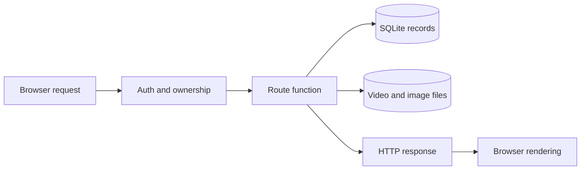
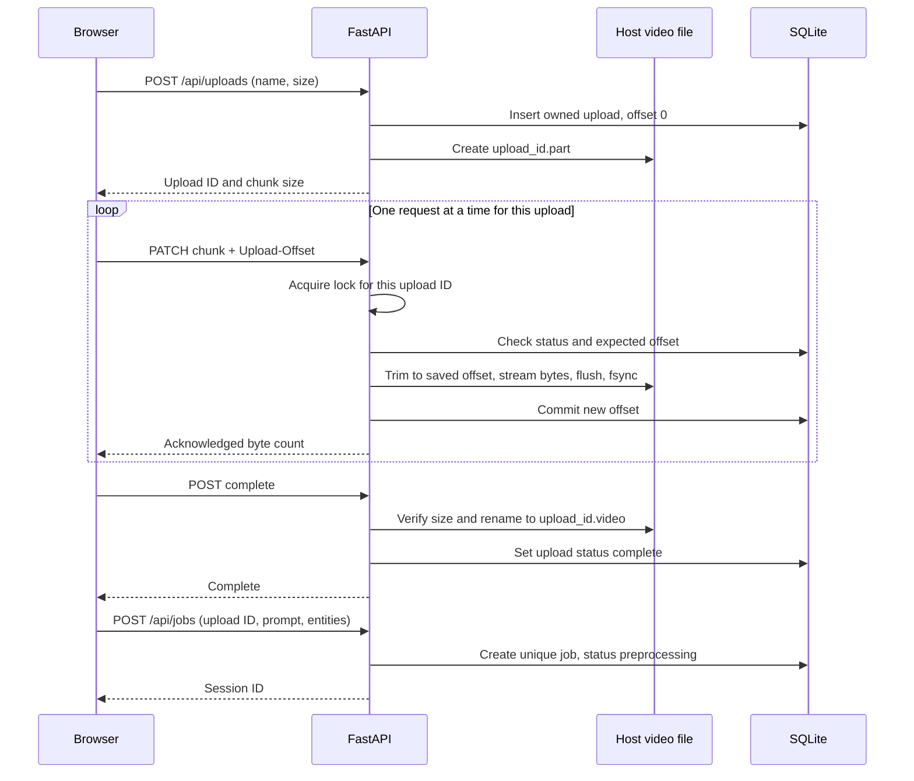
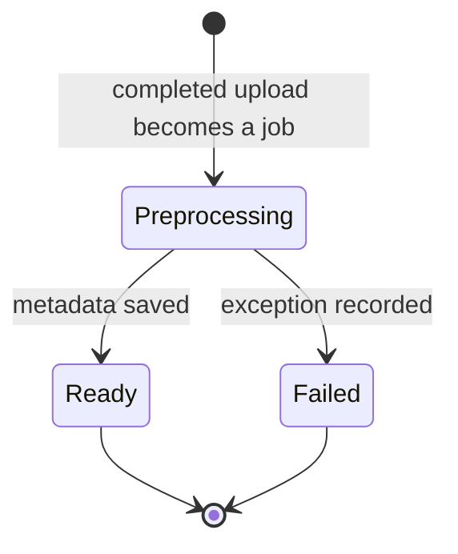
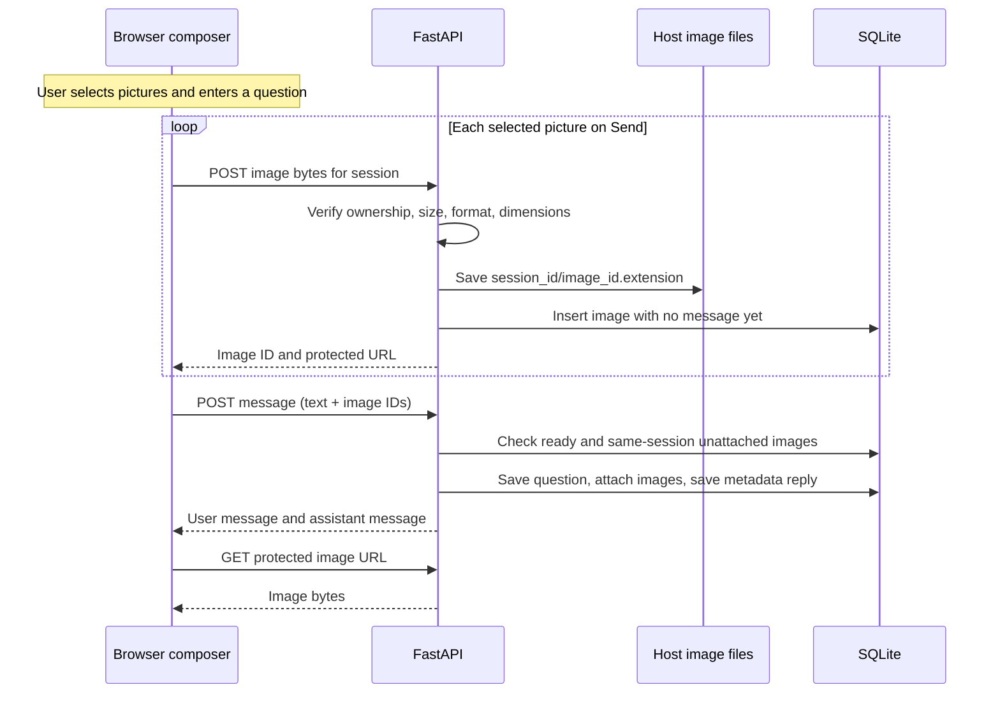
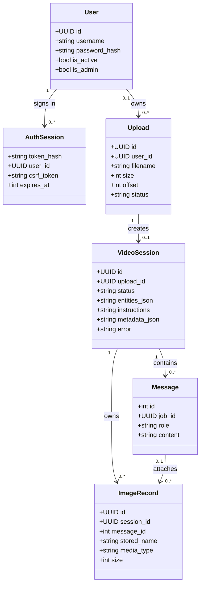
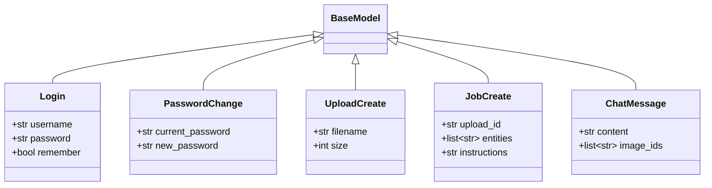

# Backend design — APIs, storage, and session mapping

> **Low-level design (LLD)** · Describes the current Python implementation.
> Deployment target: one FastAPI application container on the Ubuntu Kubernetes host, with `/data` mounted from host storage.

[Architecture overview](../architecture.md) · [Frontend screens and interactions](frontend-design.md)

**On this page:** [Modules](#1-backend-components) · [Identity](#2-identity-and-access) · [API reference](#3-api-contracts) · [Video flow](#4-video-upload-and-preparation) · [Chat and images](#5-chat-and-image-flow) · [Class diagrams](#6-data-model-and-class-diagrams) · [Recovery](#7-failure-handling-and-operational-limits)

## 1. Backend components

The backend accepts requests from the browser, owns all database writes, and saves media into the mounted host directory. It currently uses route functions and direct SQL. The table below maps responsibilities to existing functions; no unimplemented service classes are implied.

| Module | Entry points | Responsibility |
| --- | --- | --- |
| [main.py](../../main.py) | `app`, `lifespan` | Register middleware and routers, serve frontend assets, resume unfinished preparation |
| [auth.py](../../backend/auth.py) | `protect_api`, `authenticate`, `login` | Session cookies, CSRF, user ownership |
| [uploads.py](../../backend/uploads.py) | `create_upload`, `append_upload`, `complete_upload`, `lock_for` | Ordered, resumable video transfer |
| [jobs.py](../../backend/jobs.py) | `create_job`, `preprocess_video`, `job_status` | Video-to-conversation mapping and preparation status |
| [conversation_deletion.py](../../backend/conversation_deletion.py) | `delete_conversation` | Owner-scoped conversation deletion, staged media removal, rollback and purge reporting |
| [video_metadata.py](../../backend/video_metadata.py) | `inspect_video` | Read the file, calculate SHA-256, optionally obtain duration |
| [images.py](../../backend/images.py) | `upload_image`, `image_response`, `get_image` | Validate images, persist file references, serve authorized bytes |
| [chat.py](../../backend/chat.py) | `send_message`, `list_messages` | Persist questions, image associations, and current metadata replies |
| [db.py](../../backend/db.py) | `initialize_db`, `db_connection` | SQLite tables, incremental schema initialization, transaction scope |
| [schemas.py](../../backend/schemas.py) | Pydantic request models | JSON field validation |
| [config.py](../../backend/config.py) | `DATA_DIR`, `UPLOAD_DIR`, `IMAGE_DIR`, `DB_PATH`, size constants | Storage paths from `FRAME_DATA_DIR` and upload limits |



`main.py` mounts the frontend last so API paths take precedence. All app routes share one origin. The current application does not use GPU execution; the separate service appears only in the [HLD architecture box](../architecture.md#2-the-architecture).

## 2. Identity and access

1. Login verifies an active account and its password hash. It creates an opaque cookie token and stores the token's SHA-256 digest in `auth_sessions`.
2. Requests with `frame_session` are authenticated against the stored digest, expiry, and active user.
3. Protected writes must send the JSON `csrf_token` returned by login or `/api/me` in the `X-CSRF-Token` header. Login itself is exempt.
4. An upload owner is read from `uploads.user_id`. A conversation's owner is resolved through `jobs.upload_id -> uploads.user_id`. Image and message requests use that same conversation ownership.

| Setting | Current behavior |
| --- | --- |
| Cookie | `frame_session`, HttpOnly, SameSite Strict, path `/` |
| HTTPS | Secure cookie when FastAPI sees the request scheme as HTTPS; ingress forwarding must be configured correctly |
| Lifetime | 12-hour server expiry without remember-me; 7 days with remember-me |
| Browser storage | Identity and CSRF held in memory; upload/session selection IDs may be in local storage |
| Public endpoints | Health and login; `/api/me` authenticates directly despite its middleware exemption |
| Ownership errors | Missing or inaccessible upload/session returns 404 |
| Administration | Local [manage_users.py](../../manage_users.py); `is_admin` is stored but does not add API role checks |

Logout and password-change handlers authenticate and check CSRF directly. Changing a password through the API invalidates the user's other login sessions. Authentication expiry does not delete conversations or stored files. Self-registration and rate limiting are not implemented.

## 3. API contracts

JSON requests use `Content-Type: application/json`. Video chunks and images use binary bodies. Path placeholders below are UUID strings. Creation endpoints return **201** where shown; other successful calls return **200**.

### Accounts and status

| Method | Path | Request | Response |
| --- | --- | --- | --- |
| GET | `/api/health` | None | `{"status":"ok"}`; basic process check |
| POST | `/api/auth/login` | `username`, `password`, `remember` | `id`, `username`, `csrf_token`; cookie set |
| GET | `/api/me` | Cookie | `id`, `username`, `csrf_token` |
| POST | `/api/auth/logout` | Cookie + CSRF | `{"status":"signed_out"}` |
| POST | `/api/auth/change-password` | `current_password`, `new_password` | `{"status":"changed"}` |

### Uploads and conversations

| Method | Path | Request | Response |
| --- | --- | --- | --- |
| POST | `/api/uploads` | `filename`, `size` in bytes | **201**: `id`, `filename`, `size`, `offset`, `status`, `chunk_size` |
| GET | `/api/uploads/{upload_id}` | Upload ID | Same upload fields, with committed offset |
| PATCH | `/api/uploads/{upload_id}` | Binary chunk; `Upload-Offset` header | `id`, `offset`, `size` |
| POST | `/api/uploads/{upload_id}/complete` | Upload ID | Upload fields with `status=complete` |
| GET | `/api/jobs` | Cookie | `jobs[]`: ID, upload ID, filename, status, creation time |
| POST | `/api/jobs` | `upload_id`, `entities`, `instructions` | **201**: `id`, `session_id`, `upload_id`, `status` |
| GET | `/api/jobs/{job_id}` | Conversation ID | ID, session ID, upload ID, status, entities, instructions, metadata, error |
| DELETE | `/api/jobs/{job_id}` | Conversation ID; cookie + CSRF | **200**: `status: "deleted"`, `id`, `cleanup_pending` |

### Images and messages

| Method | Path | Request | Response |
| --- | --- | --- | --- |
| POST | `/api/sessions/{session_id}/images` | Image bytes, URL-encoded display name in `X-Filename` | **201**: image ID, session ID, filename, byte size, media type, URL |
| GET | `/api/sessions/{session_id}/images` | Conversation ID | `images[]`, including nullable `message_id` |
| GET | `/api/sessions/{session_id}/images/{image_id}` | Conversation + image IDs | Authorized image file response |
| POST | `/api/jobs/{job_id}/messages` | `content`, `image_ids[]` | **201**: assistant message plus `user_message` |
| GET | `/api/jobs/{job_id}/messages` | Conversation ID | `messages[]` ordered by ID, with timestamps and image metadata |

There is no public video-download, cancel-upload, or retry-failed-preparation endpoint. FastAPI also exposes `/docs` and `/openapi.json`; raw streamed bodies do not have typed Pydantic response/request contracts for every field.

<details>
<summary><strong>Example: create a conversation and use its response</strong></summary>

After completing upload `11111111-1111-4111-8111-111111111111`:

```http
POST /api/jobs
Content-Type: application/json
Cookie: frame_session=<session cookie>
X-CSRF-Token: <csrf token>

{"upload_id":"11111111-1111-4111-8111-111111111111","entities":["People"],"instructions":"Describe this recording."}
```

```json
{
  "id": "22222222-2222-4222-8222-222222222222",
  "session_id": "22222222-2222-4222-8222-222222222222",
  "upload_id": "11111111-1111-4111-8111-111111111111",
  "status": "preprocessing"
}
```

The frontend saves the returned job ID as the conversation ID and polls `/api/jobs/22222222-2222-4222-8222-222222222222`. The job ID and session ID are two API names for the same stored ID.

</details>

## 4. Video upload and preparation

### Ordered transfer, bounded requests



The browser uses `File.slice()` to send at most **8 MiB** per PATCH. The server streams pieces from that request to disk; it does not hold the full video in memory. The default maximum is **250 GiB per video**. The file's original name is display metadata, while a server-generated UUID supplies the stored filename.

Uploads started in different New conversations use independent `POST /api/uploads` requests and receive distinct upload IDs, even for matching file metadata. Resume is tied to the upload ID saved in the explicitly selected browser draft. Neither the backend nor the new-conversation flow deduplicates videos by filename, size, or modification time. The browser checks that metadata when a user reselects a file for a paused draft; it cannot prove that the file contents are identical.

A `WeakValueDictionary` holds per-upload `asyncio.Lock` objects. Different video requests may progress concurrently; requests for the same upload must take turns. `write`, `fsync`, and SQLite operations run synchronously inside the async handler. Consequently, one process can interleave network transfers but may pause its event loop during disk/SQL work. Neither one thread per video nor multiple parallel chunks for one video are used by this browser.

### Resume and completion

- The committed database offset is the recovery point. After an unsuccessful PATCH response, the browser queries the upload and accepts a newer saved offset or retries, up to three chunk attempts. A failed status query ends that retry path.
- After refresh, the user selects a restored Resume upload draft and reselects its original file. That draft supplies the existing upload ID; starting a New conversation instead creates a separate upload. Per-draft browser persistence and optional Web Locks are described in the [frontend LLD](frontend-design.md#43-refresh-and-session-creation).
- A new PATCH trims any trailing, uncommitted bytes before writing at the saved offset. Stream/write exceptions attempt immediate truncation. `flush`/`fsync` exceptions are outside that truncation handler, so a later retry performs reconciliation.
- Completion requires the offset and file length to equal the declared size. The file is renamed and the database status is then committed. Repeated completion returns success once the row is `complete`.
- `jobs.upload_id` has a unique index. Retrying session creation returns 409 if the job already exists; the frontend can find it in the user's job list. Upload records are independent from session creation and may exist without any job.

There is no client-provided checksum comparison during upload. The later SHA-256 is a fingerprint of the stored bytes, not proof that they match the user's original file.

### Backend preparation

`create_job()` schedules `preprocess_video()` as a FastAPI background task. Its synchronous file work runs in a thread pool. `inspect_video()` rereads the saved file in 8 MiB blocks for SHA-256 and uses `ffprobe` when available to obtain duration. A nonzero probe exit can leave duration absent while the job still becomes ready; exceptions such as a timeout may fail the job.



Startup reschedules records marked `queued` or `preprocessing` with `asyncio.to_thread`; new jobs currently start as `preprocessing`. Ready means local metadata preparation is complete. The browser polls only its selected conversation every 3 seconds and enables chat when it sees `ready`.

## 5. Chat and image flow



The backend buffers an image before validation. The configured limit is **20 MiB**, with **50 million pixels** maximum and PNG, JPEG, WebP, or GIF formats. This differs from video streaming: image memory use grows with concurrently accepted image requests. The server preserves validated bytes; it does not convert an image to a new format.

An image upload needs an existing, owned session. Sending the question additionally requires `ready`, up to 4,000 text characters, and at most 10 distinct, unattached image IDs from that same session. Text can be empty when images are included. User-message insertion, image associations, and the assistant reply are committed together in one database transaction. The endpoint currently generates metadata-based replies and returns `images: []` for the assistant.

<details>
<summary><strong>Example: one question owns its own attached image</strong></summary>

```json
{
  "content": "What is the filename?",
  "image_ids": ["33333333-3333-4333-8333-333333333333"]
}
```

The response below abbreviates each image to the rendering fields; the actual image object also includes session, size, media type, and message association.

```json
{
  "id": 12,
  "role": "assistant",
  "content": "The uploaded video is camera.mp4.",
  "images": [],
  "user_message": {
    "id": 11,
    "role": "user",
    "content": "What is the filename?",
    "images": [{
      "id": "33333333-3333-4333-8333-333333333333",
      "filename": "reference.png",
      "url": "/api/sessions/22222222-2222-4222-8222-222222222222/images/33333333-3333-4333-8333-333333333333"
    }]
  }
}
```

Image `3333...` receives `message_id=11`. Its bytes live at `/data/images/2222.../3333....png`; the browser uses the protected API URL, never the host file path.

</details>

### Delete one conversation

`DELETE /api/jobs/{job_id}` uses the existing cookie authentication, CSRF check, and session ownership middleware. `delete_conversation()` checks ownership again within a `BEGIN IMMEDIATE` transaction. A missing or foreign conversation returns **404**; a `queued` or `preprocessing` conversation returns **409** so preparation cannot race with deletion. Ready and failed conversations can be deleted.

```mermaid
sequenceDiagram
    participant UI as Browser confirmation
    participant API as Conversation deletion
    participant DB as SQLite
    participant Files as Host media
    UI->>API: DELETE job with cookie and CSRF
    API->>DB: Begin write transaction, check owner and state
    API->>Files: Validate paths and rename files to quarantine names
    API->>DB: Delete images, messages, job and upload; commit
    API->>Files: Remove quarantined files
    API-->>UI: 200 deleted, id, cleanup_pending
```

The deletion covers the selected upload's `.video` and `.part` files if present, every registered image in the session (attached or still without a `message_id`), the session's image and message rows, its job row, and its upload row. User accounts, authentication sessions, other conversations, and untracked files remain. The image directory is removed only if empty. Candidate paths are validated before any move, with traversal, symlinks, and junctions rejected.

Each existing file is renamed beside its original location to `.deleted-{operation_id}-{filename}`. Staging and SQL failures roll back the transaction and attempt to restore those names in reverse order. A normal failure returns **500** with an error saying conversation data was not removed; failed restoration instead reports that administrator recovery is needed. After the database commit, failed file removal returns **200** with `cleanup_pending: true`: the conversation is already deleted, but quarantined bytes remain and the server logs their paths. Successful removal returns `cleanup_pending: false`.

An abrupt process exit between staging and commit bypasses this rollback handler and can leave database records pointing to renamed files. There is no automatic quarantine recovery or purge retry. An administrator must inspect the records and logged paths to restore or remove the affected files. The global cleanup script does not discover these files once their database rows are gone.

Image finalization and message insertion also acquire `BEGIN IMMEDIATE` and recheck the session before saving. An image request can receive its body without holding the write transaction; if deletion finishes before its final save, it cannot recreate the removed session's records. These checks coordinate application writes, but do not make disk and database operations one atomic transaction.

## 6. Data model and class diagrams

### Domain relationships

This class diagram models stored records. `User`, `Upload`, and the other record names are conceptual domain types, not ORM classes implemented in Python. Identifiers labeled UUID are stored as SQLite text.



| Domain name | SQLite table | Meaning of relationship |
| --- | --- | --- |
| User | `users` | Account; username has a case-insensitive unique constraint |
| AuthSession | `auth_sessions` | Expiring login; distinct from a video conversation |
| Upload | `uploads` | Transfer state and video file identity; legacy `user_id` can be null |
| VideoSession | `jobs` | `id` is the session ID; `upload_id` is unique |
| Message | `messages` | `job_id` points to the video session; numeric ID orders history |
| ImageRecord | `images` | `session_id` points to the video session; nullable `message_id` until sent |

Timestamps and display-image filename are omitted from the diagram for readability. `jobs.metadata` and `error` are nullable. Entities and metadata are JSON serialized into TEXT columns. Foreign-key clauses describe intended relationships, but the current connection code does not enable `PRAGMA foreign_keys`; it is not correct to claim all relationships are database-enforced. Ownership/association validation also happens in route code. The one-upload-to-one-job unique index is enforced.

### Actual request classes

These five classes really exist in [schemas.py](../../backend/schemas.py) and inherit from Pydantic `BaseModel`.



| Validation | Limit |
| --- | --- |
| Upload filename | 1–255 characters; normalized to a basename for display |
| Upload size | Greater than 0, at most 250 GiB |
| Entities | At least one; route permits People, Cars, Motorcycles, Bicycles, Animals |
| Initial instructions | At most 10,000 characters |
| Chat text / attachments | At most 4,000 characters / 10 image IDs |
| New API password | 12–128 characters |

## 7. Failure handling and operational limits

| Failure or boundary | Implemented behavior | Remaining limit |
| --- | --- | --- |
| Missing login / CSRF | 401 / 403 | Browser does not globally redirect every expired-session response |
| Wrong offset | 409 with `detail.expected_offset` | Offset reconciliation requires a successful status request |
| Empty or excessive chunk | 400 / 413 | Server enforces total/chunk bytes; no video decoding validation at this step |
| Missing/short stored file | 500 | Offset retry cannot reconstruct missing host bytes |
| Crash between file rename and DB commit | May leave file complete but row uploading | No automatic completion reconciliation for this case |
| Image DB insert exception | Attempts to remove its just-written image file | Process crashes can still leave orphan files |
| Delete during preparation | 409; conversation remains | Wait for queued/preprocessing work to finish |
| Deletion staging or SQL failure | 500; SQL rollback and media restoration attempted | A failed restore or abrupt exit can require administrator recovery |
| Deletion final purge failure | 200 with `cleanup_pending: true`; rows are already deleted | Quarantined media needs manual cleanup; no automatic purge retry |
| Chat response lost | Database may already contain both messages | No request idempotency key; blindly retrying can duplicate text or reject already-attached images |
| Many active sessions | Lists and message histories are returned in full | No pagination or measured load capacity |
| Pod restart | Host data survives; unfinished preparation is rescheduled | No cross-process locks; deployment must retain one backend writer |
| Host loss | PVC identifies the local host storage | Availability requires recovery of that host or a backup |

All records and media must use the same mounted `/data` directory in Docker/Kubernetes. SQLite connections use a 30-second lock timeout; WAL is not enabled in this code. The [deployment HLD](../architecture.md#5-docker-and-kubernetes-deployment) records the one-replica, one-worker configuration and host-volume placement.

### Maintenance and verification

[cleanup_data.py](../../cleanup_data.py) previews by default. `--execute` deletes session/upload/message/image/login rows while keeping accounts unless `--include-users` is supplied. It then deletes referenced files; the database file/schema remain. It does not scan all orphan media. Database commit precedes file removal, so errors can leave files whose rows are gone. Stop the application before cleanup: this is an operator requirement, not a reliable process-running check enforced by the script. For this deployment, run maintenance with the application stopped and the same host volume mounted.

[test_auth.py](../../tests/test_auth.py) covers account isolation, separate sessions, independent small upload streams, chat/image mapping, deletion authorization, preparation guards, rollback, purge warnings, and an image upload overlapping deletion. [test_cleanup.py](../../tests/test_cleanup.py) covers preview and execution while preserving users. Kubernetes restart, disk exhaustion, process-crash recovery, and large-video throughput remain deployment acceptance work; these documents do not claim those tests have passed.
