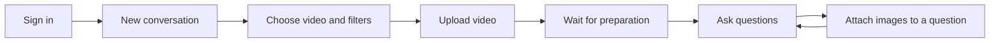
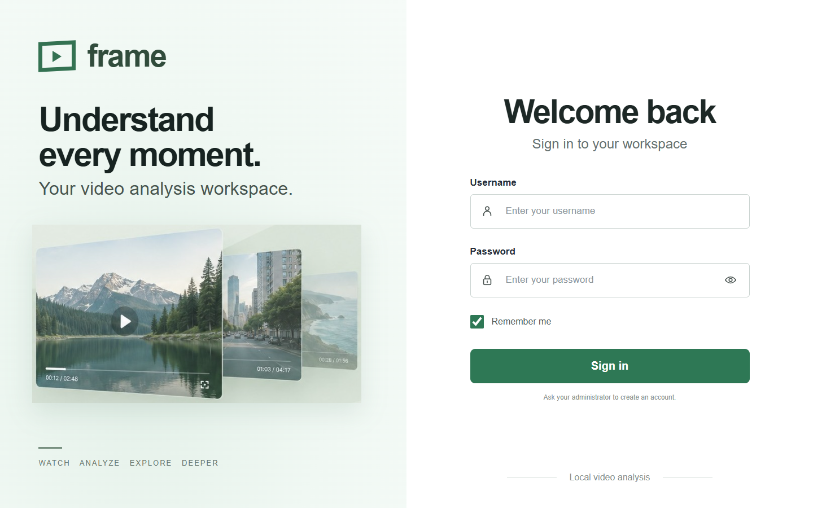
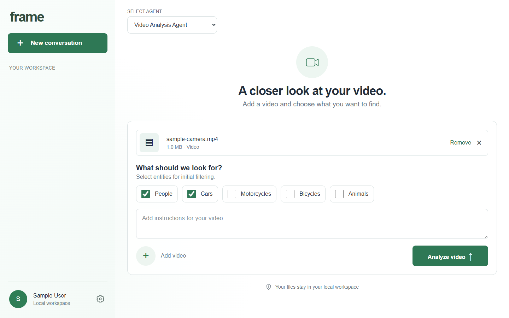
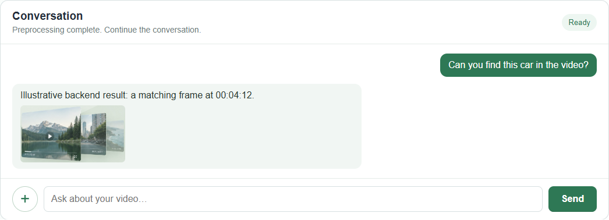
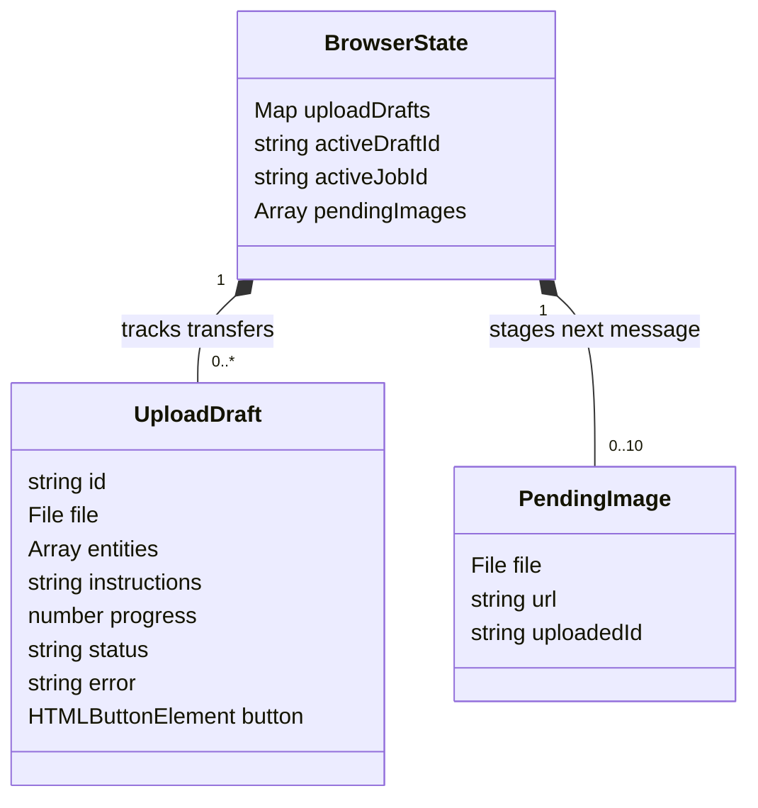
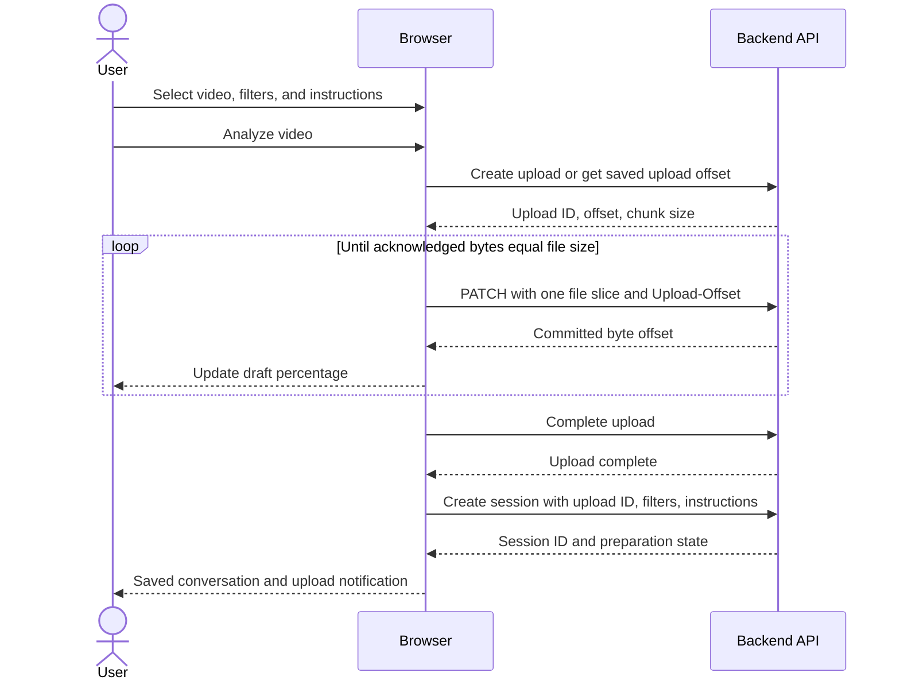
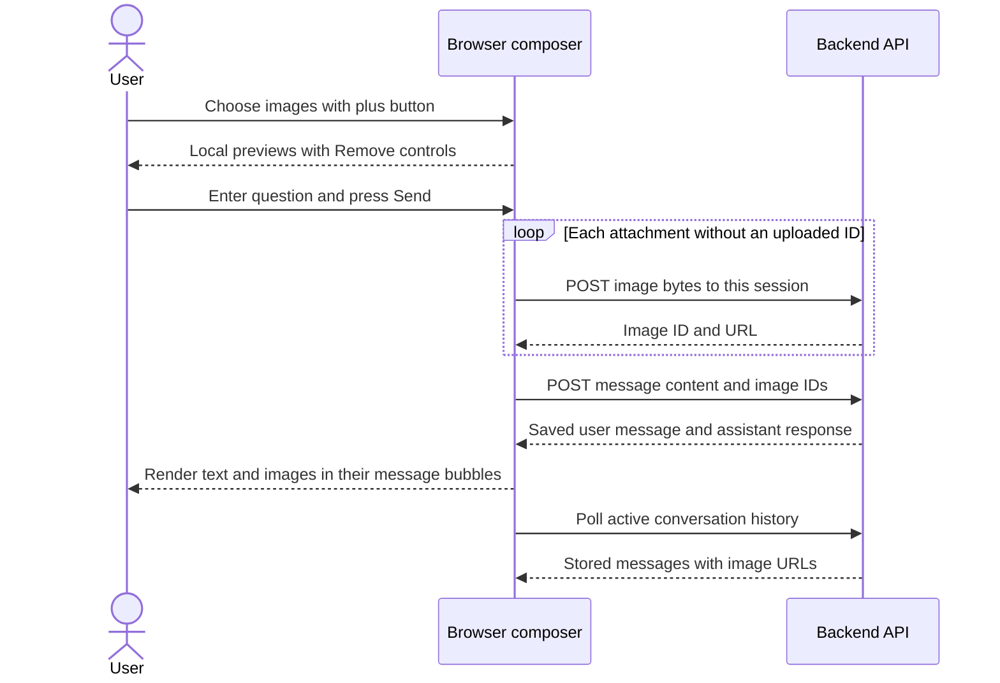
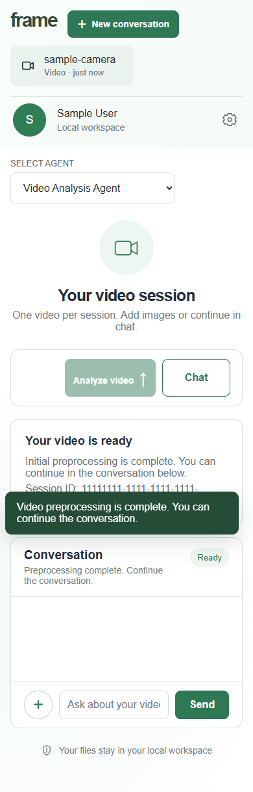

# Frame frontend design

> **Frontend LLD · Browser interface and interaction behavior**  
> Scope: sign-in, conversations, video uploads, status, chat, and image attachments.  
> Baseline: current repository implementation, reviewed 13 September 2026.

Frame gives each signed-in user a workspace of conversations. Each saved conversation contains one video and its follow-up messages. A user can upload another video in a new conversation while an earlier upload continues.

The browser selects files, transfers bytes, and displays backend responses. It does not analyze video content. This document describes the interface and its browser logic; server implementation belongs in the [backend LLD](backend-design.md), and service boundaries belong in the [architecture HLD](../architecture.md).

## Read this document

| If you want to understand... | Start here |
| --- | --- |
| The experience from sign-in to chat | [1. User journey](#1-user-journey) |
| What each screen contains | [2. Screens and controls](#2-screens-and-controls) |
| Where browser behavior is implemented | [3. Browser structure and state](#3-browser-structure-and-state) |
| Large and parallel video uploads | [4. Upload interaction](#4-upload-interaction) |
| When chat becomes available | [5. Status and notifications](#5-status-and-notifications) |
| How pictures belong to a question | [6. Chat and image attachments](#6-chat-and-image-attachments) |
| Refresh, failures, and retries | [7. Recovery behavior](#7-recovery-behavior) |
| Responsive layout and accessibility | [8. Layout and accessibility](#8-layout-and-accessibility) |
| What is verified and what needs improvement | [9. Validation and follow-up work](#9-validation-and-follow-up-work) |

## 1. User journey

1. **Sign in.** The backend restores the user's saved conversations. If available, the browser opens the last selected conversation.
2. **Start a conversation.** Select one video, select at least one entity filter, and optionally enter instructions.
3. **Upload.** Press **Analyze video**. The sidebar shows a draft with that video's upload percentage. **New conversation** remains available to start a different upload.
4. **Wait for preparation.** Once the complete upload is saved and a session is created, the interface shows the preparation state. The video selection is locked for that session.
5. **Continue in chat.** When the selected session becomes ready, **Chat** and **Send** are enabled. Each question may include its own image attachments.
6. **Return later.** Saved sessions and sent messages are loaded from the backend after refresh or another sign-in.

**Three different identities are involved:** a browser `draft-N` identifies an ongoing transfer in this tab; `upload.id` identifies the server-side video transfer; `job.id` is the saved conversation's `session_id`. A draft becomes a saved conversation only after upload completion and successful session creation.

## 2. Screens and controls

The images below are existing repository captures. They illustrate the layout; they were not regenerated for this documentation revision. Sample account names, session IDs, and files are demonstration data. Source markup and behavior take precedence if a capture differs.

### 2.1 Sign in

The sign-in form provides labeled username and password fields, a password visibility button, **Remember me**, and an inline error area. **Sign in** is disabled while its request is pending. Accounts are created by an administrator; there is no registration screen.

On page load, `GET /api/me` attempts to restore the login. A successful response leads to `GET /api/jobs` and the workspace. An initial `401` leaves the sign-in screen visible. Other initialization errors appear in the login error area.

### 2.2 New conversation and video selection

| Area | Purpose and current behavior |
| --- | --- |
| Sidebar | **New conversation**, saved conversations, and in-memory upload drafts. Selecting an item changes the active view. |
| Account area | Displays the authenticated username and initial; the icon triggers sign-out. |
| Video row | Displays the selected filename and size. **Remove** clears the current selection; it is disabled during that draft's upload. |
| Entity filters | People, Cars, Motorcycles, Bicycles, Animals. A new conversation defaults to People and Cars; submission requires at least one selection. |
| Instructions | Optional text captured when the upload starts. It is sent with the later session-creation request. |
| Analyze video | Starts or retries the selected draft. It is disabled during its upload and remains disabled once the conversation has a saved video. |
| Progress | Shows the fraction of bytes acknowledged by the backend. There is no speed estimate or remaining-time estimate. |

The header's single-choice selector is display-only in the current frontend; it has no selection handler in `script.js`.

### 2.3 Saved conversation

After session creation, `session-locked` styling hides the video picker, entity controls, instructions, and transfer progress. The page shows a result card with the session ID and a conversation panel. **Chat** scrolls to the message field and focuses it when ready.

| Session state | Visible message | Enabled interaction |
| --- | --- | --- |
| Preparing | “Background initial preprocessing is in progress.” | Conversation navigation; image staging is available, but sending is disabled. |
| Ready | “Preprocessing complete. Continue the conversation.” | Chat, text entry, image selection, and Send. |
| Failed | Backend preparation error | Conversation navigation; Chat and Send remain disabled. |
| Sending a question | “Sending question…” or “Uploading images with your question…” | Text entry, Send, and image selection are disabled until the request settles in the active conversation. |

The current backend provides metadata-based text replies. The browser can render images included in message responses, but the following capture is a **synthetic renderer example**. Its matching-frame text is sample content and is not evidence of an implemented detection feature.

## 3. Browser structure and state

### 3.1 Files and responsibilities

The frontend uses plain HTML, CSS, and JavaScript. There is no frontend framework, client-side router, or JavaScript build step. The workspace and login screen are sections of the same page, switched through the `hidden` property.

| File | Responsibility |
| --- | --- |
| [index.html](../../frontend/index.html) | Screen structure, input controls, live regions, stylesheet and script references. |
| [styles.css](../../frontend/styles.css) | Base typography, colors, sign-in layout, sidebar, form, and responsive breakpoints. |
| [upload.css](../../frontend/upload.css) | Upload progress, locked-session layout, chat, attachments, notifications, and later layout overrides. Loaded after `styles.css`. |
| [script.js](../../frontend/script.js) | Authentication UI, API wrapper, upload drafts, active session, timers, and message rendering. |

The page uses relative `/api/...` URLs and must be served through the application origin. Opening `index.html` with a `file://` URL does not supply the backend.

The deployment design keeps these static files in the FastAPI application container. On the planned Ubuntu Kubernetes host, a Service and Ingress expose the page and its API under the same origin. Host storage and the deployment topology are specified in the [HLD](../architecture.md); this paragraph describes the target boundary, not existing deployment manifests.

### 3.2 State ownership and lifetime

| State | Holds | Survives refresh? |
| --- | --- | --- |
| `currentUser`, `csrfToken` | User information and mutation token returned by the API | No; recovered from `/api/me` when the cookie is valid. |
| `currentFile` | The selected browser `File` for the visible unsaved conversation | No. |
| `uploadDrafts`, `activeDraftId` | Independent transfers and the selected draft | No. Committed server bytes may still be resumed. |
| `activeJobId` | The saved conversation being displayed | Its preference is saved; the actual session is reloaded. |
| `pendingImages` | Local previews and optional uploaded image IDs for the next question | No; also cleared when opening another conversation or a new draft. |
| `renderedMessageIds` | Message IDs already shown in the active conversation | No; rebuilt from backend history. |
| `jobTimer`, `messageTimer`, `lastJobStatus` | Polling and status tracking for the active conversation | No. |
| `frameUpload:{userId}:{name}:{size}:{lastModified}` | `localStorage` entry containing a resumable upload ID | Yes, while browser storage is retained. It does not contain video bytes. |
| `frameLastJob:{userId}` | `localStorage` entry containing the preferred saved conversation ID | Yes. It is a UI preference, not authorization. |

These are the shapes of the two main browser records. They are plain JavaScript objects, **not implemented classes**; the class notation makes their fields and containment explicit.

### 3.3 Function and event map

All functions in this table are in [script.js](../../frontend/script.js).

| Responsibility | Functions or event handler | State affected |
| --- | --- | --- |
| API transport | `api` | Reads `csrfToken`; uses same-origin cookies; throws errors with HTTP status. |
| Login restoration | Startup `/api/me` call; login submit; `showWorkspace` | Sets user/token, rebuilds the saved conversation list, opens remembered or newest session. |
| File and transfer management | File input change; analysis submit; `uploadKey`, `uploadVideo` | File reference and persisted upload ID; sequential byte offsets. |
| Parallel drafts | `createDraft`, `renderDraft`, `showDraft`, `runUpload` | Draft map, sidebar status, selected draft; saved session on success. |
| Session navigation | `addConversation`, `openJob`, `clearVideo` | Active IDs, locked form, pending previews, polling timers. |
| Status display | `refreshJob`, `displayJob`, `notifyUser` | Readiness, control availability, result card, toast, polling. |
| Image composition | Image input change; `renderPendingImages`, `clearPendingImages` | Pending files, local object URLs, uploaded image IDs. |
| Message delivery | Chat submit; `loadMessages`, `addBubble` | In-flight question, history, deduplication, text/image bubbles. |

`api()` requests JSON responses. On mutations, it adds `X-CSRF-Token` when available; `credentials: 'same-origin'` sends the login cookie. Error text comes from a string `detail`, otherwise it falls back to the HTTP status. There is no central redirect to sign-in when an established session expires.

## 4. Upload interaction

### 4.1 One video, sequential chunks

`uploadVideo()` slices the selected `File` using the backend's `chunk_size`, currently **8 MiB**. It awaits each `PATCH` before sending the next slice. The browser does not load the whole video into a JavaScript buffer or decode its frames.

Progress advances after the backend acknowledges bytes. **100% uploaded is a byte-transfer milestone**: upload completion and session creation still follow. The upload notification is emitted after session creation succeeds.

A failed `PATCH` triggers an offset lookup. If the server already committed bytes, the browser moves to that offset. Otherwise it retries, with at most three attempts for that chunk. If the offset lookup itself fails, the draft fails immediately. There is no retry delay, explicit request timeout, or upload cancel control.

### 4.2 Multiple conversations

Each `runUpload(draft)` owns its file, instructions, filters, and progress callback. Clicking **New conversation** clears the visible composer but leaves previous entries in `uploadDrafts` running. The next upload therefore has an independent request sequence.

When a background draft completes, its sidebar entry is replaced with a saved conversation. It does not take focus unless that draft was selected. Draft progress updates the main progress bar only when `activeDraftId` matches the draft.

The form rejects a second simultaneous transfer with the same user/file key **in this tab**. There is no shared draft manager across tabs and no configured frontend limit on the number of distinct concurrent uploads. Available bandwidth and server capacity are shared among them.

### 4.3 Refresh and session creation

The upload ID is stored before transfer. After refresh, the user must select the same file again; the matching browser-storage key lets the frontend request its committed offset. Filters and instructions are not restored from that key and must be entered again if session creation has not yet succeeded.

On successful session creation, the resume key is removed. If session creation returns `409`, `runUpload()` lists saved jobs and searches for one with the upload ID. Other session-creation errors leave a failed draft for user retry. A retry can reuse the completed upload and then recover the existing session, rather than upload the bytes again.

## 5. Status and notifications

`openJob()` selects one saved conversation, loads its message history, checks its status immediately, and starts a status interval of **3 seconds**. `displayJob()` updates only the matching `activeJobId`.

| Event | Browser behavior |
| --- | --- |
| Selected session is preparing | Poll its status; disable Chat, message entry, and Send. |
| Selected session is ready | Enable chat; stop status polling; start history polling every 3 seconds. |
| Selected session failed | Show the backend error; stop status polling; leave sending disabled. |
| Open another conversation | Clear the previous timers, message IDs, displayed history, and pending image previews; load the newly selected session. |
| Start a new conversation | Clear status and history timers for the old view; ongoing upload drafts continue. |

`notifyUser()` shows a toast for **6.5 seconds**. It also attempts a browser notification when requested and permission has already been granted. Permission is requested during Analyze video submission if the browser has not yet recorded a choice.

**Notifications require an open page.** There is no service worker, push subscription, or notification after the tab closes. Every completed upload can show its upload toast, but preparation status is monitored only for the selected saved conversation. A background conversation's ready notification is therefore not guaranteed until it is opened. Opening an already-ready conversation also triggers the current ready toast.

## 6. Chat and image attachments

Images belong to the **question being composed**. The plus button stages local previews; it does not immediately upload images or add them to a shared gallery.

The browser accepts PNG, JPEG, WebP, and GIF, with **up to 10 attachments per question** and **20 MiB per image**. Checks use file size and the browser-provided MIME type; backend validation remains authoritative. `URL.createObjectURL()` provides local previews, and removing or clearing a preview revokes that URL.

On **Send**, the handler captures the active session ID, trimmed text, and selected image records. It uploads images sequentially, retaining each returned `uploadedId`, then sends `{ content, image_ids }`. A text-only question and an image-only message are both allowed. The message text input has a 4,000-character limit.

Successful image uploads are reused if a later step fails and the user retries the same pending question. A successful message response clears pending previews. A failure in the still-active conversation restores the question text and displays “Could not send”. Removing a previously uploaded pending image only removes it from the browser composer; there is no frontend delete request for its stored file.

`loadMessages()` and the send response both use `renderedMessageIds` to avoid adding the same saved message twice. Responses for a different active session are not rendered into the current history. This prevents display duplication by message ID; it does not make message creation idempotent after a lost response.

`addBubble()` assigns message text through `textContent`, so message strings are displayed as text rather than executed as HTML. Attachment images use the backend-provided URL, filename as alternative text, and lazy loading. Both user and assistant messages support the same image renderer.

## 7. Recovery behavior

| Situation | What survives / what the user sees | Current recovery |
| --- | --- | --- |
| Refresh after session creation | Saved video, messages, and image associations remain on the backend. | Restore login, reload jobs, open the remembered session or newest session. |
| Refresh during transfer | Committed bytes and browser resume ID remain; `File` references and draft sidebar entries are lost. | Reselect the same file, re-enter filters/instructions, and press Analyze video. |
| Transfer error | Failed sidebar draft and inline error; backend retains committed offset. | Select the failed draft and retry. Removing it clears the draft UI, not server bytes. |
| Lost session-creation response | Video can be complete even though the draft shows failure. | Retry; reuse the upload and recover a duplicate session on `409`. |
| Preparation failure | Saved session shows Failed; chat is unavailable. | No preparation-retry control exists in this UI. |
| Chat/image request failure | Error next to the composer; pending image IDs and text can be reused while the conversation remains active. | Retry or replace the failing attachment. A lost successful message response can require history inspection before resending. |
| Established login expires | Current request fails; there is no automatic redirect. | Reload to return to sign-in, then restore saved sessions. Reselect any interrupted video. |
| Sign out with uploading drafts | Toast asks the user to wait; sign-out does not run. | Wait for uploads to settle. Successful sign-out revokes login; it does not delete saved workspace data. |

The sidebar is loaded at workspace initialization and updated for uploads completed in this tab. It is not periodically refreshed for sessions created in another tab. Browser storage is a convenience for resumption and selection; the backend is the source of truth for saved data and ownership.

## 8. Layout and accessibility

### 8.1 Responsive layout

| Viewport | Current CSS behavior |
| --- | --- |
| Wider than 900 px | Workspace has a 326 px sidebar and flexible content column. Content is capped at 1,084 px. |
| 621–900 px | Sidebar narrows to 240 px; content padding is reduced. Login changes to a stacked layout. |
| 620 px and narrower | Sidebar becomes a top section; conversation navigation scrolls horizontally; main content becomes one column. |
| Desktop height at most 800 px | Spacing, illustration size, and form height shrink to keep primary controls closer to view. |

Desktop navigation uses a sticky sidebar with its own vertical scrolling. Chat history also scrolls within a bounded panel; the whole page remains scrollable. Pending image previews are 75 × 75 px crops, while message attachments preserve their image content within a maximum 180 px box.

The following mobile capture uses sample session data. Its toast overlaps content while visible; it illustrates the existing layout rather than proving mobile usability acceptance.

View the existing mobile workspace capture

### 8.2 Existing accessibility support

Markup includes explicit form labels, accessible names for icon controls, a live message log, status regions for upload/chat feedback, and an alert region for login errors. Hidden file controls expose focus styling on their visible labels. **Chat** moves focus to the message input, and missing-video validation focuses the video picker.

These are implementation features, not a completed accessibility certification. Keyboard traversal, contrast, zoom, live-region announcements, and small-screen overflow still need browser-based validation. The progress element also needs review for a programmatically associated accessible name.

## 9. Validation and follow-up work

### 9.1 Acceptance scenarios

These scenarios define what to verify in a browser. They are not a claim that this documentation revision executed browser tests.

| ID | Scenario | Expected outcome |
| --- | --- | --- |
| FE-01 | Sign in, open a saved session, then refresh. | The user's saved history reloads and the remembered conversation is selected when it exists. |
| FE-02 | Start video A, choose New conversation, then start video B. | Both drafts advance independently; completing A does not replace the active B view. |
| FE-03 | Refresh during an upload and reselect the same file. | Transfer continues from the backend offset; already committed bytes are not resent from zero. |
| FE-04 | Observe upload completion followed by preparation. | Upload feedback and preparation feedback are distinct; sending remains disabled until ready. |
| FE-05 | Attach two images to a question and send. | Previews clear after success; the saved user bubble contains both images; history reload preserves them. |
| FE-06 | Make an image upload fail after a prior image succeeds. | Error is visible and retry reuses already returned image IDs while that draft question remains active. |
| FE-07 | Switch conversations while a history response is pending. | Its messages do not appear in the newly selected conversation. |
| FE-08 | Use keyboard navigation and a 390 px-wide viewport. | Core controls remain reachable; page and chat scrolling do not hide the action being performed. |

[test_auth.py](../../tests/test_auth.py) covers API-side ownership, independent upload progress, distinct saved sessions, and persisted message/image relationships. It does not exercise browser state, layout, or notification timing. [test_cleanup.py](../../tests/test_cleanup.py) covers cleanup behavior, not UI behavior. No large-video timing benchmark or browser test suite is established by these files.

### 9.2 Frontend improvement backlog

The following items remain future frontend work and are not represented as completed features in this design:

| Priority | Improvement | Reason |
| --- | --- | --- |
| High | Central handling for expired login during long uploads. | A user should receive a clear reauthentication path and retain resumable transfer information. |
| High | Reconcile preparation state for all saved conversations. | Background sessions currently have no continuous readiness tracking in the UI. |
| High | Keep unsent text and image selection explicitly scoped to each conversation. | Pending images are cleared on navigation, while text is not consistently reset or maintained as a per-session draft. |
| High | Define and validate navigation during in-flight Send. | Old requests can finish after navigation; control state must remain correct on the new view. |
| Medium | Distinguish byte transfer, finalization, and session creation in the progress display. | The current bar can read 100% while the draft still says Uploading. |
| Medium | Add visible upload speed, remaining-time estimate, and deliberate pause/cancel behavior. | Long transfers need more useful feedback and control. |
| Medium | Refresh captures and complete keyboard/mobile validation. | Existing screenshots show sample data and do not demonstrate all error and parallel-upload states. |
| Medium | Review sidebar timestamps and control labels. | Saved entries currently use static “just now” copy; several labels reflect early prototype behavior. |

For server request schemas, persistence, and enforcement, continue with the [backend LLD](backend-design.md). For component boundaries and deployment context, return to the [HLD](../architecture.md).
