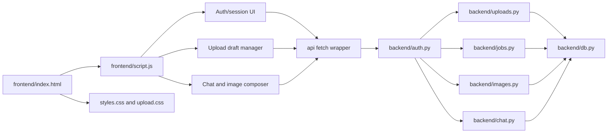
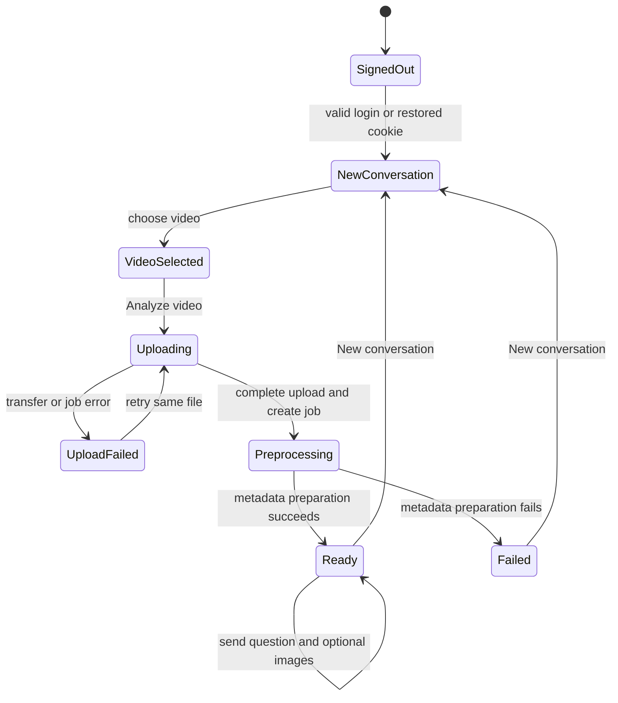
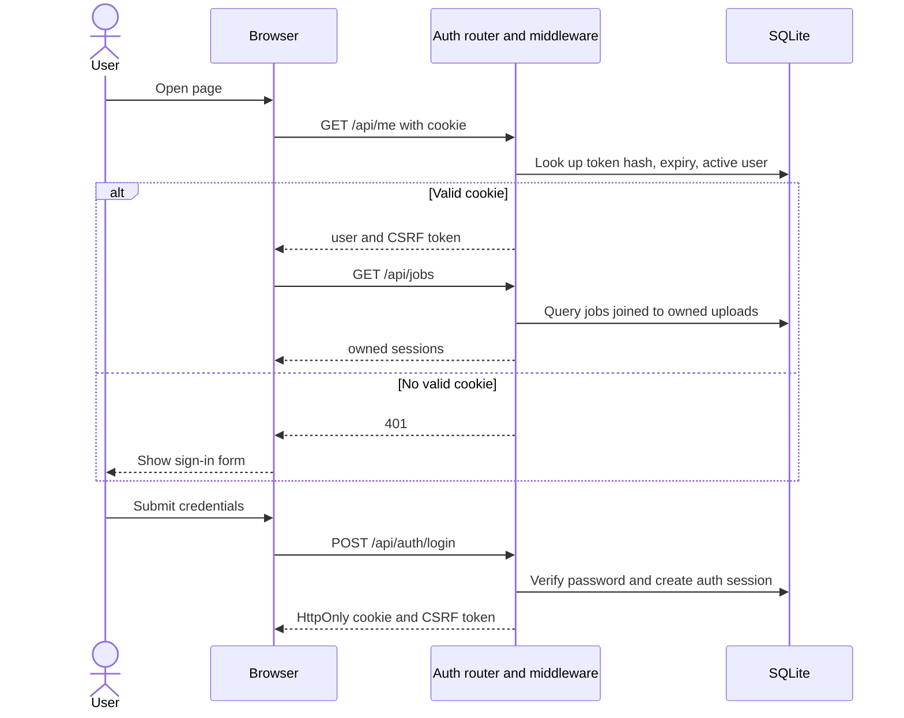
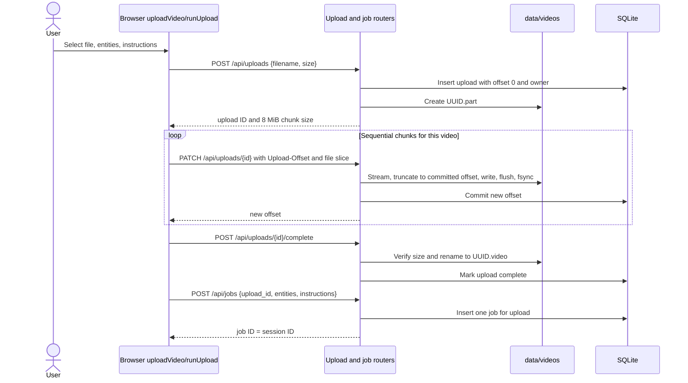
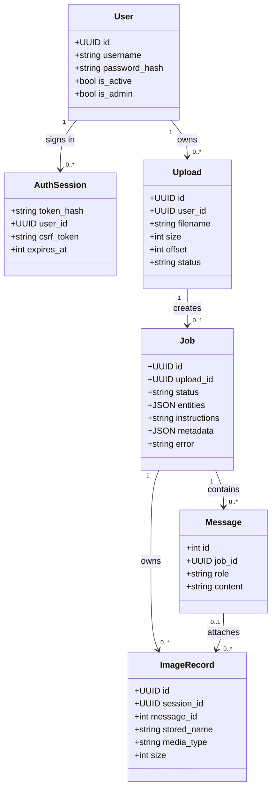

# Frame frontend and public API — low-level design (LLD)

**Status:** documents implemented behavior unless a section is marked *planned*

**Parent:** [system HLD](../architecture.md)

**Code:** `frontend/`, `main.py`, `backend/`

## 1. Scope and UI evidence

This document specifies the browser state, public endpoint call chain, stored relationships, error handling, and the boundary to the future algorithm service. The browser only selects files, sends bytes, displays progress, and renders responses. Validation, persistence, and preparation run on the backend. It does not decode or analyze video.

| Screen | Captured implementation | Notes |
| --- | --- | --- |
| Sign in |  | Username/password, visibility toggle, remember-me; accounts are created through `manage_users.py` |
| New conversation |  | Video picker, entity filters, optional instructions, Analyze video |
| Conversation |  | **Mocked example** for response-image rendering; detection and generated result images are not implemented |
| Mobile workspace |  | Sample session data, narrow viewport |

The original visual references are [login-page.jpg](figma/login-page.jpg) and [home-page.jpg](figma/home-page.jpg). Captured screenshots may need regeneration after UI changes; the source files and endpoint behavior below are authoritative.

## 2. Component and state design



`frontend/script.js` is currently one browser module with functions and module-level state, not a class-based frontend framework. The diagram names logical responsibilities, not existing JavaScript classes. `main.py` registers routers and mounts static files last.

| Browser state | Meaning and lifetime |
| --- | --- |
| `currentUser`, `csrfToken` | Signed-in identity and CSRF token, held in memory; password is never stored by the UI |
| `currentFile` | Selected `File` object for the active unsaved conversation; lost on refresh |
| `uploadDrafts`, `activeDraftId` | In-memory parallel transfer records; each holds file, prompt, selected entities, percentage, and status |
| `activeJobId` | Saved conversation currently shown; chat and polling are scoped to it |
| `pendingImages` | Local image previews and image IDs for the next chat message |
| `frameUpload:{userId}:{name}:{size}:{lastModified}` | Local-storage upload ID for resuming the same selected file after interruption |
| `frameLastJob:{userId}` | Local-storage UI preference for restoring the selected session |



Opening **New conversation** while a draft is uploading only changes the visible composer. The earlier draft remains in `uploadDrafts` and its upload continues in the same tab. A completed background draft becomes a saved session without taking focus from the current view. The same file cannot be started twice concurrently under the same user/file key. Signing out is blocked while an upload is active. A browser refresh loses `File` objects; the user must reselect the file to resume from the persisted server offset.

## 3. Interface contracts

All paths are same-origin. Except health, login, and `/api/me`, protected calls require a valid cookie; writes also require `X-CSRF-Token`. The ownership middleware scopes access to a user's uploads and their jobs/images/messages. Error responses use an HTTP status plus `detail`.

| Method and path | Request | Successful result | Owner/guard |
| --- | --- | --- | --- |
| `POST /api/auth/login` | username, password, remember | user ID, username, CSRF token; HttpOnly cookie | credentials and active account |
| `GET /api/me` | cookie | current user and CSRF token | valid login |
| `POST /api/auth/logout` | cookie and CSRF | signed out | valid login |
| `GET /api/jobs` | cookie | owned session list | user ID |
| `POST /api/uploads` | filename, total size | upload ID, offset 0, chunk size | valid user; `0 < size <= 250 GiB` |
| `GET /api/uploads/{id}` | upload ID | saved offset, size, status | upload owner |
| `PATCH /api/uploads/{id}` | binary body, `Upload-Offset` | committed offset | owner, status, exact offset, chunk and total size |
| `POST /api/uploads/{id}/complete` | upload ID | status complete | owner; saved bytes equal declared size |
| `POST /api/jobs` | upload ID, entities, instructions | job/session ID, preprocessing status | owner; complete upload; one job per upload |
| `GET /api/jobs/{id}` | session ID | status, entities, metadata/error | session owner |
| `GET /api/jobs/{id}/messages` | session ID | ordered messages and image URLs | session owner |
| `POST /api/sessions/{id}/images` | image bytes and `X-Filename` | image ID and protected URL | session owner; supported type and <= 20 MiB |
| `GET /api/sessions/{id}/images/{imageId}` | IDs | image bytes | session owner and matching image |
| `POST /api/jobs/{id}/messages` | content, up to 10 image IDs | saved user and assistant messages | ready session; images belong to it and are unattached |

Pydantic request models and limits are in `backend/schemas.py`. Uploads accept People, Cars, Motorcycles, Bicycles, or Animals as entity values. See FastAPI `/docs` for the generated request/response view, but note that image and upload bodies are handled directly from `Request` streams.

## 4. Identity and authorization



The cookie contains an opaque token; SQLite stores only its SHA-256 hash. Login sets `SameSite=Strict` and `HttpOnly`; the `Secure` flag is set when the request scheme is HTTPS. Session lifetime is 12 hours without remember-me or 7 days with it. The browser sends the CSRF token on mutations. Missing or cross-user IDs return 404 on protected media/session routes, reducing ID-based disclosure. Password hashes use `pwdlib`'s recommended scheme. There is no user self-registration or API rate limiting in the current implementation.

## 5. Video transfer and session creation



The browser never sends the entire 24-hour file in one request. It uses `File.slice()` and one `PATCH` at a time for each video; several distinct video drafts can advance concurrently. The backend serializes each upload ID using an in-process `asyncio.Lock`. An incorrect offset returns 409, and oversized chunks return 413. The browser queries the server offset after a failed response, retries the chunk up to three attempts, and resumes from the committed position. It also recovers from a lost job-creation response by finding a job with the completed upload ID. Backend upload IDs are UUIDs; display filenames never become disk paths.

**Consistency boundary:** the `.part` file is synchronized before SQLite records the new offset. On a failed write the server truncates to the last committed offset. There is no chunk checksum; the completed file is hashed during metadata preparation. In-process locks and local file paths are unsuitable for multiple API worker processes without further coordination.

## 6. Preparation and status

`POST /api/jobs` schedules `preprocess_video` using FastAPI `BackgroundTasks`. The function reads the completed file in 8 MiB blocks to compute SHA-256 and, if installed, calls `ffprobe` for duration. It stores metadata and sets `ready`, or stores an error and sets `failed`. On app startup, unfinished `queued`/`preprocessing` records are scheduled again. The browser polls `GET /api/jobs/{id}` every 3 seconds until `ready` or `failed`. A ready conversation enables chat; the UI shows a toast and may show a browser notification if permission is granted and the page is open.

`ready` means metadata preparation only. The algorithm service is not called. In-process background work is not a durable task queue; job retry, duplicate execution control across workers, and capacity limits must be designed before multi-instance deployment.

## 7. Chat and image flow

```mermaid
sequenceDiagram
    actor User
    participant UI as Browser chat
    participant API as Image and chat routers
    participant Disk as data/images
    participant DB as SQLite
    User->>UI: Select images and enter question
    UI-->>User: Temporary local previews
    loop Each image
        UI->>API: POST /api/sessions/{session}/images with bytes
        API->>API: Validate size, decoded format, dimensions
        API->>Disk: Save images/session/UUID.extension
        API->>DB: Insert unattached image row
        API-->>UI: image ID and protected URL
    end
    UI->>API: POST /api/jobs/{session}/messages {content, image_ids}
    API->>DB: Check ready status and unattached same-session images
    API->>DB: Insert user message; attach images; insert assistant reply
    API-->>UI: both messages and image metadata
    UI-->>User: Render chat bubbles
    UI->>API: GET /api/jobs/{session}/messages every 3 seconds
    API-->>UI: ordered history and owner-checked image URLs
```

The browser allows PNG, JPEG, WebP, and GIF files of up to 20 MiB each and up to 10 images per message. The server revalidates content with Pillow and rejects excessive dimensions. An image first belongs to a session; `message_id` is assigned when the user sends the question. The message endpoint prevents reattaching the same image or attaching an image from another session. The UI fetches image bytes through the protected session URL and avoids duplicate bubbles by message ID.

The current assistant reply is generated by conditional metadata rules for filename, size, duration, selected filters, and image count. For detection questions, it explicitly says video/image understanding is not connected. The illustrative screenshot in section 1 is not an implemented algorithm response.

## 8. Domain class diagram and persistence

The following is a **conceptual domain class diagram** mapped to SQLite rows. These are not Python classes in the current code; the backend uses Pydantic request models, route functions, and SQL. Cardinalities show intended record relationships. `Upload` has zero or one `Job` because an upload may finish before a session is created; a job always has exactly one upload.



| Invariant | Enforcement |
| --- | --- |
| One video per session | `jobs.upload_id` has a unique index; one job points to one upload |
| Session owner | `jobs.upload_id -> uploads.user_id`; middleware checks this join |
| Image belongs to session | `images.session_id = jobs.id`; message endpoint checks session and unattached state |
| Media naming | Video path is derived from upload UUID; image path from session UUID and server-generated name |
| Chat order | `messages.id` is an increasing integer; UI de-duplicates by ID |

`backend/db.py` is the schema source of truth. `backend/config.py` defines the local storage roots. For the target algorithm integration, the public backend will resolve an authorized session to its upload and image rows, then build an internal request containing storage keys. That request is not currently stored as one JSON document.

## 9. Errors, recovery, and verification

| Trigger | Response and UI behavior | Recovery |
| --- | --- | --- |
| Invalid login or expired cookie | 401; sign-in view | Sign in again; saved jobs remain under the user |
| Wrong CSRF token | 403 | Reload to obtain a valid session token |
| Wrong upload offset | 409 with expected offset | Browser fetches current offset and retries |
| Interrupted transfer | Failed draft; server retains committed offset | Select same file and retry; refresh loses the `File` handle |
| Duplicate job for upload | 409 | Browser lists jobs and opens the existing session |
| Preparation exception | Job `failed` with error; chat disabled | Start a new conversation; operational retry is not implemented |
| Invalid or oversized image | 413/415; chat image error | Replace the image |
| Chat before ready or foreign image | 409/422 | Wait for ready or choose a same-session image |

Current tests in `tests/test_auth.py` exercise authentication, ownership, chat/image persistence, independent upload progress, and distinct sessions. `tests/test_cleanup.py` exercises preview and reset behavior. They do not benchmark 24-hour media or validate the planned algorithm service.

## 10. Traceability and open design items

| Concern | Current implementation |
| --- | --- |
| Screen markup and accessibility labels | `frontend/index.html` |
| Browser state, API calls, progress, polling, chat | `frontend/script.js` |
| Responsive styling | `frontend/styles.css`, `frontend/upload.css` |
| Auth and owner checks | `backend/auth.py` |
| Video transfer | `backend/uploads.py` |
| Preparation | `backend/jobs.py`, `backend/video_metadata.py` |
| Images and chat | `backend/images.py`, `backend/chat.py` |
| Schema, limits, local paths | `backend/db.py`, `backend/schemas.py`, `backend/config.py` |

Before agent integration, define the internal service contract, shared storage key format, service authentication, idempotency and retry policy, result-image registration, and how preprocessing status differs from algorithm readiness. Before multi-instance production, add durable jobs, shared database/media storage, quotas, cleanup scheduling, backups, metrics, and capacity tests. See the [HLD](../architecture.md) for the target deployment boundary.
