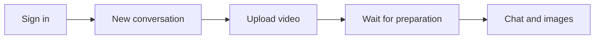
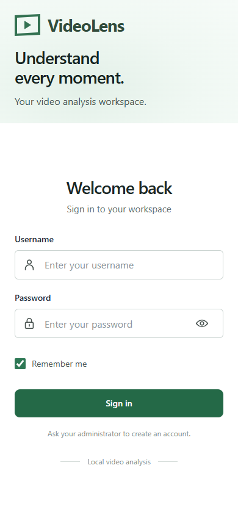
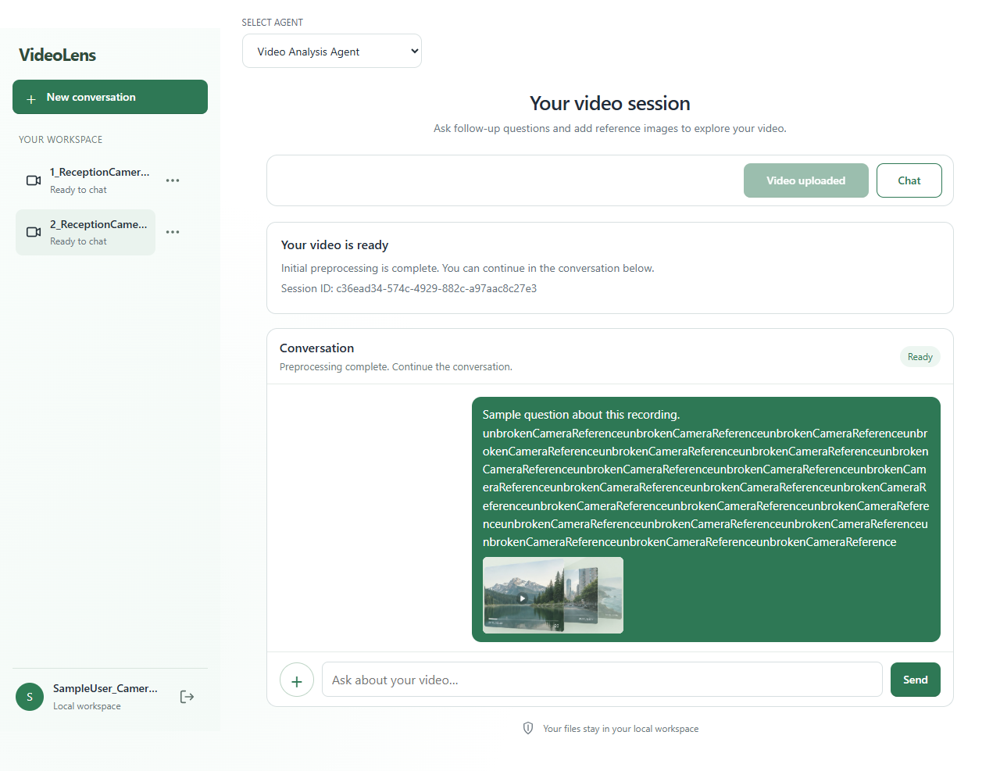
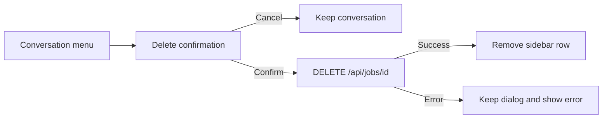
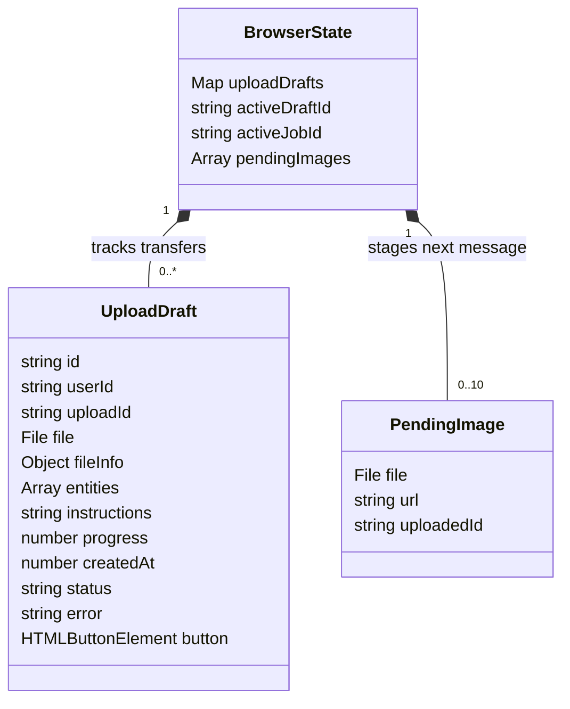
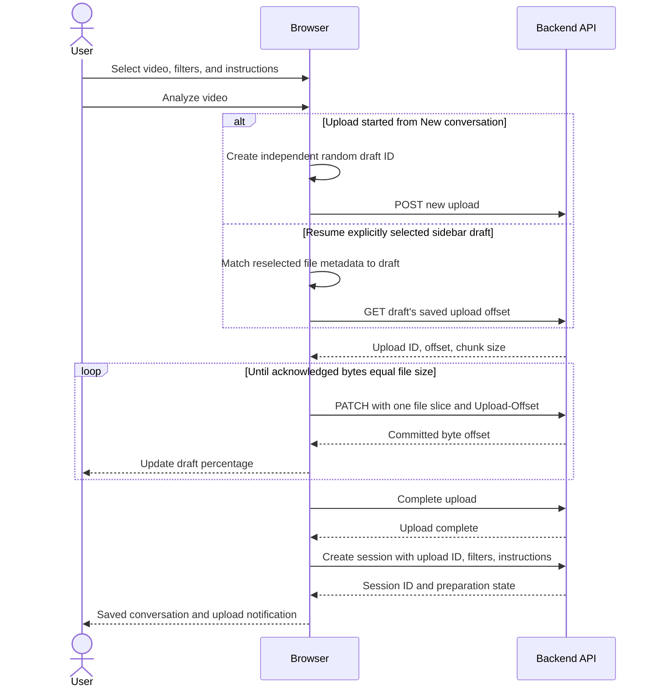
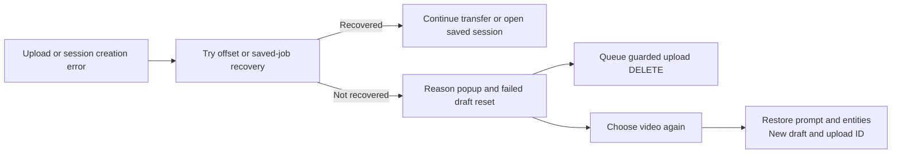
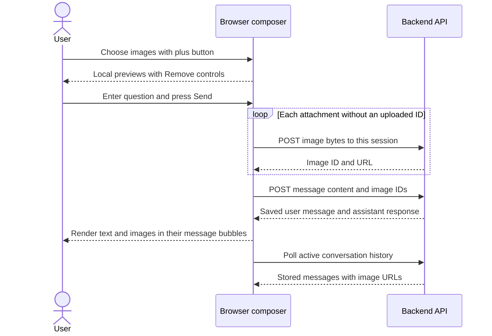
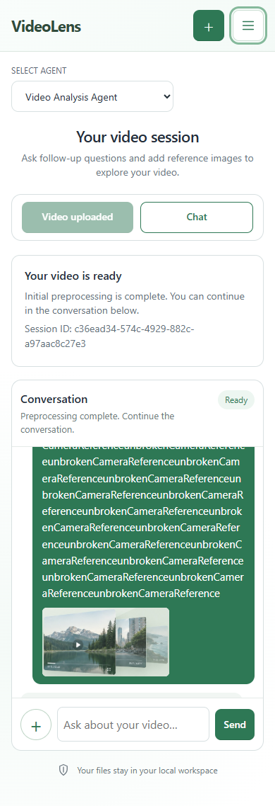

# VideoLens frontend design

> **Frontend LLD · Browser interface and interaction behavior**
>
> Scope: sign-in, conversations and deletion, video uploads, status, chat, and image attachments.
>
> Baseline: current repository implementation, reviewed 14 September 2026.

VideoLens gives each signed-in user a workspace of conversations. Each saved conversation contains one video and its follow-up messages. A user can upload another video in a new conversation while an earlier upload continues.

The browser-facing name is VideoLens. Internal compatibility names including `frame_session`, `frameUploadDraft`, and `FRAME_DATA_DIR` are retained; earlier screenshots and the backend architecture may still use Frame.

The browser selects files, transfers bytes, and displays backend responses. It does not analyze video content. This document describes the interface and its browser logic; server implementation belongs in the [backend LLD](backend-design.md), and service boundaries belong in the [architecture HLD](../architecture.md).

## Read this document

| If you want to understand... | Start here |
| --- | --- |
| The experience from sign-in to chat | [1. User journey](#1-user-journey) |
| What each screen contains | [2. Screens and controls](#2-screens-and-controls) |
| How to delete a saved conversation | [2.4 Conversation options and deletion](#24-conversation-options-and-deletion) |
| Where browser behavior is implemented | [3. Browser structure and state](#3-browser-structure-and-state) |
| Large and parallel video uploads | [4. Upload interaction](#4-upload-interaction) |
| When chat becomes available | [5. Status and notifications](#5-status-and-notifications) |
| How pictures belong to a question | [6. Chat and image attachments](#6-chat-and-image-attachments) |
| Refresh, failures, and retries | [7. Recovery behavior](#7-recovery-behavior) |
| Responsive layout and accessibility | [8. Layout and accessibility](#8-layout-and-accessibility) |
| What is verified and what needs improvement | [9. Validation and follow-up work](#9-validation-and-follow-up-work) |

## 1. User journey



1. **Sign in.** The backend restores the user's saved conversations. If available, the browser opens the last selected conversation.
2. **Start a conversation.** Select one video, select at least one entity filter, and optionally enter instructions.
3. **Upload.** Press **Analyze video**. The sidebar shows a draft with that video's upload percentage. **New conversation** remains available to start a different upload.
4. **Wait for preparation.** Once the complete upload is saved and a session is created, the interface shows the preparation state. The video selection is locked for that session.
5. **Continue in chat.** When the selected session becomes ready, **Chat** and **Send** are enabled. Each question may include its own image attachments.
6. **Return later.** Saved sessions and sent messages are loaded from the backend after refresh or another sign-in.

**Three different identities are involved:** a random browser `draft-<random ID>` identifies a conversation's upload draft; its `uploadId` identifies the server-side video transfer; `job.id` is the saved conversation's `session_id`. Every upload started from New conversation gets a separate draft and upload ID, including files with identical metadata. A draft becomes a saved conversation only after upload completion and successful session creation. `newDraftId()` uses `crypto.randomUUID()` when available and random bytes otherwise, including local-network HTTP contexts where that UUID method is unavailable.

## 2. Screens and controls

The current screenshots come from the responsive browser checks and use mocked session data. Long filenames, account names, and unbroken message text deliberately test wrapping and overflow; they are not real customer content or analysis results. Older captures, where retained, are labeled historical. Source markup and behavior take precedence if a capture differs.

### 2.1 Sign in



The sign-in form provides labeled username and password fields, a password visibility button, **Remember me**, and an inline error area. **Sign in** is disabled while its request is pending. Accounts are created by an administrator; there is no registration screen.

On page load, `GET /api/me` attempts to restore the login. A successful response leads to `GET /api/jobs` and the workspace. An initial `401` leaves the sign-in screen visible. Other initialization errors appear in the login error area.

### 2.2 New conversation and video selection

The upload form contains the controls below. The [historical upload-form capture](screenshots/workspace-current.png) shows the earlier Frame branding and navigation; the saved-session screenshots in the next section show the current responsive workspace.

| Area | Purpose and current behavior |
| --- | --- |
| Sidebar | **New conversation**, saved conversations, active uploads, and restored **Resume upload** drafts. Selecting an item changes the active view. Saved conversation rows have an ellipsis menu for deletion. |
| Tablet/phone navigation | At 900 px and below, **Show conversations** expands the list and account controls. Selection or Escape collapses it; New conversation remains in the header. |
| Account area | Displays the authenticated username, initial, and “Local workspace”; an explicit sign-out icon with a **Sign out** label replaces the former gear control. |
| Video row | Displays the selected filename and size. **Remove** clears the current selection; it is disabled during that draft's upload. |
| Entity filters | People, Cars, Motorcycles, Bicycles, Animals. A new conversation defaults to People and Cars; submission requires at least one selection. |
| Instructions | Optional text captured when the upload starts. It is sent with the later session-creation request. |
| Analyze video / Resume upload | Starts a new independent upload or resumes the explicitly selected paused draft. During transfer it reads Uploading; after saving a conversation it reads **Video uploaded** and stays disabled. |
| Progress | Shows the fraction of bytes acknowledged by the backend. There is no speed estimate or remaining-time estimate. |

The header's single-choice selector is display-only in the current frontend; it has no selection handler in `script.js`.

### 2.3 Saved conversation

After session creation, `session-locked` styling hides the video picker, entity controls, instructions, transfer progress, and decorative video badge. The action reads **Video uploaded**, disabled. The page shows a result card with the session ID and a conversation panel. The workspace subtitle reads “Ask follow-up questions and add reference images to explore your video.” **Chat** scrolls to the message field and focuses it when ready.



This desktop capture uses deliberately long sample content. See the [current mobile capture](#81-responsive-layout) for the same workspace with compact navigation.

| Session state | Visible message | Enabled interaction |
| --- | --- | --- |
| Preparing | “Background initial preprocessing is in progress.” | Conversation navigation; image staging is available, but sending is disabled. |
| Ready | “Preprocessing complete. Continue the conversation.” | Chat, text entry, image selection, and Send. |
| Failed | Backend preparation error | Conversation navigation; Chat and Send remain disabled. |
| Sending a question | “Sending question…” or “Uploading images with your question…” | Text entry, Send, and image selection are disabled until the request settles in the active conversation. |

The current backend provides metadata-based text replies. The browser can render images included in message responses. The older illustration below is a **historical synthetic renderer example**; its matching-frame text is sample content and is not evidence of an implemented detection feature.

<details>
<summary>Historical response-image illustration</summary>


</details>

### 2.4 Conversation options and deletion

Open a saved conversation's menu by **right-clicking its row**, clicking its **ellipsis** button, or pressing **Shift+F10** / the context-menu key while its conversation button has focus. Upload drafts do not have this deletion menu. Opening options for an inactive conversation does not select it.

Choose **Delete conversation** to open a modal naming the conversation and explaining that its video, images, and messages will be permanently removed. **Cancel** has initial focus. Cancel or Escape closes the confirmation without making a delete request and restores focus to its trigger when available.



Confirmation sends `DELETE /api/jobs/{job_id}` with the same-origin cookie and `X-CSRF-Token`. While pending, the action reads **Deleting…**, both buttons are disabled, and the dialog exposes `aria-busy`; Escape is prevented until the request settles. Errors appear in the dialog's alert area, with controls restored for retry or cancellation. A **409** asks the user to wait until video preparation finishes.

After success, the deleted row and any matching remembered-session preference are removed. Deleting an inactive conversation preserves the current session or upload draft. Deleting the active conversation clears its composer and polling, then opens the first remaining saved conversation; if none remain, it opens New conversation. Other upload drafts continue. A **404** removes an already-unavailable sidebar entry without claiming a new successful deletion.

The normal success toast says “Conversation deleted.” A response with `cleanup_pending: true` instead warns that some stored files could not be removed: database deletion has succeeded, and administrator cleanup is needed. Deletion includes all server-registered images in that session, even ones uploaded but never sent with a question. See [backend deletion and recovery](backend-design.md#delete-one-conversation) for the persistence contract.

## 3. Browser structure and state

### 3.1 Files and responsibilities

The frontend uses plain HTML, CSS, and JavaScript. There is no frontend framework, client-side router, or JavaScript build step. The workspace and login screen are sections of the same page, switched through the `hidden` property.

| File | Responsibility |
| --- | --- |
| [index.html](../../frontend/index.html) | Screen structure, input controls, live regions, conversation menu and confirmation dialog, stylesheet and script references. |
| [styles.css](../../frontend/styles.css) | Base typography, colors, sign-in layout, sidebar, form, and responsive breakpoints. |
| [upload.css](../../frontend/upload.css) | Upload progress, locked-session layout, chat, attachments, notifications, and later layout overrides. Loaded after `styles.css`. |
| [script.js](../../frontend/script.js) | Authentication UI, API wrapper, upload drafts, active session, deletion controls, timers, and message rendering. |

The page uses relative `/api/...` URLs and must be served through the application origin. Opening `index.html` with a `file://` URL does not supply the backend.

The [Docker Compose deployment](../deployment/docker.md) runs these static files and FastAPI in one application container on WSL or Ubuntu, serving the page and API on the same origin. One Uvicorn worker uses a host directory bind-mounted at `/data` for SQLite, videos, and images. HTTPS reverse-proxy configuration depends on the deployment hostname and proxy. Host storage and the deployment topology are specified in the [HLD](../architecture.md#5-docker-compose-deployment).

### 3.2 State ownership and lifetime

| State | Holds | Survives refresh? |
| --- | --- | --- |
| `currentUser`, `csrfToken` | User information and mutation token returned by the API | No; recovered from `/api/me` when the cookie is valid. |
| `currentFile` | The selected browser `File` for the visible unsaved conversation | No. |
| `uploadDrafts`, `activeDraftId` | Independent transfers and the selected draft | The in-memory map and selection are recreated; persisted draft details restore paused sidebar rows without `File` objects. |
| `activeJobId` | The saved conversation being displayed | Its preference is saved; the actual session is reloaded. |
| `pendingImages` | Local previews and optional uploaded image IDs for the next question | No; also cleared when opening another conversation or a new draft. |
| `renderedMessageIds` | Message IDs already shown in the active conversation | No; rebuilt from backend history. |
| `trackedJobs`, `jobRequests`, `jobTimer` | Baseline/current statuses for known conversations, in-flight requests, and background preparation polling | No; rebuilt from owned jobs at workspace initialization. |
| `messageTimer`, `jobStatusLoading`, `workspaceGeneration` | Active history polling, pending detail load, and protection against stale account/workspace responses | No. |
| `uploadFailures`, `pendingUploadCleanup`, `cleanupTimer` | Queued reason popups and best-effort discard requests | Popup prompt/filter copies are in memory; cleanup IDs restore from browser storage. |
| `notifiedEvents` | Job/event notification attempts made in this page | No; persisted event markers supplement this set. |
| `menuTarget`, `deleteTarget`, `deleteInProgress` | Saved conversation targeted by options/confirmation and whether deletion is pending | No; independent of the currently displayed session. |
| `mobileLayout`, navigation `aria-expanded` / `navigation-open` | Whether the viewport is at most 900 px and its conversation panel is open | No; the compact panel starts collapsed and resets when crossing the breakpoint. |
| `frameUploadDraft:{userId}:{draftId}` | `localStorage` JSON with draft identity, upload ID, file metadata, entities, instructions, progress, creation time | Yes, while browser storage is retained. Contains no file bytes or `File` object. |
| `frameUploadCleanup:{userId}:{draftId}` | Known upload ID awaiting guarded server discard | Yes when storage is available; restored after login. |
| `frameNotification:{userId}:{jobId}:{event}` | Marker for uploaded, ready, or preprocessing-failed notification | Yes when storage is available; used to suppress repeat alerts. |
| `frameLastJob:{userId}` | `localStorage` entry containing the preferred saved conversation ID | Yes. It is a UI preference, not authorization. |

These are the shapes of the two main browser records. They are plain JavaScript objects, **not implemented classes**; the class notation makes their fields and containment explicit. Active IDs are nullable; a restored draft has no `File` object, and `uploadId` / `uploadedId` remain null until their respective uploads are created.



### 3.3 Function and event map

All functions in this table are in [script.js](../../frontend/script.js).

| Responsibility | Functions or event handler | State affected |
| --- | --- | --- |
| API transport | `api` | Reads `csrfToken`; uses same-origin cookies; throws errors with HTTP status. |
| Login restoration | Startup `/api/me` call; login submit; `showWorkspace`, `restoreUploadDrafts` | Sets user/token, rebuilds saved conversations and paused drafts, opens remembered or newest saved session. |
| File and transfer management | File input change; analysis submit; `fileDetails`, `matchesDraftFile`, `uploadVideo` | File reference, metadata check for explicit resumption, upload ID, sequential byte offsets. |
| Parallel drafts | `createDraft`, `renderDraft`, `showDraft`, `runUpload`, `transferDraft` | Independent draft state, optional Web Lock, progress, saved session on success. |
| Draft persistence | `draftStorageKey`, `persistDraft`, `forgetDraft`, `restoreUploadDrafts` | Per-user JSON entries, refresh restoration, migration of legacy resume keys. |
| Upload failure | `handleUploadFailure`, `uploadFailureReason`, `renderUploadFailure` | Failed draft reset, reason dialog, retained prompt/filters for a fresh retry. |
| Upload cleanup | `queueUploadCleanup`, `restoreUploadCleanup`, `retryUploadCleanup`, `finishUploadCleanup` | Per-user pending discard records, retry timer, cleanup feedback. |
| Session navigation | `addConversation`, `openJob`, `clearVideo`, `startNewConversation` | Active IDs, locked form, pending previews, polling timers. |
| Responsive navigation | `setNavigationOpen`, `closeMobileNavigation`; toggle, Escape, media-query change | Compact navigation visibility, accessible toggle state, focus after collapse. |
| Conversation deletion | `showConversationMenu`, `closeConversationMenu`, confirmation handlers | Menu/dialog target, pending request, sidebar row, selection after deletion. |
| Status and notifications | `refreshJob`, `updateJob`, `ensureJobPolling`, `displayJob`, `notifyJobOnce`, `notifyUser` | Background status tracking, active controls/history, transition alerts, event deduplication. |
| Image composition | Image input change; `renderPendingImages`, `clearPendingImages` | Pending files, local object URLs, uploaded image IDs. |
| Message delivery | Chat submit; `loadMessages`, `addBubble` | In-flight question, history, deduplication, text/image bubbles. |

`api()` requests JSON responses. On mutations, it adds `X-CSRF-Token` when available; `credentials: 'same-origin'` sends the login cookie. Error text comes from a string `detail`, otherwise it falls back to the HTTP status. There is no central redirect to sign-in when an established session expires.

## 4. Upload interaction

### 4.1 One video, sequential chunks



`uploadVideo()` slices the selected `File` using the backend's `chunk_size`, currently **8 MiB**. It awaits each `PATCH` before sending the next slice. The browser does not load the whole video into a JavaScript buffer or decode its frames.

Progress advances after the backend acknowledges bytes. **100% uploaded is a byte-transfer milestone**: upload completion and session creation still follow. The upload notification is emitted after session creation succeeds.

A failed `PATCH` triggers an offset lookup. If the server already committed bytes, the browser moves to that offset. Otherwise it retries, with at most three attempts for that chunk. If the offset lookup itself fails, recovery ends immediately. Exhausted recovery enters the [failure/reset flow](#44-upload-failure-and-a-fresh-retry). Chunk transfer has no retry delay, explicit request timeout, or upload cancel button.

### 4.2 Multiple conversations

Each `transferDraft(draft)` owns its file, instructions, filters, upload ID, and progress callback. Clicking **New conversation** clears the visible composer but leaves previous entries in `uploadDrafts` running. Starting the next upload creates a random draft ID and requests a new server upload ID. A matching filename, size, or modification time never chooses an existing draft implicitly.

When a background draft completes, its sidebar entry is replaced with a saved conversation. It does not take focus unless that draft was selected. Draft progress updates the main progress bar only when `activeDraftId` matches the draft.

Identical file metadata is allowed in different conversations. `runUpload()` uses a Web Lock named for the user and draft when available, so another tab cannot transfer that same draft concurrently. A failed lock attempt identifies the other-tab conflict and leaves the draft available for retry. Different drafts use different locks. Without Web Locks, the browser does not enforce cross-tab exclusion; resume a particular draft in one tab. No frontend limit is configured for independent concurrent uploads, which share available bandwidth and server capacity.

### 4.3 Refresh and session creation

Each draft is persisted under `frameUploadDraft:<userId>:<draftId>` with this JSON shape:

```json
{
  "id": "draft-<random ID>",
  "userId": "<user UUID>",
  "uploadId": "<upload UUID>",
  "fileInfo": { "name": "camera.mp4", "size": 4294967296, "lastModified": 1789257600000 },
  "entities": ["People", "Cars"],
  "instructions": "Describe this recording.",
  "progress": 25,
  "createdAt": 1789257600000
}
```

`uploadId` is `null` before the server creates the upload. The record stores metadata only. It cannot preserve access to the local file after refresh. `restoreUploadDrafts()` rebuilds the current user's incomplete entries as paused **Resume upload** rows, with filters and instructions restored. Select the intended row, reselect the original video, and resume it. The name, byte size, and last-modified time must match its recorded metadata; this check is not proof that the contents are identical. Selecting a file from New conversation instead starts a new independent upload.

Legacy `frameUpload:<userId>:<name>:<size>:<lastModified>` entries migrate into explicitly selectable paused drafts. Those old keys contain no prompt or filters, so migration supplies empty instructions and the People/Cars defaults. Malformed entries are skipped. Entries whose upload already has a saved job are discarded during restoration.

The server's committed offset remains authoritative; persisted progress is only a display value. When draft persistence fails, a toast asks the user to keep the tab open. Browser storage retention and access are prerequisites for restoring local draft records.

On successful session creation, only that draft's resume key is removed. After *any* failed `POST /api/jobs` response, `transferDraft()` lists owned jobs and searches for its upload ID before entering failure handling. A matching saved conversation is recovered without retransmitting the video. If this lookup also fails or finds no match, the failure flow resets the draft; server-side discard still refuses to remove an upload referenced by a saved conversation.

### 4.4 Upload failure and a fresh retry

When recovery cannot complete the upload, **Video upload failed** opens with the filename, a specific reason, and cleanup status. Sign-in expiry, request-size limits, connection loss, and server errors receive readable messages. Failed drafts and their local resume records are removed, their `File` reference is cleared, and the visible file/progress controls reset only when that draft was active. Other uploads and the current unrelated conversation remain intact. Multiple failures are queued as separate popups.



**Close** dismisses the popup. **Choose video again** opens a new conversation, restores that failure's prompt and entity choices, and opens the video picker. The next submission starts from a fresh draft/upload ID. An interrupted page or refresh that never handled an upload failure still restores a paused Resume upload draft; that separate path continues its existing transfer.

When the failed draft has a known upload ID, the browser persists `{ key, userId, uploadId }` under `frameUploadCleanup:<userId>:<draftId>` and sends `DELETE /api/uploads/{uploadId}`. It retries on the `online` event and every **15 seconds** while signed in with the page open; each cleanup attempt has a **10-second** timeout. Login restores saved cleanup records. If storage is unavailable, retries survive only while this page remains open.

Cleanup **200** or **404** finishes the queue entry. **409** means the video has a saved conversation, which is preserved; feedback directs the user to refresh the workspace. A successful response with `cleanup_pending: true` finishes the request but reports files needing administrator cleanup. Other errors leave cleanup pending without restoring the failed upload selection. This is best-effort browser-driven deletion, not a guarantee that server files disappear immediately or a background service after the tab closes.

## 5. Status and notifications

`showWorkspace()` seeds `trackedJobs` from the user's saved jobs as a baseline. `openJob()` selects a conversation, loads its history, and checks its details immediately. `ensureJobPolling()` checks all known queued/preprocessing jobs every **3 seconds**, including background conversations, plus an active detail load still awaiting status. `jobRequests` prevents overlapping status requests for the same job. `displayJob()` changes only the selected view.

| Event | Browser behavior |
| --- | --- |
| Any tracked session is preparing | Poll its status and update its sidebar label; sending is disabled when it is the selected session. |
| Preparing becomes ready | Update its label to Ready to chat and issue its ready event once; enable chat/history polling only when selected. |
| Preparing becomes failed | Update its label and issue a preparation-error event; leave sending disabled when selected. |
| Open/reopen/reload an already-ready session | Load its history and enable chat quietly; baseline ready data is not a new completion event. |
| Open another or a new conversation | Reset the previous view's history/timer and pending images; upload drafts and background job polling continue. |

There are two normal completion events: **uploaded** after the conversation is saved and **ready** after an observed queued/preprocessing-to-ready transition. `notifyJobOnce()` uses per-user/job/event local-storage markers and a Web Lock where available. This suppresses repeat attempts on polling, navigation, reload, and cooperating tabs. Without storage, deduplication is page-local; without Web Locks, simultaneous tabs have no atomic claim. This is not server-side exactly-once notification delivery.

`notifyUser()` shows a toast for **6.5 seconds** and optionally a browser notification when permission is granted, using a stable event tag. Permission is requested during Analyze video submission when appropriate. Unsupported or throwing browser-notification APIs are caught and cannot turn a saved upload into a failure or trigger discard. Delayed preparing responses cannot regress a known terminal status; responses from a previous workspace generation are ignored.

**Notifications require an open page.** There is no service worker or offline push. Background preparation is observed while the page runs; a job first loaded as ready after the tab was closed establishes a quiet baseline rather than replaying a completion notification.

## 6. Chat and image attachments

Images belong to the **question being composed**. The plus button stages local previews; it does not immediately upload images or add them to a shared gallery.



The browser accepts PNG, JPEG, WebP, and GIF, with **up to 10 attachments per question** and **20 MiB per image**. Checks use file size and the browser-provided MIME type; backend validation remains authoritative. `URL.createObjectURL()` provides local previews, and removing or clearing a preview revokes that URL.

On **Send**, the handler captures the active session ID, trimmed text, and selected image records. It uploads images sequentially, retaining each returned `uploadedId`, then sends `{ content, image_ids }`. A text-only question and an image-only message are both allowed. The message text input has a 4,000-character limit.

Successful image uploads are reused if a later step fails and the user retries the same pending question. A successful message response clears pending previews. A failure in the still-active conversation restores the question text and displays “Could not send”. Removing a previously uploaded pending image only removes it from the browser composer; there is no individual-image delete request. Deleting its entire conversation also removes that stored image.

`loadMessages()` and the send response both use `renderedMessageIds` to avoid adding the same saved message twice. Responses for a different active session are not rendered into the current history. This prevents display duplication by message ID; it does not make message creation idempotent after a lost response.

`addBubble()` assigns message text through `textContent`, so message strings are displayed as text rather than executed as HTML. Attachment images use the backend-provided URL, filename as alternative text, and lazy loading. Both user and assistant messages support the same image renderer.

## 7. Recovery behavior

| Situation | What survives / what the user sees | Current recovery |
| --- | --- | --- |
| Refresh after session creation | Saved video, messages, and image associations remain on the backend. | Restore login, reload jobs, open the remembered session or newest session. |
| Refresh during transfer | Committed server bytes and locally persisted draft details remain; `File` references are lost. | Select the restored Resume upload row, reselect its original file, and resume; its saved filters/instructions are restored. |
| Transfer recovery exhausted | Reason popup; failed draft/file selection removed; guarded server cleanup queued. | Choose video again restores its prompt/entities and starts a new draft/upload ID. |
| Lost session-creation response | The backend may already hold a saved conversation. | Query owned jobs by upload ID first; guarded discard returns 409 if a saved session exists. |
| Cleanup request cannot complete | Known upload ID remains in the per-user cleanup queue. | Retry on network recovery/every 15 seconds while the page is open; restore after login. |
| Preparation failure | Saved session shows Failed; chat is unavailable. | No preparation-retry control exists in this UI. |
| Chat/image request failure | Error next to the composer; pending image IDs and text can be reused while the conversation remains active. | Retry or replace the failing attachment. A lost successful message response can require history inspection before resending. |
| Established login expires | Current request fails; upload failure explains expiry and resets that draft; no automatic redirect. | Sign in again. Pending cleanup resumes; interrupted-page drafts can resume, while a reported failure starts a fresh upload. |
| Same draft resumed in two tabs | Where Web Locks is available, the second transfer is rejected with a conflict message. | Return to the tab already transferring it, or use New conversation for an independent upload. |
| Sign out with uploading drafts | Toast asks the user to wait; sign-out does not run. | Wait for uploads to settle. Successful sign-out revokes login; it does not delete saved workspace data. |
| Deletion rejected or request fails | Confirmation remains open with an inline error; its buttons become usable again. | Wait for preparation on 409, or address the reported failure before retrying. |
| Deletion succeeds with a cleanup warning | Sidebar entry is removed; toast reports that some files remain. | Administrator inspects quarantined files; the conversation has already been deleted. |

The sidebar is loaded at workspace initialization and updated for uploads completed in this tab. It is not periodically refreshed for sessions created in another tab. Browser storage is a convenience for resumption and selection; the backend is the source of truth for saved data and ownership.

## 8. Layout and accessibility

### 8.1 Responsive layout

| Viewport | Current CSS behavior |
| --- | --- |
| Wider than 900 px | Two columns: sidebar width is `clamp(240px, 22vw, 290px)` and the content column can shrink. Conversation content is capped at 880 px. |
| 621–900 px | One content column below a compact header. A toggle expands the conversation/account panel, capped at `60dvh`; the conversation list scrolls vertically. Login uses a stacked layout. |
| 620 px and narrower | Same collapsible navigation; smaller spacing, wrapping chat controls, and a compact login without the large illustration. |
| 480 px and narrower | New conversation becomes a labeled 44 px icon control; upload actions use the full available row and the file details/removal control can wrap. |
| Desktop height at most 800 px | Spacing, illustration size, and form height shrink to keep primary controls closer to view. |

The desktop sidebar is sticky and constrained to the viewport height. Its conversation list scrolls independently while the account area stays in the sidebar. At tablet/phone widths, `#toggle-navigation` shows or hides `#workspace-navigation`. The toggle updates `aria-expanded` and its Show/Hide conversations label. Choosing a saved conversation, an upload draft, or New conversation collapses the panel. Escape closes it when no conversation menu or deletion dialog is handling that key. Crossing the 900 px breakpoint resets its open state. Focus is moved to the toggle or workspace heading when necessary so it does not remain in collapsed content.

**Vertical page scrolling is intentional.** Long forms, status messages, and chat content remain reachable instead of forcing the whole workspace into one fixed-height screen. Chat history has its own bounded scroll area: up to `min(38dvh, 350px)` normally and `42dvh` on phones. Pending image previews are 75 × 75 px crops, while message attachments preserve their image content within a maximum 180 px box.

The layout uses dynamic viewport units (`dvh`), flexible minimum widths, wrapping action rows, and breaking long status text. Editable login, instruction, and chat inputs use 16 px text at the default browser font size. The viewport enables `viewport-fit=cover` and requests content resizing for the onscreen keyboard where supported; safe-area insets add space around navigation, login/footer content, and phone toasts. These CSS choices support fitting the available screen while keeping vertical scrolling and normal browser zoom available.

**Typography and spacing:** VideoLens uses a compact type scale for reading conversations and scanning controls. These are local design decisions, with no measured equivalence to Gemini or ChatGPT. The system font stack (`system-ui`, Apple system fonts, Segoe UI, then sans-serif) uses installed fonts and makes no external font requests. Shared `:root` tokens in `styles.css` keep text sizing consistent across the page and `upload.css`.

| Element | Current sizing |
| --- | --- |
| Captions / secondary text | `.75rem` / `.8125rem` (12 / 13 px at the default 16 px root) |
| Interface labels, navigation, buttons | `.875rem` (14 px); default line-height 1.45 |
| Conversation text | `.9375rem` (15 px); line-height 1.55 |
| Editable inputs and section headings | `1rem` (16 px) |
| Workspace title | Fluid `clamp(1.375rem, 1rem + 1vw, 1.625rem)` (22–26 px) |
| Login form title | Fluid 1.75–2rem (28–32 px) |
| Workspace brand | 1.375rem (22 px) |
| Workspace action controls | 44 px standard/minimum height; Sign in is 46 px and login fields are 48 px |

Rem-based text respects the browser's root font preference. The content column stops at 880 px to keep conversation lines manageable. Compact spacing includes 18 px upload-card padding, a 24 px top gap before that card, 12 × 16 px chat header/composer padding, and 11 × 14 px chat-bubble padding. Phone overrides keep wrapping and touch controls usable while reducing surrounding space; this is not a fixed-scale screenshot layout.

The mobile capture below shows the compact navigation and a sample conversation with deliberately unbroken text and an image. It is a full-page screenshot, so its height includes content reached by normal vertical scrolling.

<details>
<summary>View the current mobile workspace capture</summary>



</details>

### 8.2 Existing accessibility support

Markup includes explicit form labels, accessible names for icon controls, a live message log, status regions for upload/chat feedback, and an alert region for login errors. The upload progress element is associated with its visible status label. Hidden file controls expose focus styling on their visible labels. **Chat** moves focus to the message input, and missing-video validation focuses the video picker. Saved conversation options expose a menu through pointer and keyboard controls; the native confirmation dialog has a name, description, error alert, initial Cancel focus, and busy-state feedback. The navigation toggle exposes its expanded state and controlled panel; reduced-motion preference disables smooth scrolling.

These are implementation features, not a completed accessibility certification. Keyboard traversal, contrast, zoom, live-region announcements, physical-phone keyboard behavior, and small-screen overflow need validation across the supported browsers.

### 8.3 Test on a phone over Wi-Fi

Run the backend on the computer with `python -m uvicorn main:app --host 0.0.0.0 --port 8000 --workers 1`. Connect the phone to the same local network, find the computer's Wi-Fi IPv4 address using Windows `ipconfig` or Ubuntu `hostname -I`, and open `http://<computer-LAN-IP>:8000` on the phone. Phone `localhost` cannot address the computer. If needed, permit TCP 8000 inbound on the computer's private-network firewall and check Wi-Fi client isolation.

Frontend assets and relative API paths use the same origin, so this test requires no CORS configuration changes. Media selected on the phone is uploaded over the local network to the backend host. Plain LAN HTTP can lack secure-context browser features such as notifications or Web Locks; HTTPS is the deployment route for those features. LAN startup instructions are also in the [frontend README](../../frontend/README.md).

## 9. Validation and follow-up work

### 9.1 Acceptance scenarios

These scenarios define browser acceptance checks. The automated and targeted checks recorded below do not establish that every scenario has been verified on physical devices.

| ID | Scenario | Expected outcome |
| --- | --- | --- |
| FE-01 | Sign in, open a saved session, then refresh. | The user's saved history reloads and the remembered conversation is selected when it exists. |
| FE-02 | Start video A, choose New conversation, then start video B with matching filename, size, and modification time. | Different draft and upload IDs advance independently; completing A does not replace the active B view or remove its resume key. |
| FE-03 | Refresh during an upload, select its Resume upload row, and reselect the original file. | Filters/instructions restore; the selected draft continues from its backend offset. |
| FE-04 | Observe upload completion followed by preparation. | Upload feedback and preparation feedback are distinct; sending remains disabled until ready. |
| FE-05 | Attach two images to a question and send. | Previews clear after success; the saved user bubble contains both images; history reload preserves them. |
| FE-06 | Make an image upload fail after a prior image succeeds. | Error is visible and retry reuses already returned image IDs while that draft question remains active. |
| FE-07 | Switch conversations while a history response is pending. | Its messages do not appear in the newly selected conversation. |
| FE-08 | Use keyboard navigation and a 390 px-wide viewport. | Core controls remain reachable; page and chat scrolling do not hide the action being performed. |
| FE-09 | Open options on an inactive conversation with right-click, ellipsis, or Shift+F10, then cancel. | The current view stays selected; no delete request is sent. |
| FE-10 | Confirm deletion of inactive and active saved conversations. | Inactive deletion preserves the view; active deletion opens a remaining session or New conversation; other uploads continue. |
| FE-11 | Attempt deletion during preparation, or simulate a server failure and a purge warning. | Errors remain in the dialog; a successful deletion with pending cleanup removes the row and shows a warning. |
| FE-12 | Select a paused draft and choose a file with different metadata. | Resume is rejected without changing the draft's upload identity; New conversation remains available for a separate video. |
| FE-13 | Resume one draft from a second tab while its Web Lock is held. | Its second transfer is rejected; independent drafts can still upload. |
| FE-14 | Restore a legacy per-user filename-based resume key. | An explicit paused draft appears; merely selecting the same file in New conversation does not reuse it. |
| FE-15 | Resize between desktop, tablet, and phone widths; expand navigation, select a session/draft, and press Escape. | Navigation is visible on desktop and toggle-controlled below 901 px; selection/Escape collapse it without leaving focus hidden. |
| FE-16 | Open login, upload, and chat on a phone using the computer's Wi-Fi address. | Page and relative API requests reach the same backend; controls remain reachable through vertical scrolling and the onscreen keyboard. |
| FE-17 | Exhaust video chunk recovery while another video uploads. | Reason popup appears; only the failed draft resets; Choose video again restores its prompt/entities with a new ID. |
| FE-18 | Interrupt failed-upload DELETE, then restore connectivity/sign-in. | Its cleanup record retries; 404 finishes it, 409 preserves a saved session, and a purge warning requests administrator cleanup. |
| FE-19 | Open/reload a ready session, then finish a new upload and a background preparation. | Existing ready data stays quiet; each new upload-saved/ready event is attempted once and the completed control reads Video uploaded. |

[test_auth.py](../../tests/test_auth.py) covers API-side ownership, independent upload progress, distinct saved sessions, persisted message/image relationships, and conversation deletion guards and recovery. It does not exercise browser state, layout, or notification timing. [test_cleanup.py](../../tests/test_cleanup.py) covers cleanup behavior, not UI behavior.

[test_upload_discard.py](../../tests/test_upload_discard.py) checks the guarded DELETE contract with isolated temporary data, including linked-session protection, locking, and file/SQL rollback. [frontend_notifications.cjs](../../tests/frontend_notifications.cjs) uses mocked API responses to check quiet ready baselines, one notification attempt per completion event, background preparation, optional Notification failures, and stale-response handling. Run the latter with `node tests/frontend_notifications.cjs` using the same Playwright/Edge prerequisites as the browser suites below.

[frontend_uploads.cjs](../../tests/frontend_uploads.cjs) passed in Microsoft Edge with mocked API responses. It checks independent parallel uploads with matching file metadata, exact bytes and per-conversation prompts/entities, resumption after refresh, mismatch rejection, legacy draft migration, cross-tab Web Locks, and isolated resume-key removal. Run it with `node tests/frontend_uploads.cjs` against the application's static assets; the script requires Playwright and Edge and documents optional paths in its header. The API is mocked and payloads are small, so these results establish neither physical-phone layout acceptance nor 24-hour-video or network/server throughput.

[frontend_layout.cjs](../../tests/frontend_layout.cjs) checks the actual frontend in Edge using mocked API data. Confirmed checks passed at 320, 360, 390, 700, 768, 900, and 1,280 px widths, including an 844 × 390 landscape viewport. They cover login, upload form, navigation, saved conversation, deletion dialog, long filenames/account names, unbroken messages, and images. Resizing preserves the active job, unsent question, pending images, and upload progress without reloading. Run `node tests/frontend_layout.cjs` with the same Playwright/Edge prerequisites; it also writes the three current screenshots referenced above. Viewport emulation does not verify physical iOS/Android keyboards, mobile-browser chrome, or an actual phone connection over Wi-Fi.

For the deletion change, browser checks with mocked API responses passed for right-click, ellipsis, Shift+F10, cancellation, inactive/active/last-conversation deletion, a 409 error, mobile menu bounds, refresh, and the CSRF request header, with no JavaScript errors. Those checks did not delete real workspace data; backend deletion was checked separately with isolated test data.

### 9.2 Frontend improvement backlog

The following items remain future frontend work and are not represented as completed features in this design:

| Priority | Improvement | Reason |
| --- | --- | --- |
| High | Central handling for expired login during long uploads. | A user should receive a clear reauthentication path and retain resumable transfer information. |
| High | Keep unsent text and image selection explicitly scoped to each conversation. | Pending images are cleared on navigation, while text is not consistently reset or maintained as a per-session draft. |
| High | Define and validate navigation during in-flight Send. | Old requests can finish after navigation; control state must remain correct on the new view. |
| Medium | Distinguish byte transfer, finalization, and session creation in the progress display. | The current bar can read 100% while the draft still says Uploading. |
| Medium | Add visible upload speed, remaining-time estimate, and deliberate pause/cancel behavior. | Long transfers need more useful feedback and control. |
| Medium | Complete physical-phone and assistive-technology validation. | Current viewport checks and sample screenshots do not establish real iOS/Android keyboard or screen-reader behavior. |
| Medium | Add useful creation timestamps alongside status labels. | Saved entries show Preparing video, Ready to chat, or Preparation failed; creation times are not yet presented. |

For server request schemas, persistence, and enforcement, continue with the [backend LLD](backend-design.md). For component boundaries and deployment context, return to the [HLD](../architecture.md).
