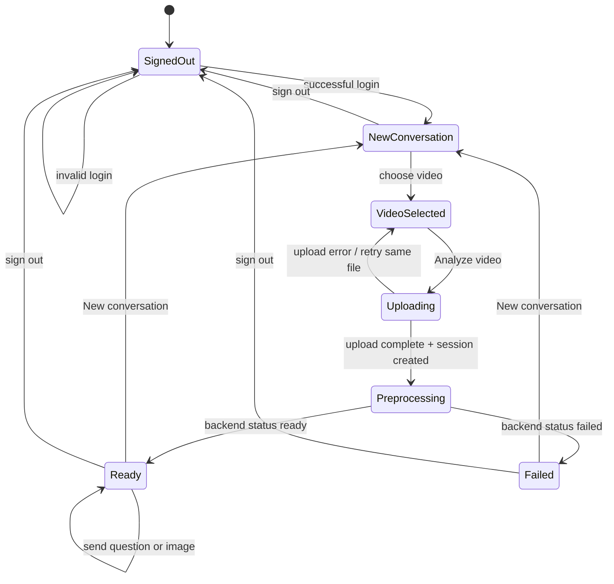
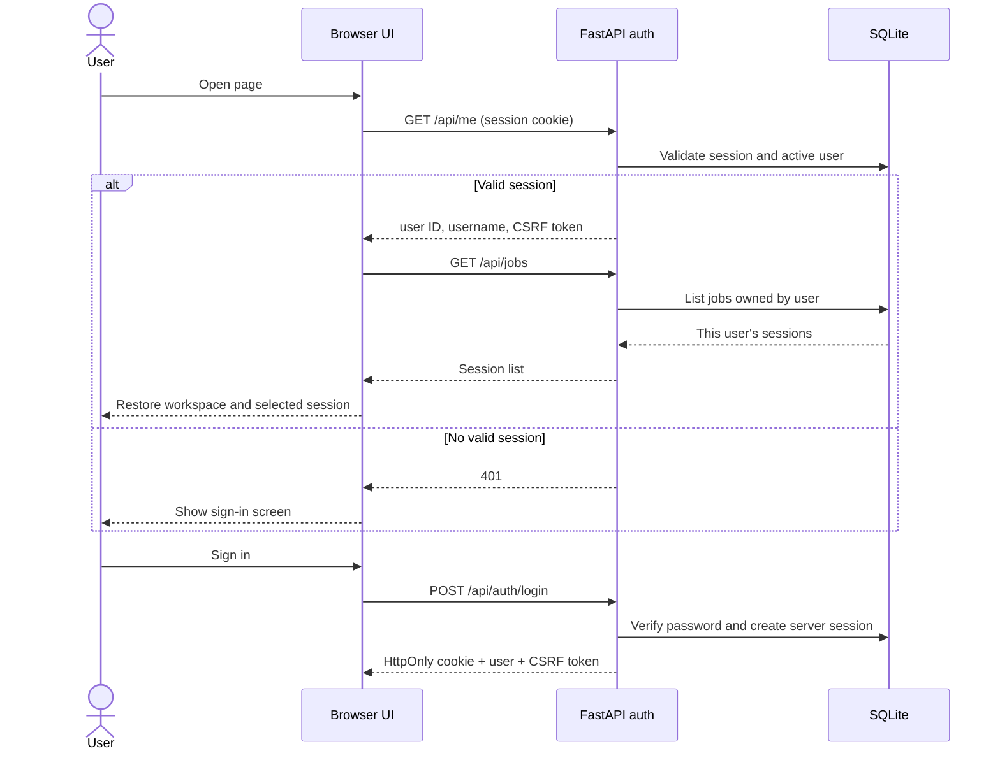
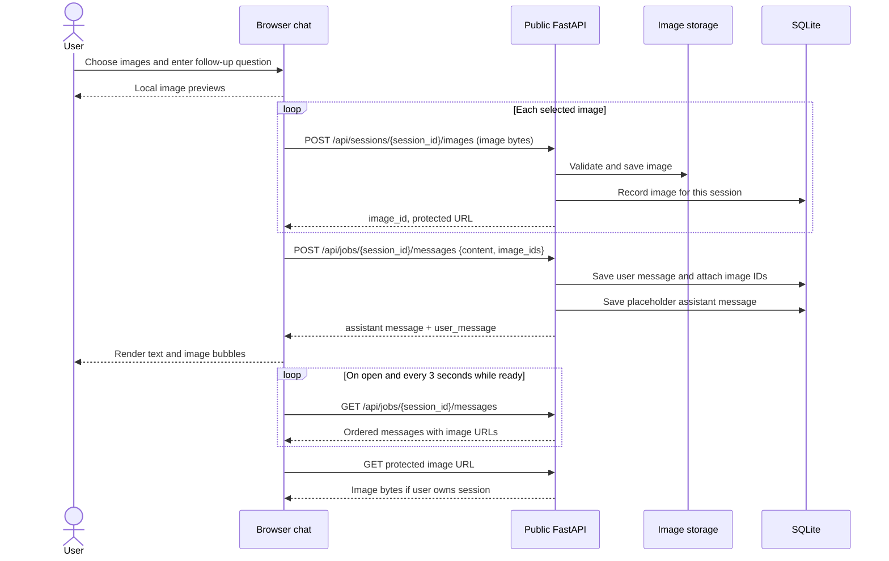
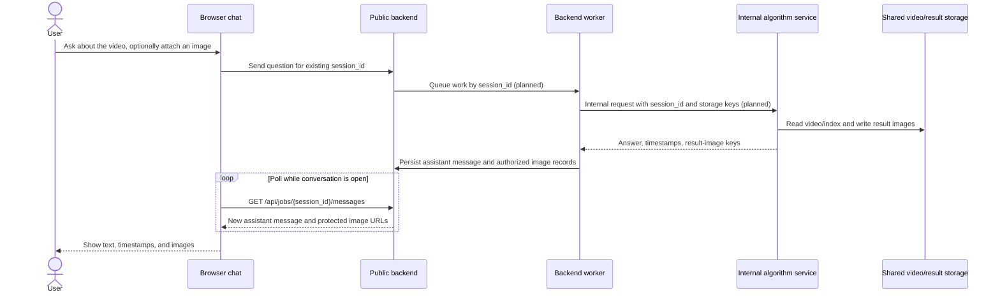

# Frame frontend design and interaction flow

This document describes the **current browser interface** in `frontend/` and its calls to the public FastAPI backend. It is a reference for UI changes and for integrating the separate algorithm service later. The screenshots below were captured from the running HTML/CSS/JavaScript on a 1440 px desktop viewport and a 390 px mobile viewport. Workspace screenshots use sample API data; no real user video or account is shown. The conversation image response is **illustrative**: the current backend does not generate detection results or assistant images.

## Screens and screenshots

### Sign in


The sign-in screen has a product story on the left and a username/password form on the right. Password visibility can be toggled. **Remember me** is checked by default. Invalid credentials display an inline error without leaving the screen. Accounts are created by an administrator through `manage_users.py`; there is no self-registration UI. The original visual reference is [login-page.jpg](figma/login-page.jpg).

### New video workspace


The sidebar contains **New conversation**, the signed-in user's sessions, account name, and sign-out. The main card contains a video picker, five entity filters, optional instructions, and **Analyze video**. People and Cars are selected by default. Selecting a file shows its name and size. The original visual reference is [home-page.jpg](figma/home-page.jpg).

### Ready conversation and image response


This is a UI example with **mocked messages**. It demonstrates the conversation layout, user and assistant bubbles, an image inside an assistant bubble, the **+** image picker, and **Send**. The real chat endpoint currently answers only simple file-metadata questions; it does not identify objects or people in video and does not produce assistant images. The UI can render an image when a stored message includes an authorized image URL.

### Mobile workspace


On narrow screens, the sidebar becomes a top section. The session list remains horizontally scrollable and sign-out stays visible. The workspace, status card, and chat stack vertically. The mobile screenshot uses sample session data.

## Screen states and controls

| State | Visible behavior | User action | Next state |
| --- | --- | --- | --- |
| Signed out | Login form; workspace hidden | Enter credentials | Workspace, or inline error |
| New conversation | Video picker, entity filters, instructions | Select a video and press **Analyze video** | Uploading |
| Uploading | Percentage progress; Analyze disabled | Wait or retry after an error | Preprocessing |
| Preprocessing | Session ID, status text, disabled chat input | Leave page or wait | Ready or Failed |
| Ready | Chat enabled, **Chat** button enabled, Analyze locked for this session | Send question and optional images | Ready with more messages |
| Failed | Error shown in status card; chat unavailable | Start a new conversation | New conversation |

Each session has **one video**. The **New conversation** button resets the composer for another session. Clicking a saved session opens its status and conversation. On refresh, the browser asks the backend for the signed-in user and their sessions, then reopens the last selected session if it still belongs to that user.



## Identity and session mapping

The browser calls `GET /api/me` on page load. If the server session cookie is valid, it calls `GET /api/jobs` and renders only that user's sessions. `POST /api/auth/login` sets an HttpOnly cookie and returns a CSRF token; the JavaScript keeps the CSRF token in memory and sends it as `X-CSRF-Token` on modifying API calls. Fetch uses same-origin credentials. Signing out calls `POST /api/auth/logout`, which revokes the server session and clears the cookie.

| Identifier | Created by | Purpose |
| --- | --- | --- |
| User ID | Account administration | Owns uploads and their sessions |
| Upload ID | `POST /api/uploads` | Resumable transfer record and video file name |
| Job ID / Session ID | `POST /api/jobs` | One video, preprocessing status, and chat history |
| Image ID | `POST /api/sessions/{session_id}/images` | Stored image attached to a chat message |
| Message ID | Chat endpoint | Orders user and assistant messages |

The browser stores **no password or auth token** in local storage. It stores `frameLastJob:{user_id}` as a UI preference and `frameUpload:{user_id}:{filename}:{size}:{lastModified}` to resume an interrupted upload. The backend validates ownership on every protected upload, job, message, and image route; a saved ID alone cannot grant access.



## Video upload and preprocessing call chain

The browser splits a selected file into **8 MiB transfer chunks**. It does not decode or analyze video content. The backend writes the bytes to `data/videos/{upload_id}.part`, then renames that file to `{upload_id}.video` after the expected byte count arrives. Metadata and ownership live in `data/frame.sqlite3`. The configured maximum video size is **250 GiB**.

| Step | Browser call | Backend handler | Result |
| --- | --- | --- | --- |
| Start or resume | `GET /api/uploads/{upload_id}` if a saved ID exists; otherwise `POST /api/uploads` with `filename` and `size` | `backend/uploads.py` | Upload ID, current offset, chunk size |
| Transfer | `PATCH /api/uploads/{upload_id}` with `Upload-Offset` and binary chunk | `backend/uploads.py` | New committed offset |
| Finish transfer | `POST /api/uploads/{upload_id}/complete` | `backend/uploads.py` | Complete video file |
| Create session | `POST /api/jobs` with `upload_id`, `entities`, `instructions` | `backend/jobs.py` | Job/session ID, `preprocessing` |
| Check progress | `GET /api/jobs/{job_id}` every 3 seconds while processing | `backend/jobs.py` | `preprocessing`, `ready`, or `failed` |

```mermaid
sequenceDiagram
    actor User
    participant UI as Browser UI
    participant API as Public FastAPI
    participant Disk as Video storage
    participant DB as SQLite
    participant Prep as Local preprocessing
    User->>UI: Select video, entities, instructions
    UI->>API: POST /api/uploads {filename, size}
    API->>DB: Create upload owned by user
    API-->>UI: upload_id, offset=0, chunk_size
    loop Until offset equals file size
        UI->>API: PATCH /api/uploads/{id} (binary chunk, Upload-Offset)
        API->>Disk: Append and sync chunk
        API->>DB: Save new offset
        API-->>UI: offset
        UI-->>User: Update percentage
    end
    UI->>API: POST /api/uploads/{id}/complete
    API->>Disk: Rename .part to .video
    API-->>UI: status=complete
    UI->>API: POST /api/jobs {upload_id, entities, instructions}
    API->>DB: Create one job for this upload
    API-->>UI: session_id, status=preprocessing
    API->>Prep: Calculate SHA-256; run ffprobe if available
    Prep->>DB: Save metadata and ready/failed status
    loop Every 3 seconds while processing
        UI->>API: GET /api/jobs/{session_id}
        API-->>UI: status, metadata or error
    end
    UI-->>User: Ready notification and enabled chat
```

For a lost chunk response, the browser requests the upload's stored offset and continues from that offset. If transfer finishes but the session-creation response is lost, the browser reuses the completed upload and looks for its session in `GET /api/jobs`, avoiding a second large transfer. A session's **Analyze video** button remains locked once a job exists.

`ready` currently means **local metadata preprocessing is complete**. It does **not** mean the separate detection/agent service has analyzed the video.

## Follow-up chat, image upload, and response flow

The **+** control selects PNG, JPEG, WebP, or GIF files. The browser makes temporary preview URLs for display only; validation and storage happen on the server. A message can include up to **10 images**, each at most **20 MiB**. The user may send a question, images, or both, but the job must be `ready`.

1. Selecting images shows removable previews beside the unsent message.
2. On **Send**, the browser uploads each image with `POST /api/sessions/{session_id}/images`, using the file bytes as the request body and `X-Filename` for its display name. Each response contains an `image_id` and a protected `url`.
3. The browser calls `POST /api/jobs/{session_id}/messages` with `content` and `image_ids`. The backend links those images to the saved user message, saves a placeholder assistant answer, and returns both the assistant response and `user_message`.
4. The UI adds the user and assistant bubbles. It calls `GET /api/jobs/{session_id}/messages` on open and every 3 seconds while ready. Message IDs prevent duplicate bubbles.
5. Images in history use `GET /api/sessions/{session_id}/images/{image_id}`. The same session cookie and ownership checks apply when the browser loads each image.



Example **current** chat request and response (IDs shortened for readability):

```http
POST /api/jobs/{session_id}/messages
Content-Type: application/json

{"content":"What is the filename?","image_ids":["image-uuid"]}
```

```json
{"id":12,"role":"assistant","content":"The uploaded video is sample-camera.mp4.","images":[],
 "user_message":{"id":11,"role":"user","content":"What is the filename?",
 "images":[{"id":"image-uuid","filename":"reference.png","url":"/api/sessions/{session_id}/images/{image_id}"}]}}
```

The agent integration is deferred. A future algorithm-service response should be persisted as a real assistant message with authorized result-image URLs before the UI displays it. The illustrative screenshot above shows the intended rendering only; it is not evidence that detection is implemented.

The **planned** response chain for the separate internal service is:



This is a design contract, not a description of code already connected. The internal endpoint, service authentication, worker, shared storage, and result persistence still need implementation.

## Errors, notifications, and responsive behavior

| Condition | Current UI behavior |
| --- | --- |
| Wrong login | Inline error on sign-in form |
| No video or no selected entity | Inline form message; no upload starts |
| Interrupted upload | Saved upload ID and server offset allow retry with the same file/browser |
| Preprocessing failure | `Failed` status and backend error in the session card; chat disabled |
| Unsupported or oversized image | Image-specific message; file is not added |
| Chat request failure | Error beside chat input; question text restored for retry |
| Upload complete or preprocessing ready | Temporary toast; optional browser notification if permission was granted and the page is open |

The responsive breakpoints are defined in `frontend/styles.css` and `frontend/upload.css`. The login columns stack below 900 px; the workspace changes to a narrow top sidebar below 620 px. Form controls and chat messages then use the available width. The interface uses labelled inputs, visible keyboard focus, status/live regions for messages and progress, and `alt` text for displayed images.

## Implementation map

| Concern | File |
| --- | --- |
| Screen structure and accessible labels | `frontend/index.html` |
| Login, uploads, polling, sidebar, chat, previews | `frontend/script.js` |
| Base layout and responsive rules | `frontend/styles.css` |
| Upload, status, and chat styling | `frontend/upload.css` |
| Auth/session cookies and route ownership | `backend/auth.py` |
| Chunked upload and completion | `backend/uploads.py` |
| Session creation and local metadata preprocessing | `backend/jobs.py`, `backend/video_metadata.py` |
| Image validation, storage, and delivery | `backend/images.py` |
| Chat persistence and current placeholder answers | `backend/chat.py` |

For the boundary between this public backend and the separately deployed algorithm service, see [architecture.md](../architecture.md).
